# Notes on Interactive 3D Graphics Course from Udacity


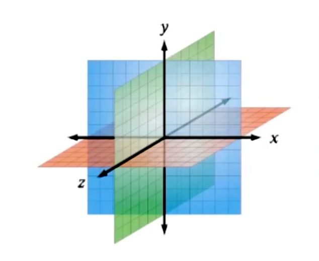


## Core Ideas

### Frames Per Second

Frames per Second
Films/TV: 24FPS and refresh rate 48 or 72 Hz
Video Games: 30-60FPS and refresh rate usually is 60 Hz

These numbers are tied to the hardware, most monitors nowadays refresh at 60 Hz, which means, display the image 60 times per second. This is called the refresh rate. This value gives an upper limit on the frame rate, the number of new images per second. An application can have fewer frames per second but that means when the monitor refreshes it will repeat some images.

Films have much smaller frames per second number because recording captures `motions blur`, When a camera creates an image, that image does not represents a single instant of time, but it represents the image over a period of time, that is why when trying to capture objects in movement they look blurry. See more info [here](https://en.wikipedia.org/wiki/Motion_blur).  


### View Frustum

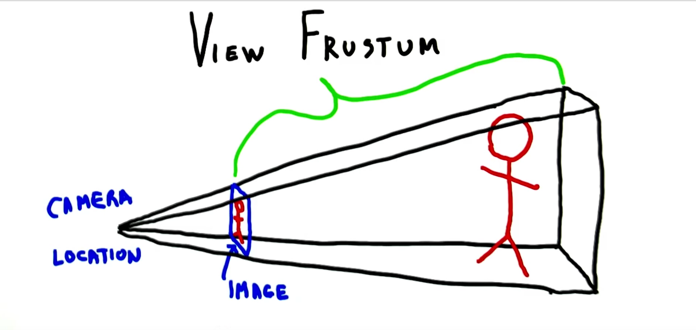

Frustum is the region of space in the modeled world that may appear on the screen; it is the field of view of the notional camera.

The view frustum is typically obtained by taking a frustum—that is a truncation with parallel planes—of the pyramid of vision, which is the adaptation of (idealized) cone of vision that a camera or eye would have to the rectangular viewports typically used in computer graphics.

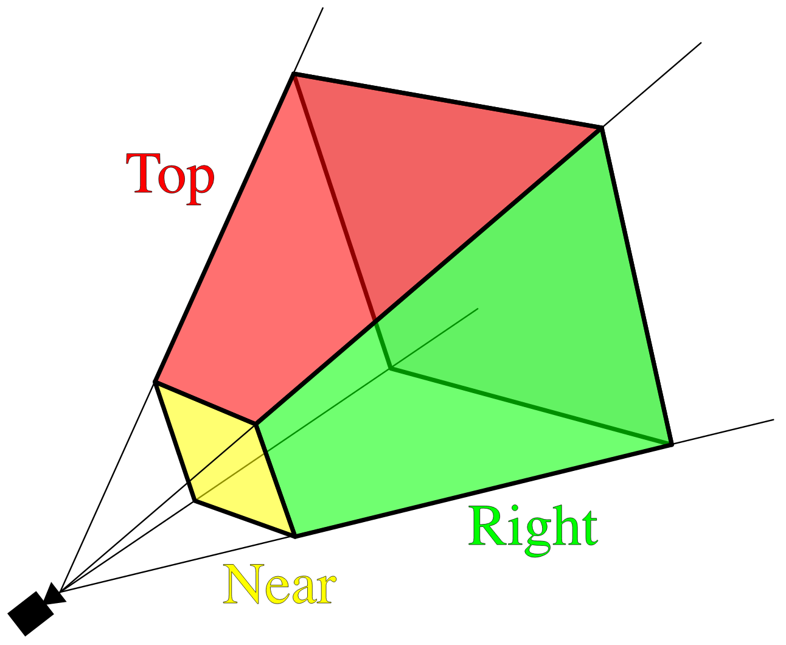


### Scene

A scene consit of:

    1. Objects (usually described by geometry and material)
    2. Lights
    3. Camera


### Graphics Pipeline (rendering pipeline)
The sequence of steps used to create a 2D raster representation of a 3D scene. Plainly speaking, once a 3D model has been created, for instance in a video game or any other 3D computer animation, the graphics pipeline is the process of turning that 3D model into what the computer displays.

The 3D pipeline usually refers to the most common form of computer 3D rendering, 3D polygon rendering, distinct from raytracing, and raycasting. In particular, 3D polygon rendering is similar to raycasting. In raycasting, a ray originates at the point where the camera resides, if that ray hits a surface, then the color and lighting of the point on the surface where the ray hit is calculated. In 3D polygon rendering the reverse happens, the area that is in view of the camera is calculated, and then rays are created from every part of every surface in view of the camera and traced back to the camera.


1. **Application**:
First, the scene is created out of geometric primitives. Traditionally this is done using triangles, which are particularly well suited to this as they always exist on a single plane.

2. **Camera & Model Transform**:
Transform from the local coordinate system to the 3d world coordinate system.
Transform the 3d world coordinate system into the 3d camera coordinate system, with the camera as the origin.


3. **Rasterization**:
Rasterization is the process by which the 2D image space representation of the scene is converted into raster format and the correct resulting pixel values are determined. From now on, operations will be carried out on each single pixel. This stage is rather complex, involving multiple steps often referred as a group under the name of pixel pipeline.


### Algotithms

**Painters Algorithm**: Start painting the object which is must further away, the last painted object is the closest one. It has a flaw where it can't render a scene where objects interacts with each other independent of their position, imagine a cat at the back and a milk pot at the front but the cat's tail is wrapping around the milk pot, or 3 triangles where they stack on top of each other.

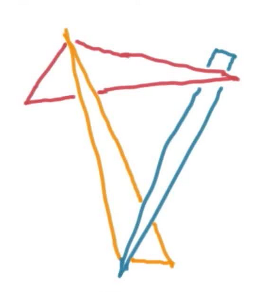


**Z-Buffer**: Also known as **depth buffering**, is the management of image depth coordinates in 3D graphics, usually done in hardware, sometimes in software. It is one solution to the visibility problem, which is the problem of deciding which elements of a rendered scene are visible, and which are hidden. The painter's algorithm is another common solution which, though less efficient, can also handle non-opaque scene elements.

When an object is rendered, the depth of a generated pixel (z coordinate) is stored in a buffer (the z-buffer or depth buffer). This buffer is usually arranged as a two-dimensional array (x-y) with one element for each screen pixel. If another object of the scene must be rendered in the same pixel, the method compares the two depths and overrides the current pixel if the object is closer to the observer. The chosen depth is then saved to the z-buffer, replacing the old one. In the end, the z-buffer will allow the method to correctly reproduce the usual depth perception: a close object hides a farther one. This is called z-culling.

Because of Z-buffer, drawing object form front to back is what GPU's do to optimize rendering.

So we get the closest object and we spend the following cycles:

    1. 1 cycle to read the z-buffer (z-buffer here is empty so we can write to it as this object z position is the smallest).
    2. 1 cycle to write the z-buffer.
    3. 1 cycle to paint pixel color.

Then we get the second object, which is behind the first and we spend the following cycles:

    1. 1 cycle to read the z-buffer (we see that this object z value is higher than the actual in z-buffer, so we won't need to paint this pixel as the object is hidden).

If we started from the object further away we'd have to read, write and paint for every object.


### Geometric Objects

How geometric objects are defined for rendering:

3D point: defines a location in a 3D space.
3D vector: defines a direction in a 3D space.

In 3D computer graphics, we usually use a Cartesian Coordinate System. In this system we have an `origin` and three direction vectors called `x`, `y` and `z`.

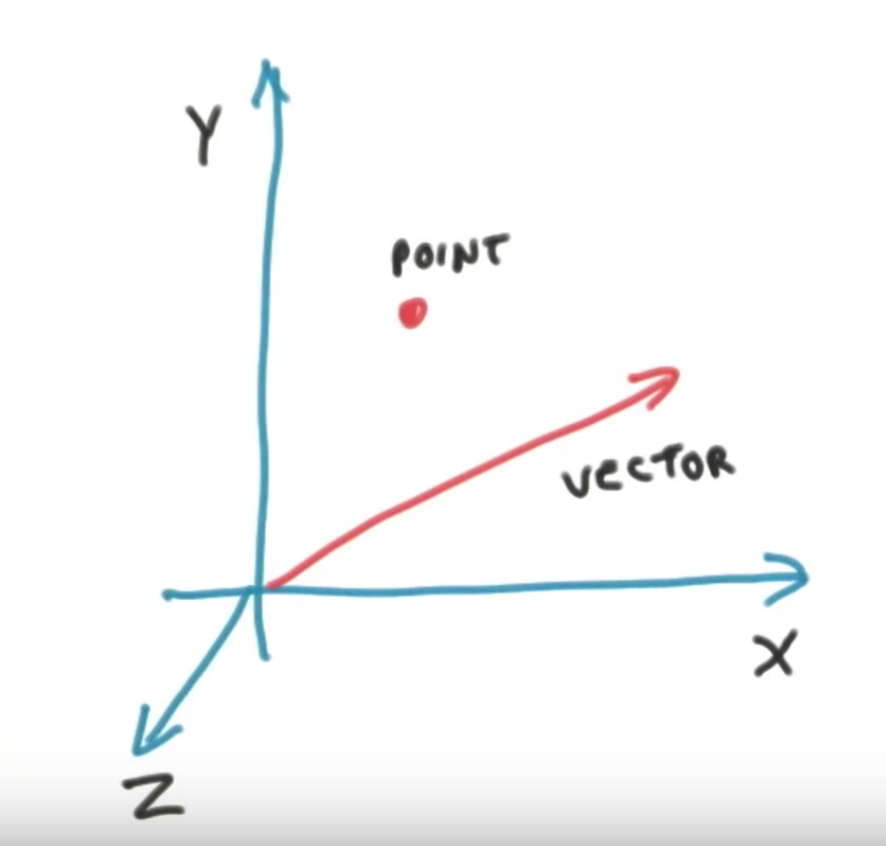

The `origin` is some fixed point in space whose location everyone agrees on.

The `x`, `y` and `z` direction vectors define the axis of the coordinate system, they are normally each perpendicular to the other, that means, the angle to each other are all 90 degrees (see red lines in the center of image bellow).

So given an origin and 3 vectors we can define the location of any point in space with a **triplative** numbers. For example the point at the top has a triplative number of **(x,y,z) === (2,3,4)**

3D vectors are described by a similar coordinate system, except that the origin is not needed. A vector describes a motion, which again can be described by three numbers. That is, it describes how far to move to get from one point to another, however, this movement is not fixed in any particular location in space. To make an analogy think about time, a specific time is like a point while an amount of time is like a vector, it specifies the duration but no starting time is given.

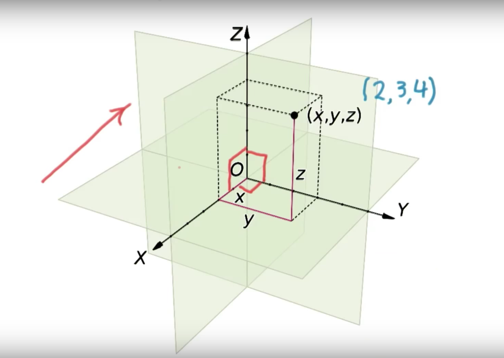


### Left-Handed vs Right-Handed

Indicates if in the coordinates the z value is going to be positive or negative, in the left-handed z index is positive when away from viewer while in right-handed z-index is positive towards the viewer.


### Points and Lines
There are only three primitives we ever send to the graphics processing unit, `points`, `line segments` and `triangles`. Of these, triangles are by far the most important. For example, just about everything you see in a 3D game is ultimately made of triangles.

**Defining a point (x,y,z)**

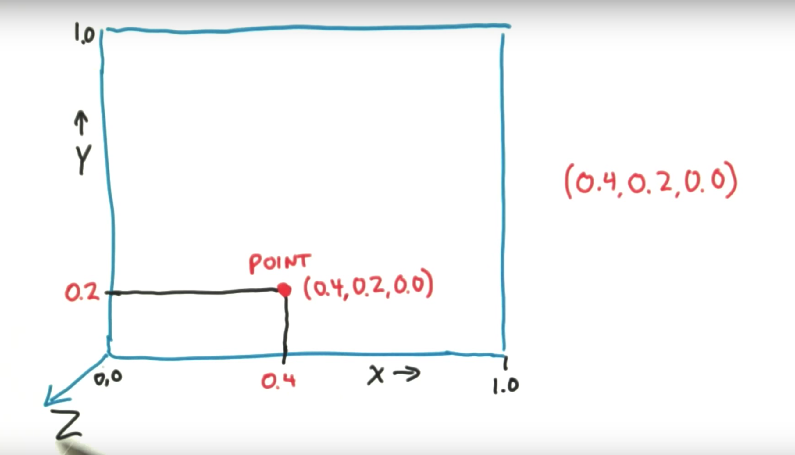  


**Defining a line segment (x,y,z) (x,y,z)**

By defining a second point you can define a line segment.

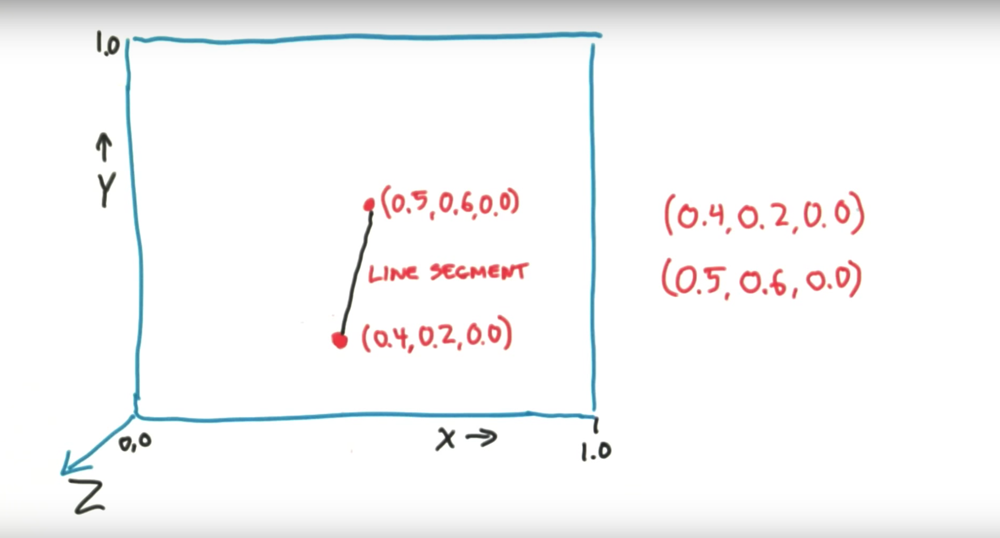  


**Defining a triangle (x,y,z) (x,y,z) (x,y,z)**

A triangle is created by defining three points

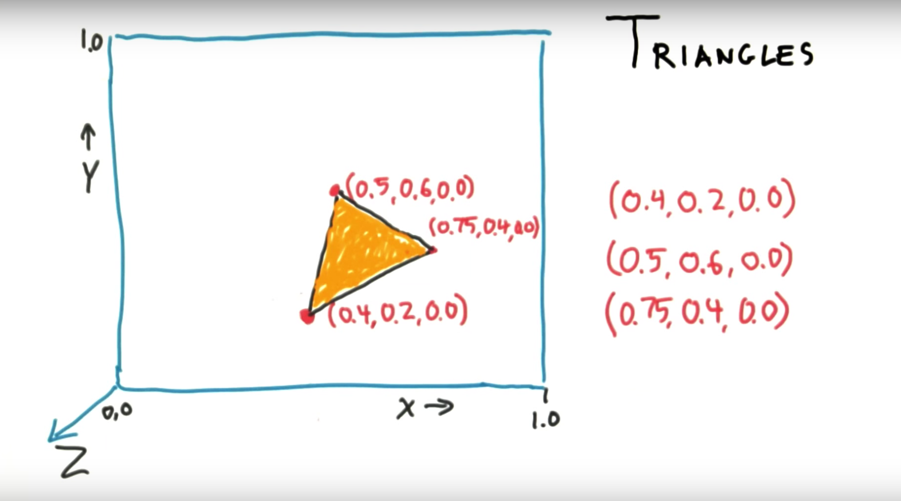  


### ThreeJS


**Vertices** are the corners of a polygon, we use `Vector3` for both **points** and **vectors** within THREEJS
```javascript
const triangle = new THREE.Geometry();
triangle.vertices.push( new THREE.Vector3(1,1,0) );
triangle.vertices.push( new THREE.Vector3(3,1,0) );
triangle.vertices.push( new THREE.Vector3(3,3,0) );

triangle.faces.push( new THREE.Face3(0,1,2) );  
// 0,1,2 corresponds to the index of the trinalge.vertices array
// [(1,1,0), (3,1,0), (3,3,0)]


const triangleMaterial = new THREE.MeshBasicMaterial({
    color: 0x2686AA,
    side: THREE.DoubleSide
});

const triangleMesh = new THREE.Mesh(triangle, triangleMaterial);

scene.add(triangleMesh);

var square = new THREE.Geometry();
square.vertices.push( new THREE.Vector3( x1, y1, 0 ) ); square.vertices.push( new THREE.Vector3( x2, y1, 0 ) ); square.vertices.push( new THREE.Vector3( x2, y2, 0 ) ); square.vertices.push( new THREE.Vector3( x1, y2, 0 ) ); square.faces.push( new THREE.Face3( 0, 1, 2 ) );
square.faces.push( new THREE.Face3( 2, 0, 3 ) ); return square;

```


### Vertex Ordering and Culling
Back-face culling determines whether a polygon of a graphical object is visible. It is a step in the graphical pipeline that tests whether the points in the polygon appear in clockwise or counter-clockwise order when projected onto the screen. If the user has specified that front-facing polygons have a clockwise winding, but the polygon projected on the screen has a counter-clockwise winding then it has been rotated to face away from the camera and will not be drawn.

The process makes rendering objects quicker and more efficient by reducing the number of polygons for the program to draw.

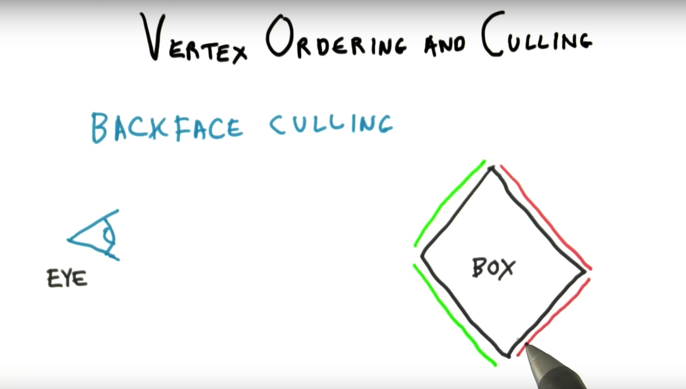

In ThreeJS, so turn backface-culling on use the `side` property in the material.

```javascript
var material = new THREE.MeshBasicMaterial({
    color: 0xF6831E,
    side: THREE.FrontSide
});
```

To determine if a triangle is a frontface or a backface:
There are three points defining each triangle, the order of the vertices after they are projected on the screen tells us that. In WebGL the order is counterclockwise for front-facing and  clockwise for backface (use the right-hand wrapping technic).

So bellow we have a square made of two triangles, the first triangle is frontface the second backface.

```javascript
geometry.vertices.push( new THREE.Vector3( 3, 3, 0 ) ); // bottom left corner
geometry.vertices.push( new THREE.Vector3( 7, 3, 0 ) ); // bottom right corner
geometry.vertices.push( new THREE.Vector3( 7, 7, 0 ) ); // top right corner
geometry.vertices.push( new THREE.Vector3( 3, 7, 0 ) ); // top left corner

// frontface because order of the vertices is counterclockwise
geometry.faces.push( new THREE.Face3( 0, 1, 2 ) );

// backface because the order of the vertices is clockwise
geometry.faces.push( new THREE.Face3( 0, 2, 3 ) );
```


## Colors and Materials

### The Programmable Pipeline
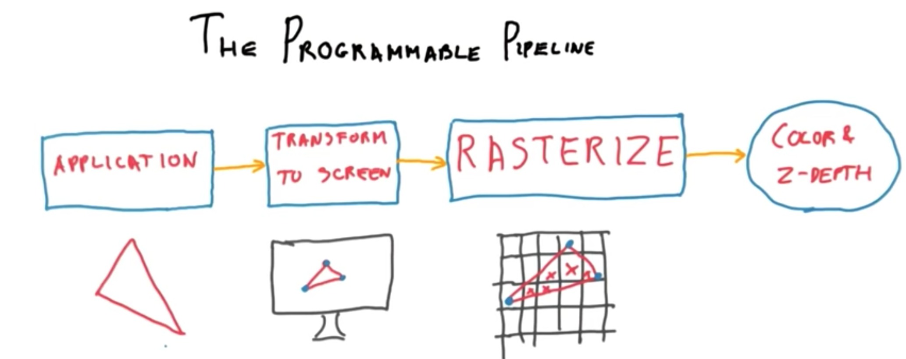
Above is a simplified view of the rendering pipeline. The application sends a triangle to the GPU. The GPU determines where the triangle vertices are on the screen, including z-depth. Each pixel inside the triangle is shaded. If the pixel passes the z-buffer test it is then saved to the image and displayed at the end of the frame.

Modern GPUs have parts of the pipeline that are programmable. The transformed screen part of the pipeline is done by what is called a Vertex Shader, this programmable element, essentially a little computer, processes each Vertex of the triangle. The Vertex Shader uses information provided to it to manipulate each Vertex in some way. For example, the color of the triangle at this point could be computed or the vertexes position could be modified if, for example, you wanted to have an object inflate or explode. One operation the vertex shader always does it to output a location of the vertex on the screen.
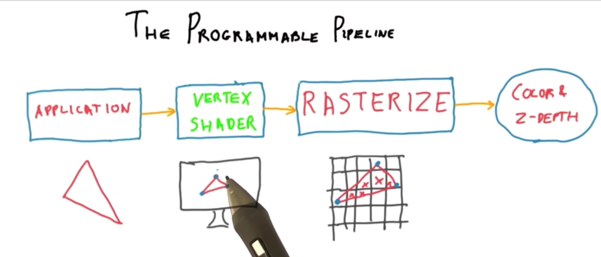

The second half of our modern GPU pipeline we represent bellow by two stages. `Triangle Setup` and the `Fragment Shader`.

Triangle Setup uses the three screens locations generated by the Vertex Shader for the incoming triangle. This forms a triangle in a screen space. Each pixel covered by part of the triangle has what is called a Fragment generated for it. This process is called `scan conversion`. The Fragments generated are sent to the **Fragment Shader** (Microsoft DirectX API calls it Pixel Shader). The Fragment Shader is provided information by the triangle being processed. Somewhere to the Vertex Shader the programmer can also feed in any other data desired. The Fragment Shader run a program that typically outputs a Color and a Z Depth value. This Z Depth value is then tested against the Z Buffer as usual. If the surface is visible, the color is saved for that pixel. The Shade Pipeline is designed to compute the color of Each pixel the surface covers. That is its ultimate purpose after all. The creation of an image. Everything done in the pipeline comes down to this. **How DO WE EFFICIENTLY CALCULATE THIS COLOR**

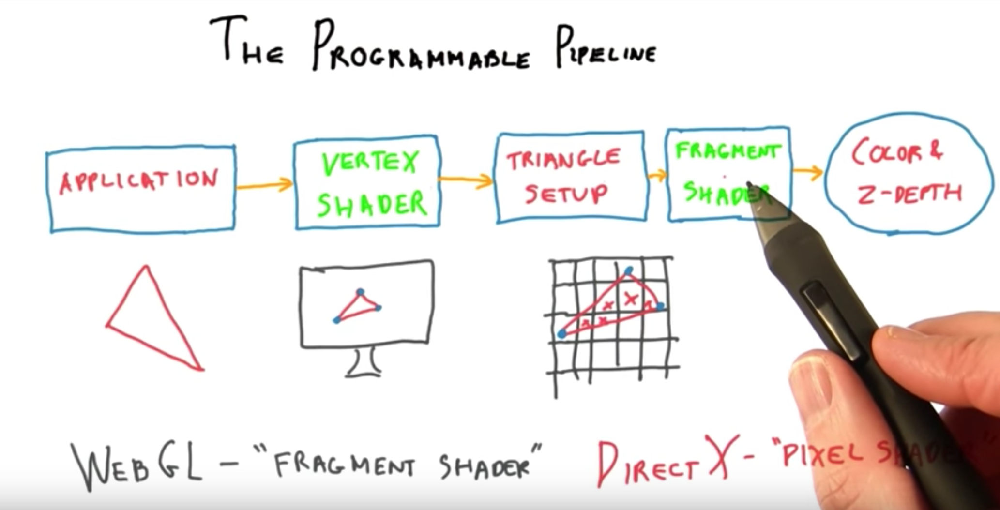

Given a material and an incoming light you want to calculate what color is coming out of that pixel.

### Colors
In interactive rendering systems, a color is defined by three values: `red`, `green` and `blue`, or RGB, each color value is often called a channel. Once in a while you can find systems defined as BGR, so you have to pay attention to swap the channels accordingly.

We usually define colors in one of two ways. As floating point numbers or integers.

```javascript
// Float Point 0.0 to 1.0
(0.0, 0.0, 0.0)  // black
(1.0, 1.0, 1.0)  // white
(1.0, 0.0, 0.0)  // red
(0.0, 1.0, 0.0)  // green
(0.0, 0.0, 1.0)  // blue
```
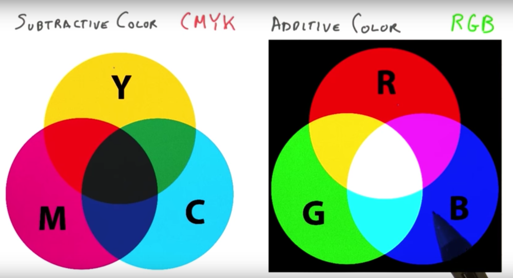


In THREEJS there are a number of ways to set a color. Lets cover four of them here:

1. Define a material

    ```javascript
    var material = new THREE.MeshLamberMaterial()
    ```

    The material has a property color, which is a THREE.Color object. You can define the material colors in several ways:
    ```javascript
    material.color.r = 1.0;
    material.color.g = 0.0;
    material.color.b = 0.0;

    // or
    material.color.setRGB(1.0, 0.0, 0.0);

    // or
    material.color.setHex(0x1280FF);
    ```


### Materials
When performing interactive rendering, the standard way to think about a material's appearance is as a few different components added together.

1. Emissive
    The idea of the emissive term is that it's for coloring glowing objects. For example, a lightbulb has its own color and other light sources don't really affect it. In reality the emissive term is simply a way to add in some constant color regardless of the light condition.

2. Ambient
    This is a fugde factor. Something added in so objects look better specially in areas that are not directly lit. You'll see it in various systems controlled in various ways. When all is said and done, the Ambient term helps compute a constant color value that is added to the fragment's final color value.
    The Emissive and Ambient terms are kept separate, as they fulfill different functions, and often have different controls. For example THREE.JS allows you to set an ambient light that affects all materials with an ambient term.

    Remember we made a simplification with lights in a scene. We assumed photons come only from lights, and don't bounce around. In reality photons would reflect from the floor to the bottom of the sphere to our eye. However, with our assumption the lower part of the sphere doesn't get any light and so would look black. The Ambient term give us at least some color in the type of areas instead of being entirelly black.
    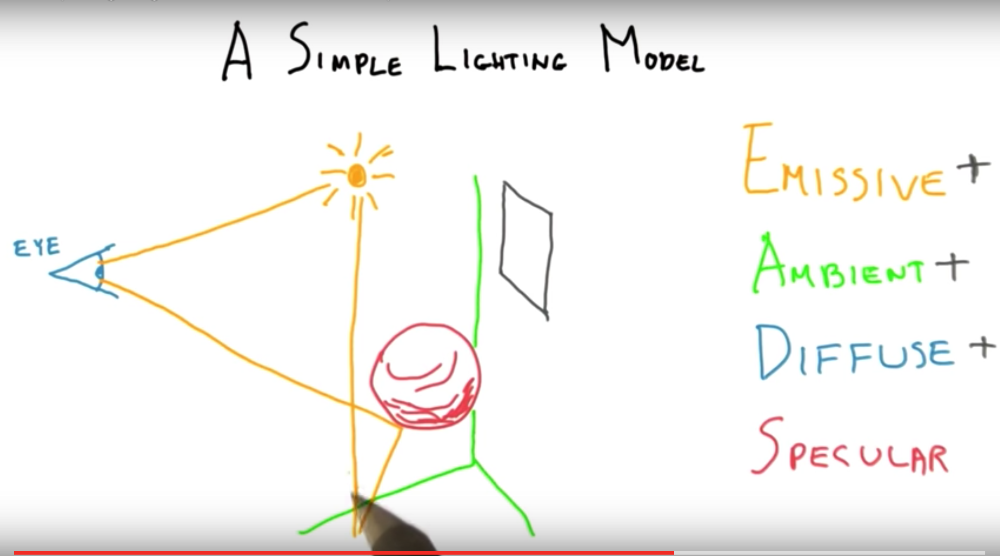

3. Diffuse

4. Specular
    The Diffuse and Specular components are computed based on the lights in the scene. While the emissive and ambient are essentially independent of these, the Diffuse term can be though of as a flat matte finish, and the specular can be thought of as the shininess of an object. In terms of computation, the specular term is also affected by the viewers location. While the diffuse term is determined only by each light location.

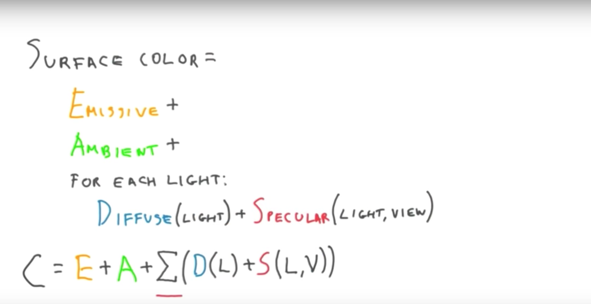


#### Kind of Materials

**Diffused Material** is defined as one that scatters light in all directions above the plane according to the cosine law.
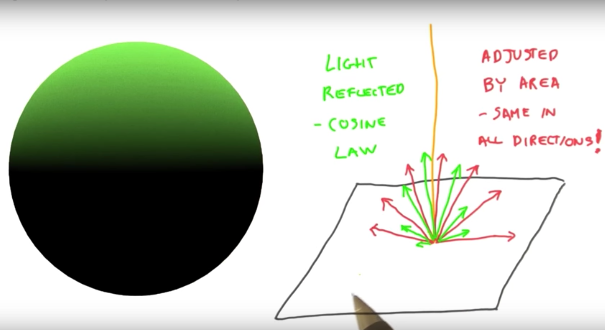
The cosine law states that the amount of light from a single point on the surface drops off with the cosine of the angle the surface compared to the eye.

To Shade a diffuse surface, we need the cosine of the angle between the direction to the light and the surface's normal. Then we can perform a vector operation called `dot product` to directly compute this cosine.
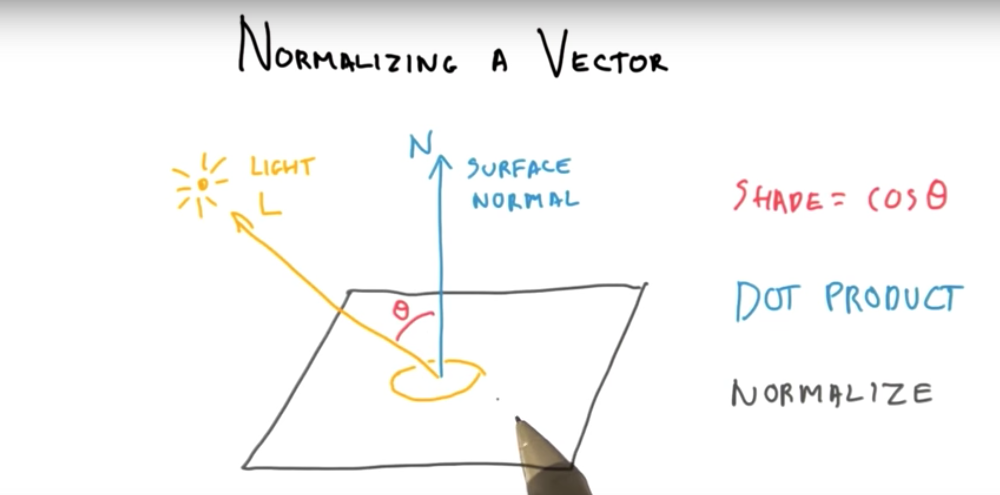


First, you must normalize the surface normal and the vector to the light. Normalizing means rescaling a vector so that it has a length of 1. Normalized vectors are the norm in reflection models. The `dot product` of two normalized vectors gives a value between -1 and 1. which will prove useful in computing the effect of lighting.

1. Find the length of the Vector using the Pythagorean theorem (take each component of the vector and square them and calculate the square root of the result).

2. Divide the vector by its length and you get a normalized vector.

If you compare the non-normalized with the normalized vector they go in the same direction but the normalized vector travels only one unit. If you try to normalize an already normalized vector you will get the same value.

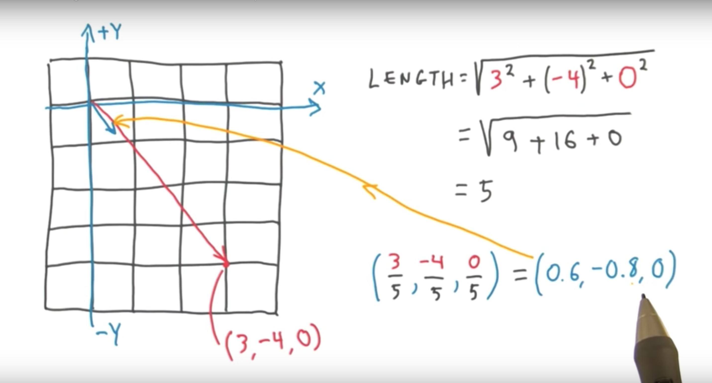


```javascript
function normalizeVector({x, y, z}) {
	const length = Math.sqrt(
    Math.pow(x,2) +
    Math.pow(y,2) +
    Math.pow(z,2)
  );

  return {
    x: x / length,
    y: y / length,
    z: z / length,
    length
  }
}
```

**The dot product operation**

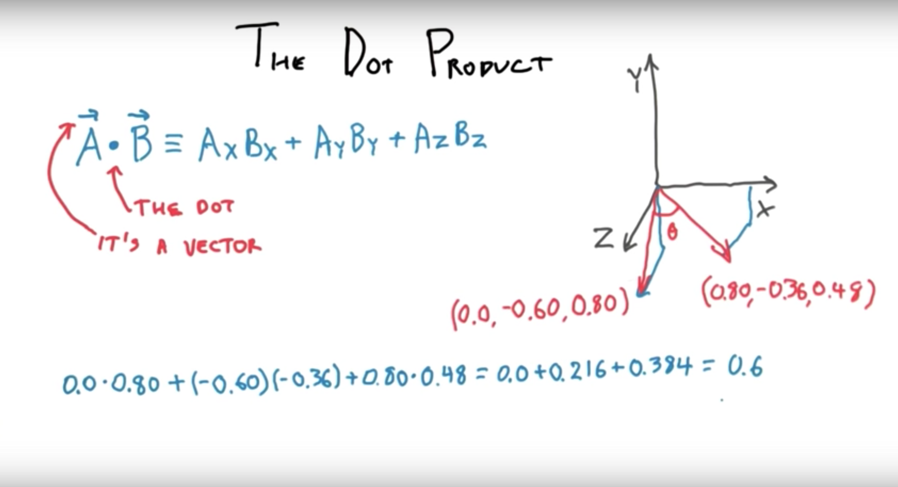

If you take a close look to the image above we can see that the surface is not smooth enough but instead we see it is formed by triangles faces. To have a tessellated surface made of triangles look smooth, we introduce the idea of a `Shading Normal`. For a tessellated sphere the geometric normal's for the triangles look like the left image bellow (right), each triangle has geometric normals that are all the same along its surface. In other words the triangle is flat. That is why we get these discontinuities at the vertices. Instead of using geometric normals, we can store a shading normal at each vertex (image bellow on the left). These shading normals are created by the application in some way, sometimes you can get the normal from the underlying surface. A sphere is a good example as the normal at a point is always the direction from the sphere's center. However shading normal is entirely made up, you can set it however you want. in fact there are different ways of averaging the geometric normals of a triangle that share a vertex. None of these ways is perfect, each has its strengths and weaknesses, so there's no right answer. Shading normals are different from geometric normals. If you are given a triangle, you can always get its geometric normal. That's a property that's derived from the triangles points.


### Shading Normals
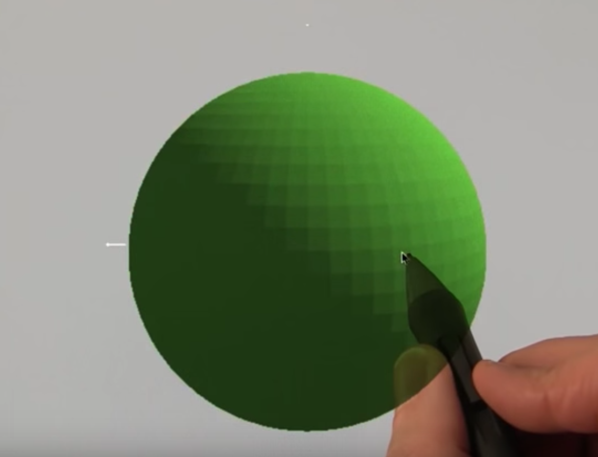


### Transparency

**Blending**

One simple way to think of transparency is that you want to see a bit of both objects. So, say two object on the screen, an opaque sphere and a red filter on top of it. The image bellow is a blow up of the pixels and it shows the result of blending both images colors in each pixel, this way it blends the two colors together. This algorithm is know as `Screen-Door Transparency` and it is very limited form of transparency as it only supports two objects and only a 50/50 mix looks good.
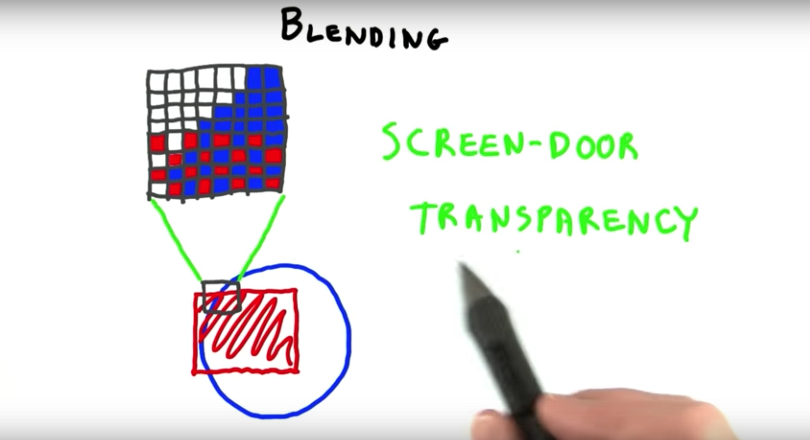


**The Over Operator**
What would be more general is to have the transparent filter's color affect the color behind it. In other words, we want to blend the two colors. In blending in computer graphics, the original color is called the `destination` and the color of the transparent object we are looking through is called `source` color. We'd also like to control how much can be seen through this filter. In computer graphics this control value is called `alpha`, it represents our filter's opacity. When alpha is 1 the filter is fully opaque and does not let any light through, as this value decreases more of the destination value is visible. When alpha is zero our filter is entirely transparent and has no effect.
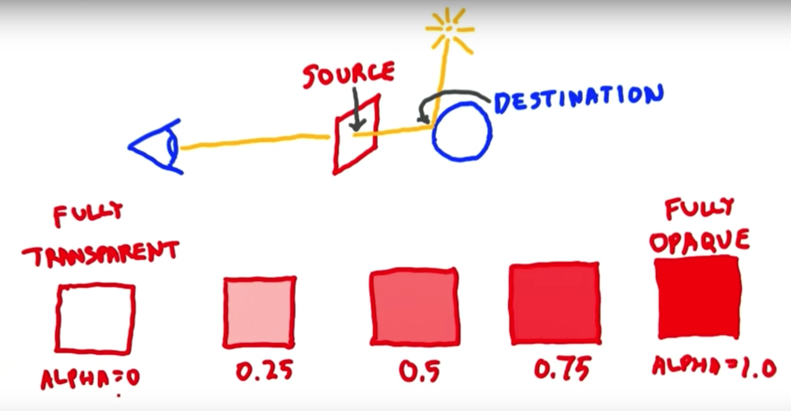


A typical way to blend these colors is by using the equation bellow.

The color of the source of our filter (red) is multiplied by the source's alpha, this gives how much the source will affect the final color. The same alpha is subtracted from 1 and the value is multiplied by the destination color, this determine how much the destination color influences the result. This type of blend is called "over" operator. Another way to say it is that the equation performs linear interpolation, as one color's influence increases the other colors effect drops off in proportion.
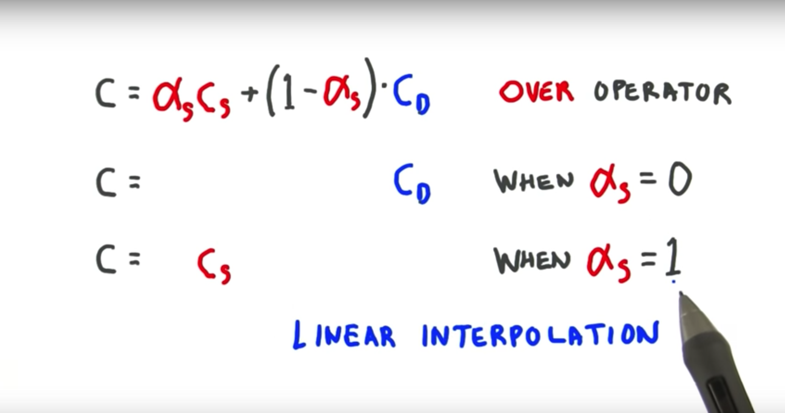


The alpha control is commonly used in many areas of computer graphics. The over operator is used for transparency, however there are many blend modes available on WebGL. For example one blend mode is called `add` as it adds the source and destination colors together. In Three.JS the blend mode used is specified with the materials blend parameter.


```javascript
const calculateOverOperator = (function () {
  function overOperator(filterColor, bgColor, alpha) {
  	return (alpha * filterColor) + (1 - alpha) * bgColor;
  }

  return function calculateOverOperator(filterColor, bgColor) {
    return {
      r: overOperator(filterColor.r, bgColor.r, filterColor.a),
      g: overOperator(filterColor.g, bgColor.g, filterColor.a),
      b: overOperator(filterColor.b, bgColor.b, filterColor.a)
    }
  }
})();

var filter = {r: 0.9, g: 0.2, b: 0.1, a: 0.7};
var background = {r: 0.9, g: 0.9, b:0.4};

calculateOverOperator(filter, background);
/*
{
	r:0.9000000000000001,
	g:0.41000000000000003,
	b: 0.19,
}
*/
```


**Z-Buffer and Transparency**
WE know the Z-Buffer stores the depth of the object that is closest to the eye. When we draw from back to front, say we draw the blue far object first, then draw and blend in a red transparent object in front of it. This works fine, the blue objects color is taken and blended with the red fragment that is drawn. However if we reverse the draw order to front to back, we start to get into problems because the object at the back has not being drawn yet, so its color still not available.
We can solve this problems two ways:

1. Draw all object sorted back to front order.  (For complicated scenes this is inefficient)
2. Draw the fully opaque objects first, transparent latter.

A system of transforming transparency that mostly works is:

1. Render All opaque objects first, Z-Buffer on.
2. Turn on Blending (Blending takes extra time for the GPU to compute, so its turned on only when its needed)
3. Render transparent objects sorted back to front.

This is the algorithm that Three.JS implements. You can make an object transparent by setting the material:

```javascript
var material = new THREE.MeshLambertMaterial({
    color: 0xE53319,
    opacity: 0.7,
    transparent: true
});
```


The solution above has its own problems, because xomplex objects can have two or more surfaces overlapping a single pixel, again it depends on draw order as to what appears on the screen. if the fragment on the left is drawn first, then the fragment on the right won't properly blend with it at the pixel. There is even research about the order in triangles in the mesh itself to avoid these problems, but these type of technique can be costly to apply. For a more advanced transparency algorithm there is an algorithm called `DEPTH-PEELING` which idea is to peel away each transparent layer until all layers are processed, by storing an additional z-depth for each pixel, this technique is very expensive as each peel operation needs to have all transparent objects rendered again and many passes may be needed before all the layers are found and processed.

Other solutions are:
    **A-Buffer**: Store a list of all the transparent fragments in each pixel, along with their depth. Once we have all this information we can then combine these fragments in the right order. This is possible in new GPUs for desktop, but it can use a considerable amount of memory.
    **Tile-Based**: Used usually in mobile devices.
    **Stochastic-Transparency**: Uses Screen-Door transparency within the pixel itself, along with some randomness to get it a reasonable average result.


## Transforms

Transform here is a mathematical therm meaning an operation that changes the position, orientation, or size and shape of an object. Transforms are a key part of computer graphics.

The study of of transforms for computer graphics is associated with the field of linear algebra, a field concerned with vector spaces.

#### Point and Vector operations
A point is a position and a vector describes a motion. We can combine both in various useful ways by adding or subtracting their coordinates from one another. To start with, if you subtract the location of point A from point B, you get a Vector describing how to get from point A to point B.
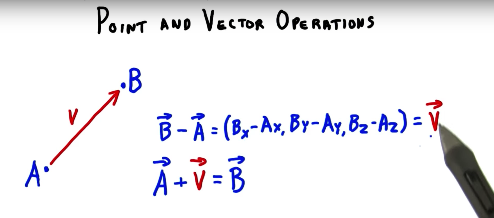

We can also add vectors together.
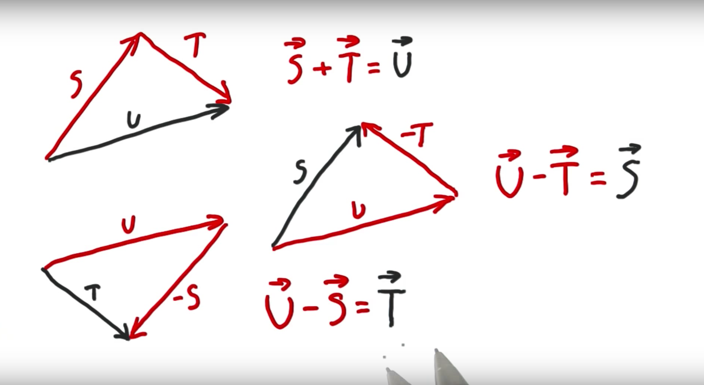

The other thing commonly done with vectors and points it to multiply them by a scalar number to describe moving in a given direction, multiplying by a positive number indicates moving further, if you multiply by negative value you reverse the vector direction.

Multiply a point by a number is a way to make an object larger or smaller. This type of operation is called scaling.


#### Translations
Translations is just a way to say "move something into a new position". ThreeJS has translation and other transforms built into every object. Bellow you can see how translation is applied to a sphere object, in the second example we see that the y coordinate is the sum of values, the coordinates can actually be the sum of product of any se of values, adding values together like this is equivalent as adding the coordinates of vectors. So say bellow vector of (0,160,0) was added to a vector of (0,390,0).

Translations can be treated somewhat like numbers in this respect. You can add them together in any order and you'll obtain a final translation vector that sums all the translations and tell you the final position.
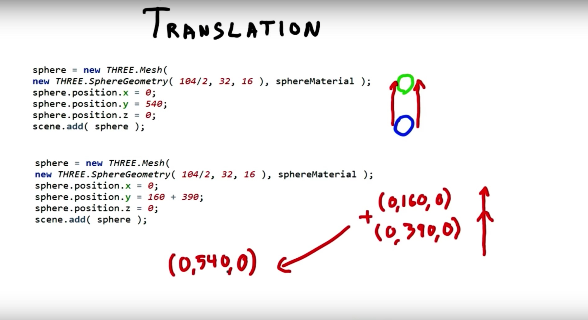

#### Rotaion
ThreeJS also has built in support for object rotations. The object rotates around its center in a counter clock wise fashion. The angle is specified in radians which computer likes, humans prefer degrees. So bellow we are specifying 70 degrees and converting it to radians by multiplying by PI/180.

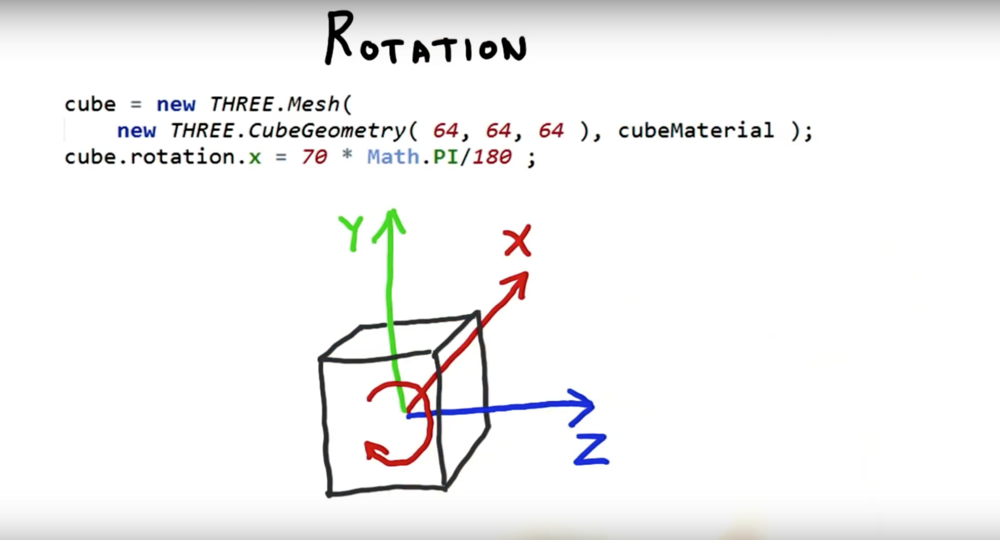


#### Euler Angles
The Euler angles are three angles introduced by Leonhard Euler to describe the orientation of a rigid body with respect to a fixed coordinate system. They can also represent the orientation of a mobile frame of reference in physics or the orientation of a general basis in 3-dimensional linear algebra.

Any orientation can be achieved by composing three elemental rotations, i.e. rotations about the axes of a coordinate system. Euler angles can be defined by three of these rotations. They can also be defined by elemental geometry and the geometrical definition demonstrates that three rotations are always sufficient to reach any frame.


The three elemental rotations may be extrinsic (rotations about the axes xyz of the original coordinate system, which is assumed to remain motionless), or intrinsic (rotations about the axes of the rotating coordinate system XYZ, solidary with the moving body, which changes its orientation after each elemental rotation).


#### Rigid Body Transforms vs Scaling
To scale something is to make it larger or smaller. This operation is somewhat different than translation and rotation. When we translate or rotate an object, we don't change it's shape or it's volume. These two operations are what is called **rigid body transforms**. The name rigid is just what it says. If you have an object and apply any number of rotations and translations to it you wont change it's shape.

Scaling does change an object overall size, so its not a rigid body transform. To scale an object is ThreeJs.

```
ballon.scale = new THREE.Vector3(3,3,3);
```

To code above makes the ballon 3 times larger than it was before, the ballon will be 3 times larger in all ways, the thickness of the skin, the part where you seal it off, and so on. Like rotation, scaling is done with respect to an origin. Since the valve of the is at the origin, the valve will stay still and the ballon will expand upwards.

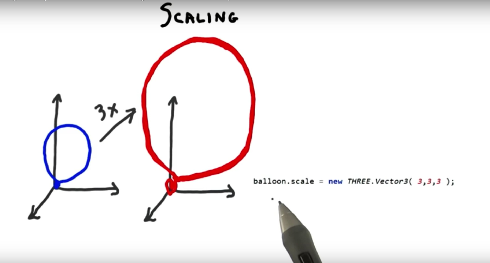

You can scale an object differently along each of the three axes, x, y and z. The code bellow is scaling the object along the y axis, but not the other two. A number less than 1 means you are making the object smaller.

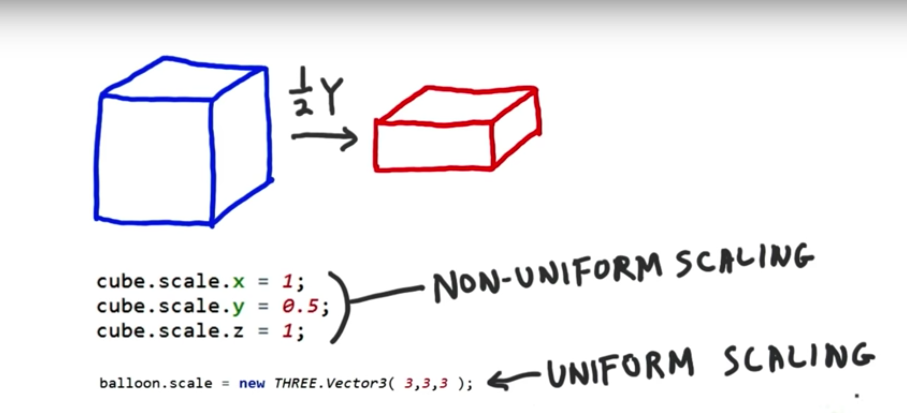

When you scale an object the same amount in all directions, this is called uniform scaling. If the scale varies it's called non-uniform. Uniform scaling does not change any angles within the model itself. Non uniform scaling can modify angles. In other words, the shape of the model itself is changed.

#### Order
When rotations or scales are involved, the order in which they occur matter. ThreeJS uses the following order to apply the transforms on an object. `scale -> rotate -> translate (position)`. It doesn't matter in what order you set the parameters, the above order will always be respected during evaluation. This is the default because it is often the easiest way to produce the results you want. If you have something special in mind you may find it best to transform in a different order. That's possible


**IMPORTANT** : I ThreeJs the object transforms and rotates around the origin, which is the scene origin and not the element center. See the image bellow, the green circle is the scene origin, we add an element to the scene (in this case the wood stick) and its center is centered with scene origin, if we first translate the object, moving it some units up, and afterwards we try to rotate, rotation will be based on the scene origin, causing the wood stick to position at the floor. That i why ThreeJs uses the order of transformation `scale -> rotate -> translate (position)`.

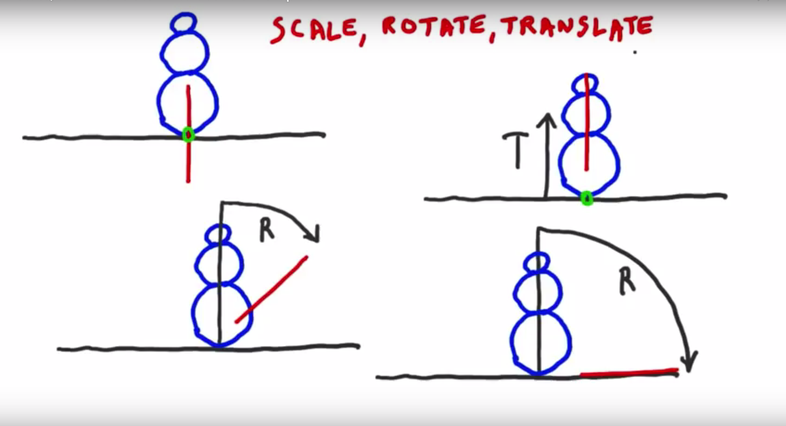


If we want instead to change this order of execution ThreeJs allows us to use an Object3D to wrap any element, see code bellow:

```javascript
var block = new THREE.Mesh(new THREE.BoxGeometry(100, 4, 4), clockMaterial);
block.position.x = 40;

var clockHand = new THREE.Object3D();
clockHand.add(block);

clockHand.rotation.y = -70 * Math.PI / 180;
scene.add(clockHand);
```

Above the block is nested inside the clockHand object. The translation moves the block so that on end is over the center of the clock face so that the hand will rotate around the clock properly. So for the hand, the rotation is still relative to the scene origin, as nothing was added to it, while the block was used to move the handle to the correct position.

### Jargons

Spline: A fancy word for a type of curve. Spline curves are formed by carefully placing a few points, called control points.
