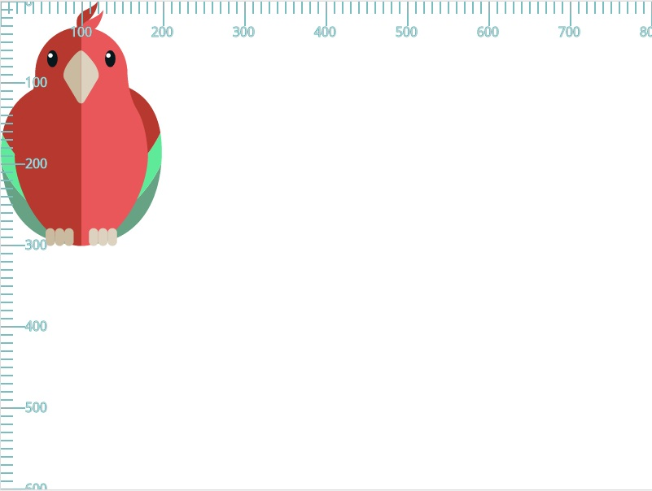
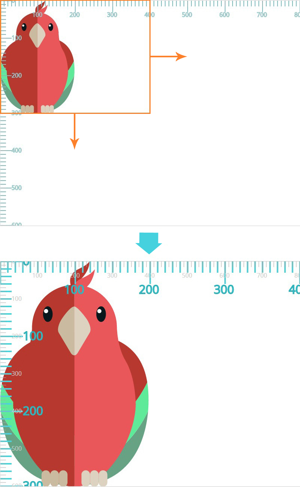
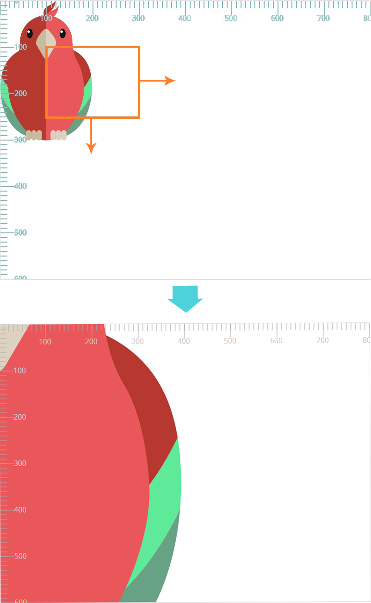
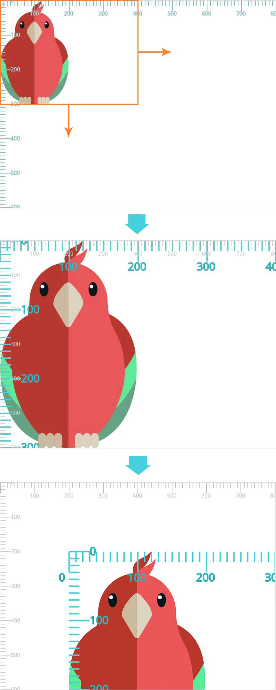
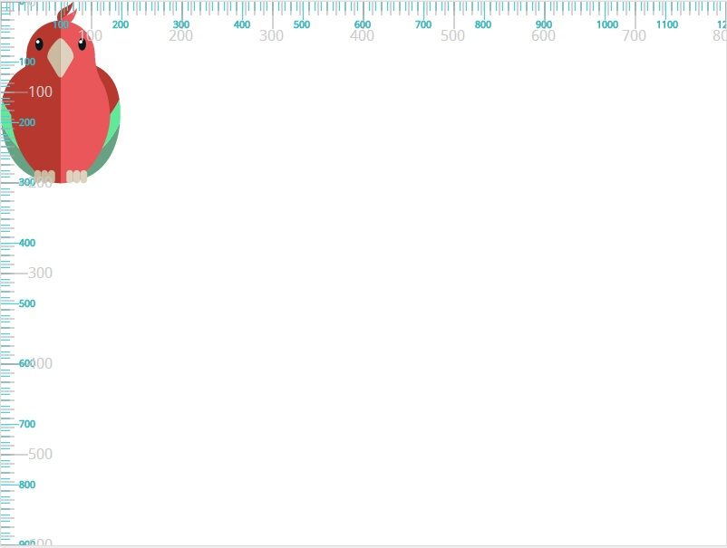
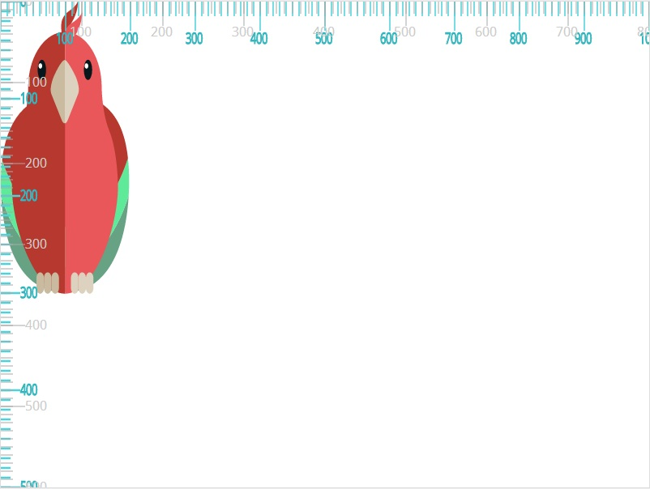
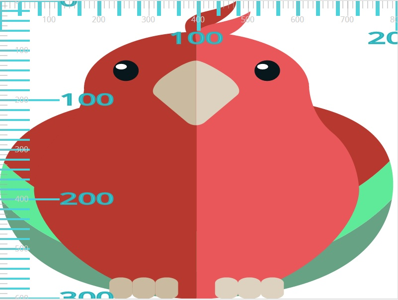

### Notes on Working with SVGs

### Include an SVG with an Image Tag
Since an SVG is really just an image, it can be included on a page just like any other image, using an img tag. This is simple to implement, easy to resize and has the benefit of being cacheable.
There are a couple downsides to this approach, however. You can’t modify the SVG attributes such as fill or stroke; once the icon is included, there isn’t much you can do to change its appearance. Also, each icon you include creates an HTTP request, potentially impacting page load speed.

```html

```


### Add an SVG as a Background Image
Same as using the Image Tag, you can control the size of the svg by changing the width and height of the element containing background image. The downsides are the same too, each background image creates an HTTP request and can impact page load and you are unable to change attributes on the SVG such as fill or stroke.

```html
<i class="icon icon-star"></i>
```
```css
.icon-star {
  background-image: url('path/to/icon.svg');
}
```


### Add an SVG as an Embedded Background Image
This method has an added benefit of not incurring any HTTP requests, as the SVG is simply embedded into the CSS. They can also be resized by changing the width and height of the element containing background image, so it’s easy to create multiple sizes of the same svg using this approach.
One negative to adding the interaction styles is that it requires you to duplicate selectors and the SVG markup; the more icons you have, the larger your stylesheets will become.
Important: You need to urlEncode the content of the svg for browser compatibility.
Remember to specify the content type with `data:image/svg+xml,`

Note: Base-64 encoding is a way of taking binary data and turning it into text so that better transmitted in things like e-mail, HTML etc. but be aware Base64 encoding often increase the size of the image. More info [here](https://en.wikipedia.org/wiki/Base64).

I'd avoid this as much as possible, too many downsides.


```html
<i class="icon icon-star"></i>
```
```css
.icon-star {
  background-image: url('data:image/svg+xml,%3Csvg%20width%3D%2224%22%20height%3D%2224%22%20viewBox%3D%220%200%2024%2024%22%20id%3D%22ic_access_alarm_24px%22%20y%3D%220%22%3E%3Cpath%0A%20%20%20%20%20%20%20%20d%3D%22M22%205.72l-4.6-3.86-1.29%201.53%204.6%203.86L22%205.72zM7.88%203.39L6.6%201.86%202%205.71l1.29%201.53%204.59-3.85zM12.5%208H11v6l4.75%202.85.75-1.23-4-2.37V8zM12%204c-4.97%200-9%204.03-9%209s4.02%209%209%209c4.97%200%209-4.03%209-9s-4.03-9-9-9zm0%2016c-3.87%200-7-3.13-7-7s3.13-7%207-7%207%203.13%207%207-3.13%207-7%207z%22%2F%3E%3C%2Fsvg%3E%0A%20%20');
}
```


### Style SVGs
Any valid css can be applied to an svg and each shape (path) inside it can be styled individually.

With the `fill` property you can specify `fill: currentColor` so it inherits from the parent element. The fill property cascades the color in all elements inside the svg (unless applied to individual element).

```css
.svg {
  width: 1em;
  height: 1em;
  fill: red;
  stroke: black;
  stroke-width: 1px;
}
```


### Structuring, Grouping, and Referencing in SVG
SVG comes with its own ways for structuring a document by means of certain SVG elements that allow us to define, group, and reference objects within the document. These elements make reusing elements easy, while maintaining clean and readable code.

**Grouping with the <g> element**
The ‘g’ in <g> stands for ‘group’. The group element is used for logically grouping together sets of related graphical elements. In terms of graphics editors, such as Adobe Illustrator, the <g> element serves a similar functionality as the Group Objects function. You can also think of a group as being similar to the concept of a layer in a graphics editor, since a layer is also a grouping of elements.
The <g> element groups all of its descendants into one group. It usually has an id attribute to give that group a name. Any styles you apply to the <g> element will also be applied to all of its descendants. This makes it easy to add styles, transformations, interactivity, and even animations to entire groups of objects.

```html
<svg width="1144.12px" height="400px" viewBox="0 0 572.06 200">
    <style>
        svg{background-color:white;}
        #wing{fill:#81CCAA;}
        #body{fill:#B8E4C2;}
        #pupil{fill:#1F2600;}
        #beak{fill:#F69C0D;}
        .eye-ball{fill:#F6FDC4;}
    </style>
    <g id="bird">
        <g id="body">
            <path d="M48.42,78.11c0-17.45,14.14-31.58,31.59-31.58s31.59,14.14,31.59,31.58c0,17.44-14.14,31.59-31.59,31.59
            S48.42,95.56,48.42,78.11"/>
            <path d="M109.19,69.88c0,0-8.5-27.33-42.51-18.53c-34.02,8.81-20.65,91.11,45.25,84.73
            c40.39-3.65,48.59-24.6,48.59-24.6S124.68,106.02,109.19,69.88"/>
            <path id="wing" d="M105.78,75.09c4.56,0,8.84,1.13,12.62,3.11c0,0,0.01-0.01,0.01-0.01l36.23,12.38c0,0-13.78,30.81-41.96,38.09
            c-1.51,0.39-2.82,0.59-3.99,0.62c-0.96,0.1-1.92,0.16-2.9,0.16c-15.01,0-27.17-12.17-27.17-27.17
            C78.61,87.26,90.78,75.09,105.78,75.09"/>
        </g>
        <g id="head">
            <path id="beak" d="M50.43,68.52c0,0-8.81,2.58-10.93,4.86l9.12,9.87C48.61,83.24,48.76,74.28,50.43,68.52"/>
            <path class="eye-ball" d="M60.53,71.68c0-6.33,5.13-11.46,11.46-11.46c6.33,0,11.46,5.13,11.46,11.46c0,6.33-5.13,11.46-11.46,11.46
                C65.66,83.14,60.53,78.01,60.53,71.68"/>
            <path id="pupil" d="M64.45,71.68c0-4.16,3.38-7.53,7.54-7.53c4.16,0,7.53,3.37,7.53,7.53c0,4.16-3.37,7.53-7.53,7.53
                C67.82,79.22,64.45,75.84,64.45,71.68"/>
            <path class="eye-ball" d="M72.39,74.39c0-2.73,2.22-4.95,4.95-4.95c2.73,0,4.95,2.21,4.95,4.95c0,2.74-2.22,4.95-4.95,4.95
                C74.6,79.34,72.39,77.13,72.39,74.39"/>
        </g>
    </g>
</svg>
```

If you were to change the fill color of the #body group, the fill color of all the elements inside the group will change to the color you specify. This is very convenient.

Grouping elements is very useful, not just for organizational and structural purposes. It’s particularly useful for when you want to add interactivity or transformations to an SVG graphic that is made up of several items. You can associate those items together in a group and then define transformations to move, scale, or rotate all the items together so that their spatial relations to one another are maintained.

Grouping makes interactivity, in particular, more convenient. You can attach mouse events to the entire bird and have it respond to the events as a whole group, instead of having to apply the same interactions and/or transformations to every element in that group.

The <g> element has one more important and great feature: it can have its own <title> and <desc> tags that help make it more accessible to screen readers, and overall make the code more readable to humans as well.


### Reusing elements with the <use> element
TLDR: Use `<symbol>` and `<use>` elements together for better reusability. See *Grouping elements with the <symbol> element* bellow.

The `<use>` element takes nodes from within the SVG document, and duplicates them somewhere else.
The effect is the same as if the nodes were deeply cloned into a non-exposed DOM, and then pasted where the use element is, much like cloned template elements in HTML5.

```html
<use x="100" y="100" xlink:href="#bird" />
```
See `xlink:href="#bird"` is the id of the g element previously listed `<g id="bird">`.

Note that you can reference any SVG element inside the `xlink:href` attribute, even if that element is in an external file. The referenced element or group does not have to exist in the same file. This is great for organizing files (for example you could have a file for reusable components) and for caching the used files. If the bird in our example were created in a seperate file called animals.svg for example, we could have referenced it like so:

```html
<use x="100" y="100" xlink:href="path/to/animals.svg#bird" />
```

See `path/to/animals.svg#bird` references to a specific group id inside the animal.svg file.

Drawbacks:

Referencing external SVG in <use> doesn’t work in most versions of IE (up to IE 11), for that use [svg4everybody](https://github.com/jonathantneal/svg4everybody)


The <use> element “copy” of the original element will have the exact same styles as the original element. Whenever you apply any style or transformation changes to the #bird group in the above example, all the copies of the bird will get the same styles and transformations.

You can use an element and apply an independent transformation to it. For example, the following line will reuse the bird, but it will make it half its original size using a scale transformation:
```html
<use x="100" y="100" xlink:href="#bird" transform="scale(0.5)" />
```
However, you cannot override the styles of the original element (such as fill and strokes) on the copy. This means that if you want to create multiple birds or multiple icons (if you’re working with icons) and you want every icon to have a different color, this won’t be possible with the <use> element (unless the original element is defined inside a <defs> element without these styles applied to it.


### Reusing Stored elements with the <defs> element
The **<defs>** element can be used to store content that will not be directly displayed. In other words, the **<defs>** element is used to define elements without directly rendering them. This stored hidden content can then be referenced and displayed by other SVG elements, which makes it ideal for things such as patterns that contain reusable graphics.

So, using **<defs>** we can define an element that we want to use. This element can be anything, ranging from a group of elements like the bird we saw earlier, to a clipping path, mask, or a linear gradient. Basically, anything that we want to define and store away for later use can be defined inside the **<defs>** element, and that element will serve as a **template** for future use, or as a tool that is available for use whenever needed. The template is never rendered, only instances of it are displayed.

> `symbol` elements define new viewports whenever they are instanced by a `use` element.

This feature is great because it allows you to define elements that are independent of the viewport they’re rendered into, hence allowing you to make sure the symbol you’re referencing will always display a certain way inside the viewport.

You need to be familiar with the way the viewBox works, and the values of the `preserveAspectratio` attribute to make the best use of this feature. Chris Coyier wrote an [article](https://css-tricks.com/svg-symbol-good-choice-icons/) explaining why the <symbol> element can be a good choice for icons, and how to use it.


```html
<svg width="500.79px" height="200px" viewBox="0 0 500.79 200">
  <style>
    svg{background-color:white;}
    #wing{fill:#81CCAA;} // these styles won't be overridden by the use tag, so if you want to style it
    #body{fill:#B8E4C2;} // you will have to remove from here
    #pupil{fill:#1F2600;}
    #beak{fill:#F69C0D;}
    .eye-ball{fill:#F6FDC4;}
  </style>
  <defs>
    <g id="bird">
        <!-- ... -->
    </g>
  </defs>
</svg>
```

Defining an element inside the `<defs>` element like that ensures that the bird will not be rendered on the canvas unless it is referenced somewhere it is needed.

All the drawbacks mentioned with the `<g>` element can be avoided using the `<defs>` element.

Now the bird serves as a template for use. We can use it using the <use> element just like we would use any other element.

When you use `<defs>` to reuse an element, you can apply different styles and fill colors to each individual tree, **as long as these styles are not defined on the original tree template**.
If the tree inside `<defs>` has styles applied to it, those styles still won’t be overridden by any new ones. So `<defs>` is great for creating minimal templates and then styling the copies as needed. Without `<defs>`, this wouldn’t be possible with `<use>` alone.


### Grouping elements with the <symbol> element
The `<symbol>` element is similar to the group element `<g>` — it provides a way to group elements together. However, it differs from the group element in two main things:

    - The `<symbol>` element is not rendered. It is actually similar to `<defs>` in this manner. It is only displayed when it is used.
    - A `<symbol>` element can have its own viewBox and preserveAspectRatio attributes. This allows it to fit into the viewport it is rendered into any way you want it to, instead of fitting in the default way.

IMPORTANT: **<symbol> is then mostly suitable for defining reusable elements (or symbols).**
It also serves as a template that is instantiated using the `<use>` element. And having viewBox and preserveAspectRatio attributes, it can scale-to-fit within a rectangular viewport defined by the referencing `<use>` element. Note that symbol elements define new viewports whenever they are instanced by a use element.


### Understanding SVG Coordinate Systems and Transformations

**The viewport, viewBox, and preserveAspectRatio**

The SVG Canvas
The canvas is the space or area where the SVG content is drawn. Conceptually, this canvas is infinite in both dimensions. The SVG can therefore be of any size. However, it is rendered on the screen relative to a finite region known as the viewport. Areas of the SVG that lie beyond the boundaries of the viewport are clipped off and not visible.

**The viewport**
The viewport is the viewing area where the SVG will be visible. You can think of the viewport as a window through which you can see a particular scene. The scene may be entirely or partially visible through that window.
You specify the size of the viewport using the width and height attributes on the outermost <svg> element.

```html
<!-- the viewport will be 800px by 600px -->
<svg width="800" height="600">
    <!-- SVG content drawn onto the SVG canvas -->
</svg>
```

In SVG, values can be set with or without a unit identifier. A unitless value is said to be specified in user space using user units. If a value is specified in user units, then the value is assumed to be equivalent to the same number of “px” units. This means that the viewport in the above example will be rendered as a 800px by 600px viewport. You can also specify values using units. The supported length unit identifiers in SVG are: em, ex, px, pt, pc, cm, mm, in, and percentages.

Once the width and height of the outermost SVG element are set, the browser establishes an initial *viewport coordinate system* and an initial user *coordinate system*.

**The initial coordinate system**
The initial viewport coordinate system is a coordinate system established on the viewport, with the origin at the top left corner of the viewport at point (0, 0), the positive x-axis pointing towards the right, the positive y-axis pointing down, and one unit in the initial coordinate system equals one “pixel” in the viewport. This coordinate system is similar to the coordinate system established on an HTML element with a CSS box model.

The initial user coordinate system is the coordinate system established on the SVG canvas. This coordinate system is initially identical to the viewport coordinate system—it has its origin at the top left corner of the viewport with the positive x-axis pointing towards the right, the positive y-axis pointing down. Using the viewBox attribute, the initial user coordinate system—also known as the current coordinate system, or user space in use—can be modified so that it is not identical to the viewport coordinate system anymore. We’ll talk about modifying it in the next section.

For now, we won’t specify a viewBox attribute value. The user coordinate system of the SVG canvas is identical to that of the viewport.

In the following image, the viewport coordinate system “ruler” is grey, and that of the user coordinate system (the viewBox) is blue. Since they are both identical at this point, the two coordinate systems overlap.


The parrot in the above SVG has a bounding box that is 200 units (200 pixels in this case) in width and 300 units in height. The parrot is drawn on the canvas based on the initial coordinate system.

**The viewBox**
I like to think of the viewBox as the “real” coordinate system. After all, it is the coordinate system used to draw the SVG graphics onto the canvas. This coordinate system can be smaller or bigger than the viewport, and it can be fully or partially visible inside the viewport too.
You specify your own user coordinate system using the viewBox attribute. If the user coordinate system you choose has the same aspect ratio (ratio of height to width) as the viewport coordinate system, it will stretch to fill the viewport area (we’ll talk examples in a minute). However, if your user coordinate system does not have the same aspect ratio, you can use the preserveAspectRatio attribute to specify whether or not the entire system will be visible inside the viewport or not, and you can also use it to specify how it is positioned inside the viewport.
The viewBox attribute takes four parameters as a value: <min-x>, <min-y>, width and height.
`viewBox = <min-x> <min-y> <width> <height>`
The <min-x> and <min-y> values determine the upper left corner of the viewbox, and the width and height determine the width and height of that viewBox. Note here that the width and height of the viewBox need not be the same as the width and height set on the parent <svg> element. A negative value for <width> or <height> is invalid. A value of zero disables rendering of the element.

```html
<!-- The viewbox in this example is equal to the viewport, but it can be different -->
<svg width="800" height="600" viewbox="0 0 800 600">
    <!-- SVG content drawn onto the SVG canvas -->
</svg>

```
Examples:

1. viewBox with aspect ratio equal to the viewport's aspect ratio:
We’ll start with a simple example. The viewbox in this example will be half the size of the viewport. We won’t change the origin of the viewbox in this one, so both <min-x> and <min-y> will be set to zero. The width and height of the viewbox will be half the width and height of the viewport. This means that we’re preserving the aspect ratio.
```html
<svg width="800" height="600" viewbox="0 0 400 300">
    <!-- SVG content drawn onto the SVG canvas -->
</svg>
```

So, what does viewbox="0 0 400 300" exactly do?

    - It specifies a specific region of the canvas spanning from a top left point at (0, 0) to a point at (400, 300).
    - The SVG graphic is then cropped to that region.
    - The region is scaled up (in a zoom-in-like effect) to fill the entire viewport.
    - The user coordinate system is mapped to the viewport coordinate system so that—in this case—one user unit is equal to two viewport units.
The following image shows the result of applying the above viewbox to the <svg> canvas in our example. The grey units represent the viewport coordinate system, and the blue coordinate system represents the user coordinate system established by the viewBox.


Anything you draw on the SVG canvas will be drawn relative to the new user coordinate system.
> I like to visualize the SVG canvas with a viewBox the same way as Google maps. You can zoom in to a specific region or area in Google maps; that area will be the only area visible, scaled up, inside the viewport of the browser. However, you know that the rest of the map is still there, but it's not visible because it extends beyond the boundaries of the viewport—it's being clipped out.

Now let’s try changing the <min-x> and <min-y> values. We’ll set both to 100. They can be any number you want. The width and height ratio will also be the same as width and height ratio of the viewport.

```html
<svg width="800" height="600" viewbox="100 100 200 150">
    <!-- SVG content drawn onto the SVG canvas -->
</svg>
```

The effect of applying viewBox="100 100 200 150" is also a crop effect like the one in the previous example. The graphic is cropped and scaled up to fill the entire viewport area.



Again, the user coordinate system is mapped to the viewport coordinate system—200 user units are mapped to 800 viewport units so that every user unit is equal to four viewport units. This results in a zoom-in effect like the one you can see in the above screenshot.

Also note, at this point, that specifying non-zero values for the <min-x> and <min-y> values has a transformation effect on the graphic; more specifically, it is as though the SVG canvas was translated by 100 units to the top and 100 units to the left (transform="translate(-100 -100)").

To demonstrate the translation transformation even better, let’s try applying negative values (-100) to <min-x> and <min-y>. The translation effect would be then similar to transform="translate(100 100)"; meaning that the graphic will be translated to the bottom and to the right after being cropped and scaled. If were to revisit the second to last example with a crop size of 400 by 300, and then add the new negative <min-x> and <min-y> values, this would be our new code:

```html
<svg width="800" height="600" viewbox="-100 -100 400 300">
    <!-- SVG content drawn onto the SVG canvas -->
</svg>
```

The result of applying the above viewBox transformation to the graphic is shown in the following image:



In this example, we’ll make the viewbox 1.5 times the size of the viewport.
```html
<svg width="800" height="600" viewbox="0 0 1200 900">
    <!-- SVG content drawn onto the SVG canvas -->
</svg>
```




**The preserveAspectRatio Attribute**
The preserveAspectRatio attribute is used to force a uniform scaling for the purposes of preserving the aspect ratio of a graphic.

If you define a user coordinate system with an aspect ratio different from that of the viewport’s, and if the browser were to stretch the viewbox to fit into the viewport as we’ve seen in previous examples, the difference in aspect ratios will cause the graphic to be distorted in either direction. So if the viewbox in the last example were to be stretched to fill the viewport in both directions, the graphic would look like so:


The distortion is also clearly visible (and unwanted, of course) when using a viewbox value of 0 0 200 300, which would be smaller than the dimensions of the viewport. I chose this value in particular so that the viewbox matches the size of the bounding box of the parrot. If the browser were to stretch the graphic to fill the entire viewport, it would look like the so:

The preserveAspectRatio attribute allows you to force uniform scaling of the viewbox, while maintaining the aspect ratio, and it allows you to specify how to position the viewbox inside the viewport if you don’t want it to be centered by default.

The official syntax for preserveAspectRatio is:
`preserveAspectRatio = defer? <align> <meetOrSlice>?`
Fordetail information of its options see this https://sarasoueidan.com/blog/svg-coordinate-systems/#preserveAspectRatio-syntax


### Combine SVG into a SVG Sprite
You can create SVG sprites with npm package `svg-sprite-generator`, with the sprite you can reference each element using the svg `use` tag


### CORS Restrictions
Due to CROS restriction we can't loadSVGs from different domains, we can work around the limitation by including [svgxuse.js](https://github.com/Keyamoon/svgxuse) polifil, it fetches external SVGs referenced in `<use>` elements when the browser itself fails to do so.


```html
<svg class="ICON">
  <use xlink:href="https://some_cdn.com/icons.svg#start" />
</svg>

<script defer src="svgxuse.js"></script>
```


### Optimize SVGs
Just like a bitmap image, you can compress an SVG by removing various pieces of code that aren’t necessary to it rendering properly. This reduces file size & download time, ultimately leading to a faster page load speed.

One way to do that is using the npm module [svgo](https://github.com/svg/svgo)


### References and useful resources
https://egghead.io/courses/create-an-svg-icon-system?utm_source=drip&utm_medium=email&utm_campaign=svg-icon-system&__s=bscdsrbtsiwjx7zmz7b4
https://sarasoueidan.com/blog/structuring-grouping-referencing-in-svg/
https://sarasoueidan.com/blog/svg-coordinate-systems/   
https://css-tricks.com/svg-symbol-good-choice-icons/
https://en.wikipedia.org/wiki/Base64
https://github.com/Keyamoon/svgxuse
https://github.com/svg/svgo
