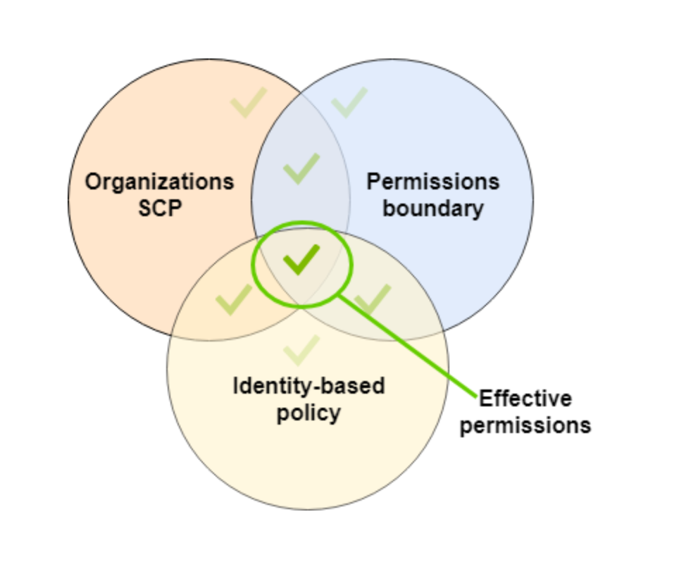
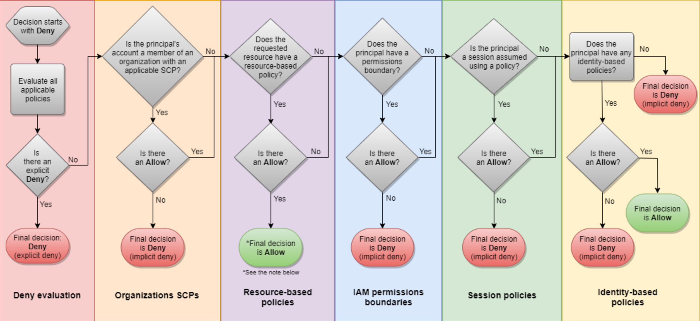
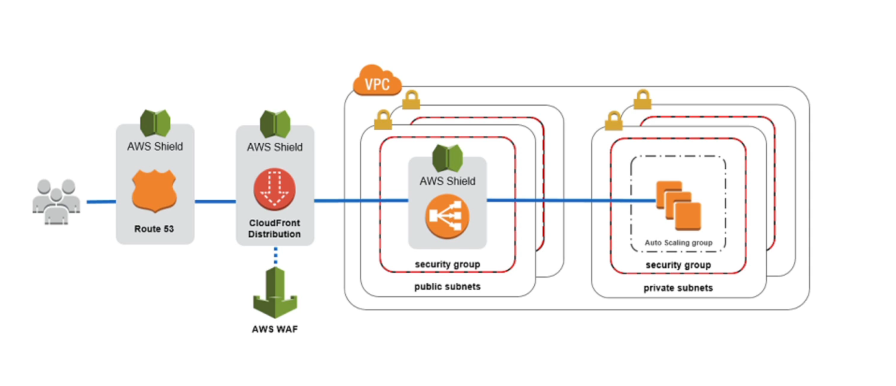

# AWS Developer Associate Certification Notes

# Security

The fundamental patterns for AWS Security.
Control your cloud infrastructure (IAM), control your data (KMS) and control your network (VPC).

1. Permissions Management: AWS Identity and Access Management.
2. Data Encryption: AWS Key Management Service.
3. Network Security Controls: Amazon Virtual Private Cloud (VPC).

**Well-Architected Framework**
The AWS Well-Architected Framework describes the key concepts, design principles, and architectural best practices for designing and running workloads in the cloud. By answering a set of foundational questions.

`Operational Excellence Pillar`
The operational excellence pillar focuses on running and monitoring systems to deliver business value, and continually improving processes and procedures. Key topics include automating changes, responding to events, and defining standards to manage daily operations.

`Security Pillar`
The security pillar focuses on protecting information and systems. Key topics include confidentiality and integrity of data, identifying and managing who can do what with privilege management, protecting systems, and establishing controls to detect security events.

`Reliability Pillar`
The reliability pillar focuses on ensuring a workload performs its intended function correctly and consistently when it’s expected to. A resilient workload quickly recovers from failures to meet business and customer demand. Key topics include distributed system design, recovery planning, and how to handle change.

`Performance Efficiency Pillar`
The performance efficiency pillar focuses on using IT and computing resources efficiently. Key topics include selecting the right resource types and sizes based on workload requirements, monitoring performance, and making informed decisions to maintain efficiency as business needs evolve.

`Cost Optimization Pillar`
The cost optimization pillar focuses on avoiding unnecessary costs. Key topics include understanding and controlling where money is being spent, selecting the most appropriate and right number of resource types, analyzing spend over time, and scaling to meet business needs without overspending.

https://aws.amazon.com/architecture/well-architected/?wa-lens-whitepapers.sort-by=item.additionalFields.sortDate&wa-lens-whitepapers.sort-order=desc

## IAM

Identity Access Management (IAM) is used to define user access permissions within AWS.

**Users**
**Groups**
**Roles** Assigned to AWS services (EC2, Lambdas, S3 etc), they allow access to AWS resources without need to use Key IDs and Secret Keys.
Roles are controlled by policies
You can change a policy on a role and it will take immediately effect.
You can attach and detach a role from ec2 without need to stop (only one role per ec2).

**Policies**
IAM has three types of policies. Inline, Managed and Customer Managed.

**Managed Policies**
A Managed Policy is an IAM policy which is created and administered by AWS.
AWS provide Managed Policies for common use cases based on job function. e.g: AmazonDynamoDBFullAccess, AWSCodeCommitPowerUser etc.
These AWS-provided policies allow you to assign appropriate permissions to your users, groups and roles without having to write the policy yourself.
A single Managed Policy can be attached to multiple users, groups, or roles within the same AWS account `and across different accounts`.
You cannot change the permissions defined in an AWS Managed Policy.

**Inline Policies**
An Inline Policy is a IAM policy which is actually embedded within the user, group, or role to which it applies. There is a strict 1:1 relationship between the entity and the policy.
Once you delete the user, group or role in which the policy is embedded, the policy will also be deleted.

In most cases, AWS recommends using Managed Policies over Inline Policies.

Inline Policies are useful when you want to be sure that the permissions in a policy are not inadvertently assigned to any other user, group, or role than the one for which they're intended.

**Customer Managed Policies**
A Customer Managed Policy is a standalone policy that you create and administer inside your own AWS account. You can attach this policy to multiple users, groups or roles - `but only within your won account`.

In order to create a Customer Managed Policy, you can copy an existing AWS Managed Policy and customize it to fit the requirements of your organization.

Recommended for use cases where the existing AWS Managed Policies don't meet the needs of your environment.

**Policy Structure**
This is known as the PARC model.

```
{
    "Statement": [{
        "Effect": "Allow | Deny",
        "Principal": "principal",                                           // P
        "Action": ["ec2:Describe*", "ec2:action1", "ec2:action2"],          // A
        "Resource": "arn",                                                  // R
        "Condition": {                                                      // C
            "condition": {
                "key": "value"
            }
        }
    }]
}
```

`Effect`: Allow or Deny
`Principal`: Use the Principal element in a policy to specify the principal that is allowed or denied access to a resource. You cannot use the Principal element in an IAM identity-based policy. You can use it in the trust policies for IAM roles and in resource-based policies.
`Action`: The Action element describes the specific action or actions that will be allowed or denied. e.g: `"Action": "sqs:SendMessage"`
`Resource`: The Resource element specifies the object or objects that the statement covers. Statements must include either a Resource or a NotResource element. You specify a resource using an ARN. For more information about the format of ARNs, see IAM ARNs (see ARNs anatomy below).
`Condition`: The Condition element (or Condition block) lets you specify conditions for when a policy is in effect. e.g: `"Condition" : { "StringEquals" : { "aws:username" : "johndoe" }}`
Tip on Conditions: You can point to managed policies. e.g:

```
"Condition": {
    "StringEquals": {
        "iam:PermissionsBoundary": "arn:aws:iam:123...:policy/region-restriction"
    }
}
```

**ARNs Anatomy**
`"Resource": "arn:aws:[service]:[region]:[account]:resourceType/resourcePath"`
e.g: `"Resource": "arn:aws:ec2:us-east-1:123456789012:instance/i-1234567890abcdef0"`
You can specify all instances that belong to a specific account by using the \_ wildcard as follows.
e.g: `"Resource": "arn:aws:ec2:us-east-1:123456789012:instance/*"`
WildCards can be used in any position of the ARN path.
e.g: `"Resource": "arn:aws:ec2:us-east-1:123456789012:*"` or `"Resource": "*"`

**IAM Conditions**
Apply conditions to make IAM policies more restrictive.
Some examples:

The below policy says "deny everything for clients where source IP is not from of the specified range".

```
{
  "Version": "2012-10-17",
  "Statements": {
    "Effect": "Deny",
    "Action": "*",
    "Resource": "*",
    "Condition": {
      "NotIpAddress": {
        "aws:SourceIp": ["203.0.113.0/24"]
      }
    }
  }
}
```

Other conditions:

```
// allow inly when requested region is from us-east-1
"Condition": {
  "StringEquals": {
    "aws:RequestedRegion": ["us-east-1"]
  }
}

// based on tags
"Condition": {
  "StringEquals": {
    "ec2:ResourceTag/Project": "WebApp" // for example restrict ec2:StopInstances for EC2 tagged with Project: WebApp
  }
}

// Force MFA, "deny all actions in all resources if MultiFactorAuthPresent is false"
"Effect": "Deny",
"Action": "*",
"Resource": "*",
"Condition": {
  "BoolIfExists": {
    "aws:MultiFactorAuthPresent": false
  }
}
```

**IAM Roles vs Resource Based Policies**
When assuming a role (user, application or service), you give up your original permissions and take the permissions assigned to the role.
When using a resource based policy, the principal doesn't have to give up his permissions.

**Identities providers**: allows you to manage user identities outside AWS. This is useful if your organization already has its own identity system, such as a corporate user directory. It is also useful if you are creating a mobile app or web application that requires access to AWS resources.When you use an IAM identity provider, you don't have to create custom sign-in code or manage your own user identities. The IdP provides that for you. Your external users sign in through a well-known IdP, such as Login with Amazon, Facebook, or Google. You can give those external identities permissions to use AWS resources in your account. IAM identity providers help keep your AWS account secure because you don't have to distribute or embed long-term security credentials, such as access keys, in your application. IAM Identity Providers is compatible with OpenID and SAML (security assertion markup language).

**STS (Security Token Service)**

AWS Security Token Service (AWS STS) is a web service that enables you to request temporary, limited-privilege credentials for AWS Identity and Access Management (IAM) users or for users that you authenticate (federated users). Credentials are valid frm 900 seconds (15 minutes) tup to a maximum og 3600 seconds (1 hour). Default is 1 hour.

**AssumeRoleWithWebIdentity**
AssumeRoleWithWebIdentity is an API provided by STS. It returns temporary security credentials for users authenticated by a mobile or web application or using a Web ID Provider like Amazon, Facebook, Google etc.
For mobile applications, Cognito is recommended (Cognito makes calls to STS on your behalf).
Regular web applications where you are not using cognito, use the STS assume-role-with-web-identity API.
For example you authenticate users with your own database, then you make a call to STS AssumeRoleWithWebIdentity to fetch temporary credentials and give them to your user.

The response will include an ARN so you can identity the user and also a temporary AccessKeyId and SecretAccessKey.

**Cross Account Access**

Used by creating Cross Account Role "Role For Cross-Account Access" in the production account. Then in the development account you add a Policy to a user or group with Action and Resource as below:

```
{
  "Version": "2012-10-17",
  "Statement": {
    "Effect": "Allow",
    "Action": "sts:AssumeRole",
    "Resource": "arn:aws:iam::PRODUCTION-ACCOUNT-ID:role/MyDevelopersAccess"
  }
}
```

Allows you to work with multiple AWS accounts. For example a different account for development and production.
This is a good practice to reduce risks of a failed configuration and security issues.
Cross account access makes it easier to work productively within a multi-account (or multi-role) AWS environment by making it easy for you to switch roles within the AWS Management Console. You can now sign in to the console using your IAM user name then switch the console to manage another account without having to enter (or remember) another user name and password.

**IAM Policy Simulator**
It is a tool where you can test the effects of your policies before committing them to production.

**IAM Permission Boundaries**
Advanced IAM feature to use a managed policy to set the maximum permissions an IAM entity can get.
IAM Permission Boundaries are supported for users and roles (not groups).
example: If we attach the below to an IAM user we are limiting the user to perform any action in S3, CloudWatch and EC2, anything else will be denied even if there is a explicit policy allowing it.
A Permission Boundary policy is similar to an IAM policy but it is not giving these permissions, it is only allowing the user to have them, the user will need a IAM policy to allow those actions.
use cases:

- Delegate responsibilities to non-administrators within their permission boundaries.
- Allow developers to self-assign policies and manage their own permissions, while making sure they can't escalate their privileges.

```json
{
  "Version": "2012-10-17",
  "Statements": [
    {
      "Effect": "Allow",
      "Action": ["S3:*", "cloudwatch:*", "ec2:*"],
      "Resource": "*"
    }
  ]
}
```

**Policy Evaluation Logic**



NOTES:
Remember the 3 different types of policies.

## Identity Federation

Identity federation is a system of trust between two parties for the purpose of authenticating users and conveying information needed to authorize their access to resources. In this system, an identity provider (IdP) is responsible for user authentication, and a service provider (SP), such as a service or an application, controls access to resources. By administrative agreement and configuration, the SP trusts the IdP to authenticate users and relies on the information provided by the IdP about them. After authenticating a user, the IdP sends the SP a message, called an assertion, containing the user's sign-in name and other attributes that the SP needs to establish a session with the user and to determine the scope of resource access that the SP should grant. Federation is a common approach to building access control systems which manage users centrally within a central IdP and govern their access to multiple applications and services acting as SPs.

Federation can have many flavours:

- SAML 2.0:
  To integrate with Active Directory or other SAML 2.0 compatible services.
  User login with AD, AD return SAML assertion, user invokes STS AssumeRoleWithSAML passing the SAML assertion and STS will return the user's temporary credentials.
  `IMPORTANT`: SAML is the "old-way" of doing this and AWS Single Sign On (SSO) is the new managed simpler way.
- Custom Identity Broker:
  For systems that are not compatible with SAML, in that case you write a custom app to do the identity brokerage, so users authenticates against it and the identity broker make calls to STS to request the temporary credentials that will be given to the user.
- Web Identity Federation with Cognito:
  Users Logins with an Identity Provider (Google, FB, Cognito UP etc).
  The Identity Provider gives the user a token.
  The token is given to Cognito Identity Pool which will get user's temporary credentials from STS.
- Web Identity Federation without Cognito: (Not recommended, Cognito is the recommended way)..
- Single Sign On.
- Non-SAML with AWS Microsoft AD

**Enabling federated AWS access**
You can use two AWS services to federate your workforce into AWS accounts and business applications: AWS Single Sign-On (SSO) or AWS Identity and Access Management (IAM). AWS SSO is a great choice to help you define federated access permissions for your users based on their group memberships in a single centralized directory. If you use multiple directories, or want to manage the permissions based on user attributes, consider AWS IAM as your design alternative. To learn more about service quotas and other design considerations in AWS SSO, see the AWS SSO User Guide. For AWS IAM design considerations, see the AWS IAM User Guide.

**Enabling federated access to your customer-facing web and mobile apps**
You can add federation support to your customer-facing web and mobile applications using Amazon Cognito. It helps you add user sign-up, sign-in, and access control to your mobile and web apps quickly and easily. Amazon Cognito scales to millions of users and supports sign-in with social identity providers, such as Apple, Facebook, Google, and Amazon, and enterprise identity providers via SAML 2.0. (see more on Cognito notes).

## Cognito

Amazon Cognito lets you add user sign-up, sign-in, and access control to your web and mobile apps quickly and easily. Amazon Cognito scales to millions of users and supports sign-in with social identity providers, such as Facebook, Google, and Amazon, and enterprise identity providers via SAML 2.0.

**Cognito and Identity Federation**
Federation allow users from outside AWS to assume temporary role for accessing AWS resources and these users assume identity provided access roles. Federation can have many flavours:
SAML 2.0:
Custom Identity Broker:
Web Identity Federation with Cognito:
Web Identity Federation without Cognito:
Single Sign On.
Non-SAML with AWS Microsoft AD
NOTES:
Cognito uses User Pools to manage user sign-up and sign-in directly or via Web Identity Providers.
Cognito acts as an Identity Broker, handling all interaction with Web Identity Providers.
Cognito uses Push Synchronization to send a silent push notification of user data updates to multiple devices types associated with a user ID.

## SSO (AWS Single Sign-On)

AWS Single Sign-On (SSO) makes it easy to centrally manage access to multiple AWS accounts and business applications and provide users with single sign-on access to all their assigned accounts and applications from one place. With AWS SSO, you can easily manage access and user permissions to all of your accounts in AWS Organizations centrally. AWS SSO configures and maintains all the necessary permissions for your accounts automatically, without requiring any additional setup in the individual accounts. You can assign user permissions based on common job functions and customize these permissions to meet your specific security requirements. AWS SSO also includes built-in integrations to many business applications, such as Salesforce, Box, and Office 365.

## AD (AWS Directory Service)

AWS Directory Service for Microsoft Active Directory, also known as AWS Managed Microsoft Active Directory (AD), enables your directory-aware workloads and AWS resources to use managed Active Directory (AD) in AWS. AWS Managed Microsoft AD is built on actual Microsoft AD and does not require you to synchronize or replicate data from your existing Active Directory to the cloud. You can use the standard AD administration tools and take advantage of the built-in AD features, such as Group Policy and single sign-on.

Microsoft Active Directory is found on Windows Servers with AD service. It is basically a database of user accounts, computers, printer, file shares, security groups etc. It is the centralized security management tools for Microsoft networking. Objects are organized in trees and a group of trees is a forest.

There are three flavours of AD service:

1. AWS Managed Microsoft AD
   You create your on AD in AWS to manage user's locally, supports MFA.
   You create a trust connection with your on-premise AD, this way user's could authenticate against AWS AD or local AD. In this case user's are shared between the two ADs.
2. AD Connector.
   Directory Gateway (proxy) to direct to on premise AD. Here user's are solely managed on the on-premise AD.
3. Simple ID
   AD compatible managed directory on AWS. It doesn't use Microsoft AD but it is compatible.
   It cannot be joined with on-premise AD.
   This is useful when you are creating EC2 instances with Windows and you want to manage them with Simple ID.

## KMS & Encryption

AWS Key Management Service (KMS) makes it easy for you to create and manage cryptographic keys and control their use across a wide range of AWS services and in your applications. AWS KMS is a secure and resilient service that uses hardware security modules that have been validated under FIPS 140-2, or are in the process of being validated, to protect your keys. AWS KMS is integrated with AWS CloudTrail to provide you with logs of all key usage to help meet your regulatory and compliance needs.

Best practice is to have a user with ability to manage the keys but no ability to encrypt and decrypt keys.
And another user with ability to encrypt and decrypt but no ability to manage keys.

Create the Key under IAM Keys menu option, while creating you'll be asked about what group can manage and what group can use the keys. This will create a policy and apply it to the key.

Master Key can never leave the KMS, never exported, if you need to own the master key you need to use AWS CloudHSM service instead of KMS.

KMS Keys are bound to regions.

With KMS you are able to fully manage the keys & policies:

- Create.
- Rotation Policy.
- Disable.
- Enable.
- Able to monitor usage of key using CloudTrail integration.

**Types of Customer Master Keys (CMK)**

- AWS Managed Service Default CMK (free).
- User creates Key in KMS (\$1 per month).
- User Keys imported (when you need to use keys outside AWS too, keys must be 256-bit symmetric) (\$1 key/month)

**Cost**
Besides costs per key above you also have to pay for KMS API calls (\$0.03 / 1000 calls).

**When to use KMS**
Anytime you need to share sensitive information:

- Database passwords.
- Credentials to external service.
- Private key of SSL certificates.

**Limits**
KMS can only encrypt and decrypt 4KB of data per call (if you need to encrypt more data then you need to use envelope encryption).

```javascript
You have exceeded the rate at which you may call KMS. Reduce the frequency of your calls.
(Service: AWSKMS; Status Code: 400; Error Code: ThrottlingException; Request ID: <ID>
```

Symmetric (AES-256 Keys)

- First offering of KMS, single encryption key that is used to encrypt and decrypt.
- AWS services that integrate with KMS use Symmetric CMKs (Customer Master Keys).
- Necessary for envelop encryption.
- You never get access to the key unencrypted (must call KMS API to use).

Asymmetric (RSA % ECC key pairs)

- Public key for encryption and private key for decryption (aka key pair).
- Used for Encrypt/Decrypt, or Sign/Verify operations.
- The public key is downloadable, but you access the Private Key unencrypted.
- Use case: encryption outside AWS by users who can't call the KMS API.

It integrates with more than 50 AWS services.
KMS has two APIs:
`KMS.Encrypt("Some Text")` => SDASRGFDGRTYER...
`KMS.Decrypt("SDASRGFDGRTYER...")` => Some Text

How KMS works under the hood:
For encrypting application data (<= 4KB), it uses envelope encryption.
`KMS.GenerateDataKey` => creates a symmetric data key (plaintext and encrypted).
Uses plaintext data key to encrypt your data then discards it.
Stores encrypted data key alongside your data.
To decrypt: `KMS.Decrypt(encryptedDataKey)` => to get the plaintext data key.
Then decrypt the data with the plaintext symmetric key.
The envelope key is encrypted and decrypted with a master key.

**API calls**
aws kms encrypt
aws kms decrypt
aws kms re-encrypt (re-encrypt takes an already encrypted file, decrypts it on the cloud and re-encrypts it, this way non-encrypted text never has to transmit across the internet)
aws kms enable-key-rotation

**To access KMS**
Make sure key policy allows access.
Make sure IAM policy allows for KMS API call.

**KSM Keys Policies**
Control access to keys, similar to S3 bucket policies.
You cannot control access without them, you must have a KMS key policy to allow access to it always.
Because of that the default KMS policy is very permissive.

- It is created by default if you don't specify a policy.
- It gives complete access to the key to the root user which means entire AWS account access.
- So if a key has the default policy and you need to give access to a user, you just need a IAM policy to give the user access to KMS.

If you define a Custom KMS Policy:

- You need to define which users/roles that can access the KMS key.
- You need to define who manages the key.
- Useful for cross-account access to your KMS key.

**Copying encrypted volumes across regions**
Because KMS keys are region restricted, if you need to move an encrypted volume, let's say EBS, to a different region, you create a snapshot of the volume, which will be encrypted and then copy to the new region specifying the new key that should be used to encrypt it. Then from the new snapshot you create a new volume.

**Copying encrypted snapshots across accounts**

- You have an encrypted snapshot which is encrypted with KMS.
- Attach a KMS key policy to authorize cross-account access.
- Share the encrypted snapshot.
- In the target account create a copy of the snapshot, encrypt it with a KMS key available in your account.

```json
{
  "Sid": "Allow an external account to use this CMK",
  "Effect": "Allow",
  "Principal": {
    "AWS": ["arn:aws:iam::TARGET_ACCOUNT:root"]
  },
  "Action": ["kms:Decrypt", "kms:createGrant"],
  "Resource": "*",
  "Conditions": {
    "StringEquals": {
      "kms:ViaService": "ec2.REGION.amazonaws.com",
      "kms:CallerAccount": "TARGET-ACCOUNT-ID"
    }
  }
}
```

**Envelop Encryption**
Envelop encryption is the process of encrypting your keys.
A master key is used to encrypt the data key (AKA envelop key) and the data key is used to encrypt the data.
When you encrypt your data, your data is protected, but you have to protect your encryption key. One strategy is to encrypt it. Envelope encryption is the practice of encrypting plaintext data with a data key, and then encrypting the data key under another key.

You can even encrypt the data encryption key under another encryption key, and encrypt that encryption key under another encryption key. But, eventually, one key must remain in plaintext so you can decrypt the keys and your data. This top-level plaintext key encryption key is known as the master key.

NOTES:
KMS is under IAM.
KMS is multi-tenant whereas CloudHSM is dedicated hardware.
Encryption Keys are regional (keys have to be in the same AZ region they are used).
Learn the API calls (most questions are here).
To delete a key you have first to disable it, then schedule for deletion with a waiting period between 7 and 30 days.

## SSM (System Management Parameter Store)

Provides secure, hierarchical storage for configuration data management and secrets management. You can store data such as passwords, database strings, Amazon Machine Image (AMI) IDs, and license codes as parameter values. You can store values as plain text or encrypted data. You can reference Systems Manager parameters in your scripts, commands, SSM documents, and configuration and automation workflows by using the unique name that you specified when you created the parameter.

You can create a parameter as:
String, String List and Secure String (which is encrypted using AWS KMS).

**features**

- Secure Storage for configuration and secrets.
- Optional encryption with KMS.
- Serverless, scalable durable and SDK.
- Version tracking of configuration adn secrets.
- Configuration management is done using path and IAM.
- Notifications with CloudWatch events.
- Integration with CloudFront.

**Example of how parameters are stored hierarchically**

```
/my-department/
  my-app/
    dev/
      db-url
      db-password
    prod/
      db-url
      db-password
  ...
...
```

Then when referring a parameter you use a folder structure like: `/my-department/my-app/prod/db-url`

**Standard vs Advanced Tiers**
Total number of parameters: 10K vs 100K.
Max size of parameter value: 4k vs 8K.
Parameter policy available: no vs yes.
Cost: free vs charges apply.
Storage price: free vs \$0.05 per advanced parameter per month.
API interaction price: Standard throughput (free) + higher throughput ($0.05 per 10K calls) vs Standard throughput ($0.05 per 10K calls) + higher throughput (\$0.05 per 10K calls).

**Parameters Policies**
Allow to assign a TTL to a parameter to force updating or deleting sensitive data such as passwords.
Allow to delete a parameter

Some examples:

```json
{
  "Type": "Expiration",
  "Version": "1.0",
  "Attributes": {
    "Timestamp": "2020-12-02T21:34:33.000Z"
  }
}

{
  "Type": "ExpirationNotification", // this would trigger a cloud watch event
  "Version": "1.0",
  "Attributes": {
    "Before": "15",
    "Unit": "Days"
  }
}

{
  "Type": "NoChangeNotification", // this would trigger a cloud watch event
  "Version": "1.0",
  "Attributes": {
    "After": "20",
    "Unit": "Days"
  }
}
```

**Getting parameters with CLI**
Return the specific parameters.
`aws ssm get-parameters --name /my-app/dev/db-url /my-app/dev/db-password --with-decryption`
Returns all parameters under a path.
`aws ssm get-parameters-by-path --path /my-app/dev --with-decryption`
Returns all parameters under a path recursively.
`aws ssm get-parameters-by-path --path /my-app/ --with-decryption --recursive`

`--with-decryption`: will decrypt any encrypted parameter and return it in plain text.

## Secrets Manager

Newer service meant for storing secrets.
Capability to force rotation of secrets every X days.
Automate generation of secrets on rotation (uses Lambda).
Integration with RDS to synchronize secrets between database and Secret Manager.
Secrets are encrypted using KMS.

## Cloud HSM

HSM = Hardware Security Module.
AWS provisions the hardware and you manage your own encryption keys entirely.
Mater keys never leave the hardware.
Hardware is tamper resistant.
CloudHSM clusters are spread across AZs but you must set this up.
Supports both symmetric and asymmetric encryption (SSL/TLS keys).
Must use the CloudHSM client software.
Redshift supports CloudHSM for database encryption and key management.
AWS cannot recover your keys if you loose the hardware credentials.

## AWS WAF

Protects you Web application from common layer 7 (HTTP) exploits.
You can deploy it on ALB, API Gateway and CloudFront.

AWS WAF is a web application firewall that helps protect your web applications or APIs against common web exploits that may affect availability, compromise security, or consume excessive resources. AWS WAF gives you control over how traffic reaches your applications by enabling you to create security rules that block common attack patterns, such as SQL injection or cross-site scripting, and rules that filter out specific traffic patterns you define. You can get started quickly using Managed Rules for AWS WAF, a pre-configured set of rules managed by AWS or AWS Marketplace Sellers. The Managed Rules for WAF address issues like the OWASP Top 10 security risks. These rules are regularly updated as new issues emerge. AWS WAF includes a full-featured API that you can use to automate the creation, deployment, and maintenance of security rules.
With AWS WAF, you pay only for what you use. The pricing is based on how many rules you deploy and how many web requests your application receives. There are no upfront commitments.
You can deploy AWS WAF on Amazon CloudFront as part of your CDN solution, the Application Load Balancer that fronts your web servers or origin servers running on EC2, or Amazon API Gateway for your APIs.

**Web ACL for Rules**
Rules can include IP addresses, HTTP headers and body, or custom URIs.
Also Rate-based rules for DDoS protection.
Also geo-match and size constraints.

## AWS Shield

AWS Shield is a managed Distributed Denial of Service (DDoS) protection service that safeguards applications running on AWS. AWS Shield provides always-on detection and automatic inline mitigation that minimize application downtime and latency, so there is no need to engage AWS Support to benefit from DDoS protection. There are two tiers of AWS Shield - Standard and Advanced.

Deploy to ALB, CLB, Elastic IP, CloudFront.

**Standard**
Free Service that is activated for every AWS customer.
Provides protection from attacks as SYN/UDP Floods, Reflection Attacks and other layer 3/layer 4 attacks.

**Advanced**
Optional DDoS mitigation service (\$3K per month per organization).
Protect against more sophisticated attack on EC2, ELB, CloudFront, AWS Global Accelerator and Route 53.
24/7 access to AWS DDoS response team (DRP).
Protects against higher fees during usage spikes due to DDoS.

## AWS Firewall Manager

To manage rules in all accounts of an AWs Organizations.
Useful o specify common set of security rules.
WAF rules (ALB, API Gateway and CloudFront).
AWS Shield Advanced rules (ALB, CLB, Elastic IP, CloudFront).
Security Groups for EC2 and ENI resources in VPC.



## Amazon Macie

Amazon Macie is a fully managed data security and data privacy service that uses machine learning and pattern matching to discover and protect your sensitive data in AWS.
Macie automatically provides an inventory of Amazon S3 buckets including a list of unencrypted buckets, publicly accessible buckets, and buckets shared with AWS accounts outside those you have defined in AWS Organizations. Then, Macie applies machine learning and pattern matching techniques to the buckets you select to identify and alert you to sensitive data, such as personally identifiable information (PII). Macie’s alerts, or findings, can be searched and filtered in the AWS Management Console and sent to Amazon CloudWatch Events for easy integration with existing workflow or event management systems, or to be used in combination with AWS services, such as AWS Step Functions to take automated remediation actions. This can help you meet regulations, such as the Health Insurance Portability and Accountability Act (HIPAA) and General Data Privacy Regulation (GDPR). You can get started with Amazon Macie with a few clicks in the AWS Management Console.

## STS (Security Token Service)

AWS Security Token Service (AWS STS) is a web service that enables you to request temporary, limited-privilege credentials for AWS Identity and Access Management (IAM) users or for users that you authenticate (federated users).
Tokens are valid for up to 1 hour.
STS exposes loads o APIs being the most important:
`AssumeRole`: Returns a set of temporary security credentials that you can use to access AWS resources that you might not normally have access to. These temporary credentials consist of an access key ID, a secret access key, and a security token. Typically, you use AssumeRole within your account or for cross-account access.
By default, the temporary security credentials created by AssumeRole last for one hour. However, you can use the optional DurationSeconds parameter to specify the duration of your session. You can provide a value from 900 seconds (15 minutes) up to the maximum session duration setting for the role. This setting can have a value from 1 hour to 12 hours.
`AssumeRoleWithSAML`: Return credentials when users logged with SAML (Security Assertion Markup Language is an open standard for exchanging authentication and authorization data between parties, in particular, between an identity provider and a service provider).
`AssumeRoleWithWebIdentity`: Returns a set of temporary security credentials for users who have been authenticated in a mobile or web application with a web identity provider. Example providers include Amazon Cognito, Login with Amazon, Facebook, Google, or any OpenID Connect-compatible identity provider. (AWS recommends against using this and instead use Cognito).
`GetSessionToken`: Returns a set of temporary credentials for an AWS account or IAM user. The credentials consist of an access key ID, a secret access key, and a security token. Typically, you use GetSessionToken if you want to use MFA to protect programmatic calls to specific AWS API operations like Amazon EC2 StopInstances. MFA-enabled IAM users would need to call GetSessionToken and submit an MFA code that is associated with their MFA device.

**How to AssumeRole**

1. Define a IAM Role within your account or cross-account.
2. Define which principal can access this IAM role.
3. Use AWS STS to retrieve credentials and impersonate the IAM Role you have access to (AssumeRole API).
   Temporary credentials will be valid between 15 minutes to 1 hour.

Other APIs: `DecodeAuthorizationMessage`, `GetAccessKeyInfo`, `GetCallerIdentity`, `GetFederationToken`.

## AWS Organizations

AWS Organizations helps you centrally govern your environment as you grow and scale your workloads on AWS. Using AWS Organizations, you can automate account creation, create groups of accounts to reflect your business needs, and apply policies for these groups for governance. You can also simplify billing by setting up a single payment method for all of your AWS accounts. Through integrations with other AWS services, you can use Organizations to define central configurations and resource sharing across accounts in your organization. AWS Organizations is available to all AWS customers at no additional charge.

- Centrally manage policies across multiple AWS accounts
- Govern access to AWS services, resources, and regions
- Automate AWS account creation and management
- Configure AWS services across multiple accounts
- Consolidate billing across multiple AWS accounts

Having multiple accounts allow for different strategies and security across the whole organization. For example you could have an account per department, or per environment (dev, prod). With organizations security is increased because of the account isolation managed by AWS. You can also have different budget strategies etc.
You can configure CloudTrail and CloudWatch to send logs to a central S3 to facilitate management and analysis.

**Organization Unit**
Accounts are organized in Organization Units. Each OU can have multiple accounts and other OU under it.

**Service Control Policies (SCP)**
You can apply permission guardrails on accounts to control which services, actions, and resources can be accessed across accounts in your organization. For example you could disallow public S3 buckets across all Organization Units.
SCPs can be applied at the OU or Account level. When applied to an OU it is applied to all Users and Roles on that organization, including Root account. It will not be applied to Serviced-linked roles.
SCP must have an explicit Allow (it does not allow anything by default).
SCP never applied to the Master Account.
SCPs are inherited across the Organization tree.

Explicit Denies override allows (as per expected IAM behavior).
Let's say we have SCP on a OU level with an explicit deny which restricts the OU to use S3, then we have another SCP applied the Root account of the same OU allowing the use of S3. The account won't be able to use S3 because ANY explicit Deny has priority on the IAM evaluation.

Example use cases:

- Disallow public S3 buckets across all Organization Units.
- Disable services that are not PCI compliance.

**Service-Linked Roles**
Service-linked roles are predefined IAM permissions that allow AWS SSO to delegate and enforce which users have SSO access to specific AWS accounts in your organization in AWS Organizations. The service enables this functionality by provisioning a service-linked role in every AWS account within its organization.

**Migrating Accounts**

1. Remove the member account from the old OU.
2. Send an invite to the new OU.
3. Accept the invite for te new OU.

To migrate the root account of an OU.

1. Migrate or remove all accounts ont hat OU.
2. Delete the organization.
3. Migrate the account as shown above.

NOTES:
Global Service.
The main account is the master account - this cannot be changed.
Other accounts are member accounts.
Member accounts can only be part of one organization (they can be migrated).
Pricing benefits from aggregated usage (volume discount for EC2, S3 etc) is on an organization level.

## RAM (AWS Resource Access Manager)

AWS Resource Access Manager (RAM) is a service that enables you to easily and securely share AWS resources with any AWS account or within your AWS Organization. You can share AWS Transit Gateways, Subnets, AWS License Manager configurations, and Amazon Route 53 Resolver rules resources with RAM.
Many organizations use multiple accounts to create administrative or billing isolation, and to limit the impact of errors. RAM eliminates the need to create duplicate resources in multiple accounts, reducing the operational overhead of managing those resources in every single account you own. You can create resources centrally in a multi-account environment, and use RAM to share those resources across accounts in three simple steps: create a Resource Share, specify resources, and specify accounts. RAM is available to you at no additional charge.

**Shareable Resources**
Amazon VPC
AWS App Mesh
Amazon Aurora
AWS Certificate Manager Private Certificate Authority
AWS CodeBuild
Amazon EC2
Amazon EC2 Image Builder
AWS Glue
AWS License Manager
AWS Resource Groups
Amazon Route 53

Some use cases:
Share VPC subnets to allow all organizations to put their services together in the same subnets. With this users won't share security groups or default VPC, participants are able to manage their own resources and they will not be able to view, modify and delete resources that belong to other participants (although their services might be able to consume other services if allowed by other participants security policies).

# Networking

## VPC

Amazon Virtual Private Cloud (Amazon VPC) lets you provision a logically isolated section of the AWS Cloud where you can launch AWS resources in a virtual network that you define. You have complete control over your virtual networking environment, including selection of your own IP address range, creation of subnets, and configuration of route tables and network gateways. You can use both IPv4 and IPv6 in your VPC for secure and easy access to resources and applications.

There are no additional charges for creating and using the VPC itself. Usage charges for other Amazon Web Services.

Limits:
By default we can have up to 5 VPCs per region, but this can be extended by contacting AWS.
Each VPC can have up to 5 CIDR.
For each CIDR the minimum size is /28 = 16 IPs.
For each CIRD the maximum size is /16 = 65536 IPs.

In a private VPC only private IPs are allowed.
When creating a new VPC make sure the CIDR do not overlap your corporate network to avoid conflicts when connecting networks.

**Subnets**
A VPC can have Private or Public subnets.
When creating a subnet we specify:

1. The VPC it is associated with.
2. The Availability Zone (subnets are tied to specific AZ).
3. The IPv4 CIDR block.

In a subnet 5 IP addresses are reserved and cannot be used (first 4 and last IPs).
IP 1 is for the network address.
IP 2 is for the VPC router.
IP 3 is for mapping to AWS provided DNS.
IP 4 is reserved for future use.
IP last if for network broadcast.

**Components of Amazon VPC?**
Amazon VPC comprises a variety of objects that will be familiar to customers with existing networks:

A `Virtual Private Cloud`: A logically isolated virtual network in the AWS cloud. You define a VPC’s IP address space from ranges you select.

`Subnet`: A segment of a VPC’s IP address range where you can place groups of isolated resources.

`Internet Gateway`: The Amazon VPC side of a connection to the public Internet.

`NAT Gateway`: A highly available, managed Network Address Translation (NAT) service for your resources in a private subnet to access the Internet.

`Virtual private gateway`: The Amazon VPC side of a VPN connection.

`Peering Connection`: A peering connection enables you to route traffic via private IP addresses between two peered VPCs.

`VPC Endpoints`: Enables private connectivity to services hosted in AWS, from within your VPC without using an
Internet Gateway, VPN, Network Address Translation (NAT) devices, or firewall proxies.

`Egress-only Internet Gateway`: A stateful gateway to provide egress only access for IPv6 traffic from the VPC to the Internet.

**Internet Gateway**
Used to connect VPCs to the internet.
It scales horizontally and is Hight Available and redundant.
Must be created separately from VPC and then attached.
a VPC can only be attached to one IGW and vice versa.
IGW is also a NAT for the instances that have a public IPv4.
On their on IGW do not allow internet access and for that we need to edit the subnet's route table.

**Egress Only Internet Gateway**
Egress = out-going.
Only for IPv6.
Similar as a NAT but for IPv6.
Used to allow IPv6 instances to access the internet while not being publicly accessible.
IPv6 has no Private Range like IPv4, and so all IPv6 instances have public address. If you don't want them to be public accessible but need them to access the internet then Egress Only Internet Gateway is used to allow it.
After creating the Egress Only Internet Gateway you need to edit the subnets route tables (::/0 target eigw).

**Route Tables**
By default AWS creates a main route table, best practice is not to use it and instead create separate route tables for the subnets. Once a route table is created than it can be associated with subnets.
For example let's say you have created a new VPC with two public subnets, you have attached a IGW and not you create a new route table and attach them to these subnets, next step is to add the route for the internet, saying that destination 0.0.0/0 will target the IGW. With this instances inside the VPC can now connect to the internet.

**NAT**
Instances in a Public subnet with IGW and route properly configured have access to the internet and can be accessed from the internet, for private subnets we need NAT to allow the instances to access internet while not being accessible from the internet.
AWs has two types of NATs:

1. NAT Gateways.
   - AWS managed NAT, higher bandwidth, better availability, no admin (compared to NAT instance).
   - Pay per hour of usage and bandwidth.
   - NAT is created in a specific AZ and uses EIP.
   - It cannot be used by instances in the same subnet, only instances from other subnets.
   - Requires an Internet Gateway (Private Subnet => NAT => IGT => Internet).
   - %GB of bandwidth with auto scaling to 45GB.
   - No need to manage Security Group.
   - NAT Gateway is resilient only in a single AZ, For High Availability across AZs a NAT Gateway must be created in each AZs.
2. Nat Instances (obsolete not recommended).
   - Allow instances in the private subnet to connect to the internet.
   - Must be launched in a public subnet.
   - Must disable EC@ flag: Source / Destination Check.
   - Must attach an elastic IP to it.
   - The route table must be configured to route traffic from the private subnet to the NAT instance.
   - The EC@ instance Security Group must allow HTTP and HTTPS.
   - This solution doesn't scale and is not Highly Available unless the nat service is behind ELB + ASG and management is harder when compared to NAT Gateways.

**DNS Resolution on VPC**
`enableDnsSupport`: DNS resolution setting.
Default true.
Helps decide if DNS resolution is supported for the VPC.
If True, queries the AWS DNS server at 169.254.169.243.
`enableDnsHostname`: DNS hostname setting.
Default false for newly created VPCs, true by default on Default VPC.
If True, Assign public hostnames to EC2 instances.

Route53: If you use custom DNS domain names in a private Zone in Route 53 you must set both attributes to true.

**VPC Security**
Amazon EC2 security groups can be used to help secure instances within an Amazon VPC. Security groups in a VPC enable you to specify both inbound and outbound network traffic that is allowed to or from each Amazon EC2 instance. Traffic which is not explicitly allowed to or from an instance is automatically denied.

In addition to security groups, network traffic entering and exiting each subnet can be allowed or denied via network Access Control Lists (ACLs).

**Network ACLs**
NACL are like a firewall which control traffic from and to subnet.
Default NACL allows everything outbound and inbound.
One NACL per subnet, new subnets are assigned the default ACL.

To define NACL rules:

1. Rules have a number (1 - 32766) and higher precedence with a lower number. Rules are evaluate from 1 to last and whenever a rule allows or denys the evaluation stops and rule is applied. e.g: Rule 100 allows IP, Rule 200 Deny => IP is allowed.
2. Last rule is "\*"
3. AWs recommends adding rule in steps of 100, in case you need to add more rules in between in the future.
4. Newly create NACL will deny everything.
5. NACL are a great way of blocking a specific IP at the subnet level.

Remember that ephemeral ports outbound must be allowed so the communication is able to reach the requet client in the port their system has started the communication. An ephemeral port is a short-lived transport protocol port for Internet Protocol (IP) communications. Ephemeral ports are allocated automatically from a predefined range by the IP stack software. In practice, to cover the different types of clients that might initiate traffic to public-facing instances in your VPC, you can open ephemeral ports 1024-65535.

**Differences between Security Groups and network ACLs in a VPC**
Security groups in a VPC specify which traffic is allowed to or from an Amazon EC2 instance. Network ACLs operate at the subnet level and evaluate traffic entering and exiting a subnet. Network ACLs can be used to set both Allow and Deny rules. Network ACLs do not filter traffic between instances in the same subnet. In addition, network ACLs perform stateless filtering while security groups perform stateful filtering.

Stateful filtering tracks the origin of a request and can automatically allow the reply to the request to be returned to the originating computer. For example, a stateful filter that allows inbound traffic to TCP port 80 on a webserver will allow the return traffic, usually on a high numbered port (e.g., destination TCP port 63, 912) to pass through the stateful filter between the client and the webserver. The filtering device maintains a state table that tracks the origin and destination port numbers and IP addresses. Only one rule is required on the filtering device: Allow traffic inbound to the web server on TCP port 80.

Stateless filtering, on the other hand, only examines the source or destination IP address and the destination port, ignoring whether the traffic is a new request or a reply to a request. In the above example, two rules would need to be implemented on the filtering device: one rule to allow traffic inbound to the web server on TCP port 80, and another rule to allow outbound traffic from the webserver (TCP port range 49, 152 through 65, 535).

Evaluation Order when request comes from outside:
Inbound request => ACL evaluate inbound rules (subnet level) => Security Group evaluate inbound rules => EC2 responds => Security Group allow outbound of an inbound traffic by default (stateful) => ACL evaluate outbound rules (stateless) => request is out.

Evaluation Order when request starts from instance:
Security Groups evaluates outbound rules => ACL evaluate outbound rules => outside responds => ACL inbound rules are evaluated (stateless) => Security Group allow inbound traffic (stateful).

**CIDR - IPv4**
CIRD (Classless Inter-Domain Routing) are used for Security Groups rules or AWS networking in general.
They help define IP address range.
192.168.0.0/26 = 64 IPS (32 - 26 = 6 = 2 ^ 6 = 64 IPs).

Private IPv4 addresses:
24-bit block 10.0.0.0 – 10.255.255.255 single class A network (very large networks)
20-bit block 172.16.0.0 – 172.31.255.255 16 contiguous class B networks (default used by AWS)
16-bit block 192.168.0.0 – 192.168.255.255 256 contiguous class C networks

All other IP ranges are Public.

**Default VPC**
All new accounts have a default VPC.
New instances are launched into the default VPC if no subnet is specified.
When AWS creates a default VPC the following to set it up for you:

1. Create a VPC with a size /16 IPv4 CIDR block (172.31.0.0/16). This provides up to 65,536 private IPv4 addresses.
2. Create a size /20 default subnet in each Availability Zone. This provides up to 4,096 addresses per subnet, a few of which are reserved for our use.
3. Create an internet gateway and connect it to your default VPC.
4. Create a default security group and associate it with your default VPC.
5. Create a default network access control list (ACL) and associate it with your default VPC.
6. Associate the default DHCP options set for your AWS account with your default VPC.

Instances that you launch into a default subnet receive both a public IPv4 address and a private IPv4 address, and both public and private DNS hostnames.

**VPC Flow Logs and Athena**
Flow logs help you capture information about IP traffic going into your interfaces.
There are three kinds of flow logs:

1. VPC Flow Logs.
2. Subnet Flow Logs.
3. Elastic Network Interface Flow Logs.

Helps to monitor & troubleshoot connectivity issues.
Flow Logs data can go direct to S3 or CloudWatch logs.
When you enable it it will also capture all network information from AWS managed interfaces such as ELB, RDS, ElastiCache, Redshift, Workspace.

Flow log syntax:
`<version> <account-id> <interface-id> <srcaddr> <dstaddr> <srcport> <dstport> <protocol> <packets> <bytes> <start> <end> <action> <log-status>`

srcaddr, dstaddr: help identity problematic IPs.
srcport, dstport: help identify problematic Ports.
action: success or failure of the request due to Security Group / ACL rules.

Logs are also useful for analytics on usage patterns, or malicious behavior.
Tools to query Flow Logs are Athena and CloudWatch Logs Insights.

**Bastion Hosts**
Hosts which are placed in a public subnet. Usually used to give access to private instances or expose private services. A Bastion host must have a security group very strict.
A bastion host is a special-purpose computer on a network specifically designed and configured to withstand attacks. The computer generally hosts a single application, for example a proxy server, and all other services are removed or limited to reduce the threat to the computer.
E.g: A Bastion Host which is used to allow SSH to private instances for a specif ID. In The Security Group make sure only port 22 is allowed and from the specific IP address.
The best practice is to use the ssh-agent forwarding instead of storing the target machine's private key on the bastion host. You must use the ssh-agent forwarding even if you are using the same key-pair for both bastion and target instances.

**VPC Peering**
Connects two VPCs privately using AWS network making them behave as if they were in the same network.
Obviously there can't be overlapping CIDR.
If VPC-A is connected to VPB and VPC-B is connected to VPC-C, VPC-A and VPC-C are not connected because VPC Peering connections are not transitive.
VPC Peering can be established between different accounts.
VPC Peering works inter-region and cross-account.
IMPORTANT: When Peering a VPC, for each subnet we want to communicate, we need to update the route tables in each subnet to ensure instances can communicate.
You can reference a security group of a peered VPC. For example if in your VPC peered you want to allow just port 80 access from the peered VPC.

**VPC PrivateLink (AKA VPC Endpoint Services)**
This is an alternative to VPC Peering, most secured and scalable to expose a service to 1000s of VPCs (own or other accounts).
The solution does not required VPc Peering, IGW, Nat, Route Tables etc.
The VPC PrivateLink will link a load balancer in one VPC to a Elastic Network Interface in another VPC.

**VPC Endpoints**
A VPC endpoint enables you to privately connect your VPC to supported AWS services and VPC endpoint services powered by AWS PrivateLink without requiring an internet gateway, NAT device, VPN connection, or AWS Direct Connect connection.
VPC Endpoints scale horizontally and are redundant.

Two kinds of endpoints:

1. `Interface`: Provisions an ENI (private IP address) as an entry point (must attach security group) - connects to most AWS services.
2. `Gateway`: Provisions a target and must be used in a route table. Needed for S3 and DynamoDB.

In case of issues:

- Check DNS setting resolution in you VPC.
- Check route tables (if using Gateway).
- When using Interface, to use private DNS names, make sure `enableDnsSupport` and `enableDnsHostname` are enabled.

IMPORTANT: Once a VPC endpoint is configured and you want to run AWS CLI commands, make sure you run the command specifying the right region, by default AWS CLI will run on us-east-1 and if your VPC Endpoint was configured for another region the command will fail. e.b: `aws s3 ls --region eu-west-1`.


**Virtual Private Gateway (VGW)**
It is a VPN concentrator on the AWS side of the VPN connection.
VGW is created and attached to the VPC for which you want to stablish the Site-to-Site VPN connection.
Possibility to customize the ASN.

**Site-to-Site VPN**
To connect your on-premise network to AWS VPC.

1. Create a Customer Gateway on the on-premise network.
2. Create in VPC settings a Customer Gateway with the information about the real Customer Gateway including IP etc. If the customer gateway is behind a NAT you need to use the NAT's IP and the NAT must be a NAT-T
3. Create a VPN Gateway and attach it to the VPC.
4. Between the Customer Gateway and the VPN Gateway configure a Site-to-Site VPN connection.
   1. Choose the Virtual Private Gateway.
   2. Choose the Customer Gateway.
   3. For routing option choose dynamic or static.
5. Download the VPN connection to configure the on-premise VPN/gateway

**Direct Connect**
A physical connection (network link). Takes around 1 months to be put in place.
Using AWS Direct Connect, you can establish private connectivity between AWS and your on-premise network, which in many cases can reduce your network costs, increase bandwidth throughput, and provide a more consistent network experience than Internet-based connections.
Once the link between AWS and on-premise is live then you need to setup a Virtual Private Gateway on your VPC.
Direct Connect will allow us to access both public resources such as S3 and private (EC2) on the same connection.
It supports both IPv4 and IPv6.

Two types of connections:

1. Dedicated Connections: 1GB/s or 10GB/s capacity (Physical Ethernet Port dedicated to you).
   For this you need to first contact AWS, then request the connection with an AWS Direct Connection Partner.
2. Hosted Connections: 50MB/s, 500MB/s up to 10GB/s.
   The connection request are made via AWS Direct Connection Partners.
   Can add or remove capacity on demand.

Date in-transit is not encrypted (although in a private network).
Combine Direct Connect + VPN to ensure a IPsec-encrypted private connection.

Use cases:

- When you need to increase bandwidth throughput - working with large datasets - could lower costs.
- Need more consistent networking experience for apps using real-time data feeds.
- Hybrid environments.

**Direct Connect Gateway**
In case you want to connect your on-premise network with multiple VPCs (same account but different regions).
A Direct Connect Gateway is non-transitive, it won't peer the VPCs, for that you still need VPC Peering.

**VPN CloudHub**
To connect multiple VPN connections and stablish a peering between them. Let's say you hav 3 offices, each office connects to AWs using VPN, you can connect all these VPNs using VPN CloudHub and peering between the offices is established. It is a low cost hub-and-spoke model for primary and secondary network connectivity between locations.

**Transit Gateway**
Used to simplify complex multi-VPN and peering network topology. For example VPC-A is peering with VPC-B and VPC-B is peering with VPC-C, with this setup VPC-A is not peering with VPC-C unless we add another Peer connection. Now scale this to 100's of VPCs and VPNs.
Transit Gateway allows you to use a single gateway to connect multiple VPCs and VPNs instead of configuring a direct VPN or Peering connection between each VPC/Gateway.
It is a regional resource but can be configured cross-region.
Can be shared across accounts using Resource Access Manager (RAM).
You can peer Transit Gateways across regions.
Using the Route Tables defined in the Transit Gateway you can configure which VPN can talk to each other.
Supports IP Multicast (which is not supported by any other AWS service).

# Compute and Related Storage

## Auto Scaling Group

An Auto Scaling group contains a collection of Amazon EC2 instances that are treated as a logical grouping for the purposes of automatic scaling and management. An Auto Scaling group also enables you to use Amazon EC2 Auto Scaling features such as health check replacements and scaling policies. Both maintaining the number of instances in an Auto Scaling group and automatic scaling are the core functionality of the Amazon EC2 Auto Scaling service.

The size of an Auto Scaling group depends on the number of instances that you set as the desired capacity. You can adjust its size to meet demand, either manually or by using automatic scaling.

An Auto Scaling group starts by launching enough instances to meet its desired capacity. It maintains this number of instances by performing periodic health checks on the instances in the group. The Auto Scaling group continues to maintain a fixed number of instances even if an instance becomes unhealthy. If an instance becomes unhealthy, the group terminates the unhealthy instance and launches another instance to replace it. For more information, see Health checks for Auto Scaling instances.

You can use scaling policies to increase or decrease the number of instances in your group dynamically to meet changing conditions. When the scaling policy is in effect, the Auto Scaling group adjusts the desired capacity of the group, between the minimum and maximum capacity values that you specify, and launches or terminates the instances as needed. You can also scale on a schedule.

When instances are launched, if you specified multiple Availability Zones, the desired capacity is distributed across these Availability Zones. If a scaling action occurs, Amazon EC2 Auto Scaling automatically maintains balance across all of the Availability Zones that you specify.

It is possible to scale a ASG with CloudWatch alarms. An alarm monitors a metric and metrics are computed for the overall ASG instances. Based on the alarm we can:

- Create scale-out policies to increase the number of instances.
- Create scale-in policies to decrease the number of instances.

**AutoScale rules**

- Target Average CPU Usage.
- Number of requests on a ELB.
- Average Network In.
- Average Network Out.

We can auto auto scale based on custom metrics, e.g: number of connected users. For doing that we:

1. Send the custom metric from EC2 to CloudWatch.
2. Create a CloudWatch Alarm to react to low/hight values.
3. Use the CloudWatch Alarm as the scaling policy for ASG.

**AutoScale Policies**
Dynamic scaling policies types:

1. Target Tracking Scaling
   Most simple and easy to setup. e.g: I want the average ASG CPU to stay around 40%. Then the ASG will scale out/in to maintain this.

2. Simple / Step Scaling
   Reacts to CloudWatch Alarms. e.g: When the average memory use goes beyond 60% scale out. When average memory goes below 40% scale in. Here we can also specify how many units (instances) we want per increment/decrement step.

3. Scaling based on Amazon SQS
   Reacts in response to changes in system load in an Amazon Simple Queue Service (Amazon SQS) queue.

4. Scheduled Actions
   Useful when you know in advance what the usage pattern might be so you want to anticipate things. e.g: You know that around 8 am and 17pm daily you need to increase the capacity by 10 instances for two hours to serve all traffic without degrading performance.

**CoolDown**
ASG have the cooldown period which helps to ensure that your ASG doesn't launch or terminate new instances before the previous scaling activity takes effect.
In addition to default cooldown we can create customs that apply to a specific scaling policy.
A scaling-specific cooldown period overrides the default cooldown period.
One common use for scaling-specific cooldowns is with a scale-in policy - a policy that terminates instances based on a specific criteria or metric. Because this policy terminates instances, Amazon Ec2 Auto Scaling needs less time to determine whether to terminate additional resources.

If the default cooldown period of 300 seconds is too long - you can reduce costs by applying a scaling-specific cooldown period of 180 seconds to the scale-in policy.

If your application is scaling up and down multiple times each hour, modify the Auto Scaling Groups cool-down timers and the CloudWatch Alarm Period that trigger the scale in.

**ASG Termination Rules**

1. Find the AZ which has the most numbers of instances.
2. Find the AZ with more instances then terminate from this AZ.
3. If there are multiple AZ with same number of instances then terminate from the AZ with the oldest launch configuration.

ASG tries to balance the number of instances across all AZs.

**ASG LifeCycle Hooks**
By default as soon as an instance is launched in a AZ it is considered "in-service".
Lifecycle hooks enable you to perform custom actions by pausing instances as an Auto Scaling group launches or terminates them. When an instance is paused, it remains in a wait state either until you complete the lifecycle action using the complete-lifecycle-action command or the CompleteLifecycleAction operation, or until the timeout period ends (one hour by default).
For example, let's say that your newly launched instance completes its startup sequence and a lifecycle hook pauses the instance. While the instance is in a wait state, you can install or configure software on it, making sure that your instance is fully ready before it starts receiving traffic. For another example of the use of lifecycle hooks, let's say that when a scale-in event occurs, the terminating instance is first deregistered from the load balancer (if the Auto Scaling group is being used with Elastic Load Balancing). Then, a lifecycle hook pauses the instance before it is terminated. While the instance is in the wait state, you can, for example, connect to the instance and download logs or other data before the instance is fully terminated.
The stages are:
Launching LifeCycles: `Pending` => `Pending Wait (here you to things you need)` => `Pending:Proceed` => `InService`
Terminating LifeCycles: `Terminating` => `Terminating:Wait(here you to things you need)` => `Terminating:Proceed` => `Terminated`.

**ASG Launch Templates and Launch Configuration**
Both allows you to define AMI, instance type, key pair, security groups, and other parameters used on EC2.
Launch Templates:
Is the latest feature and should be used.
Launch Templates allows for versioning.
Create parameter subsets (partial configuration for re-use and inheritance).
Provision using both On-Demand and Spot instances (or a mix).

Launch Configuration:
Legacy (use is not recommended).
Must be re-created every time.

NOTES:
ASGs use Launch configurations or Launch templates.
IAM roles attached to an ASG will get assigned to EC2 instances.
Remember AutoScale Policies.

## EC2

eg. X1: Memory Optimise (large amounts of memory): eg: SAP, Apache Spark
use mnemonic: FIGHT DR McPX.

1. F = FPGA
2. I = IOPS
3. G = Graphcs
4. H = Hight Disk Throughput
5. T = Cheap general purpose
6. D = Density
7. R = RAM
8. M = Main choice for general purpose
9. c = Compute
10. P = Graphcs (think Pics)
11. X = eXtreme Memory

1) On Demand.
2) Reserved (cheaper but require contract1 or 3 years).
3) Spot (bid for): You place a bid and While the price is within your bid you are provisioned instances, when it goes up your instances are terminated, if the instance is terminate because the spot price went up you won't be charged for partial hour, you are charge for partial hour if you terminate the instance(s) yourself (\*popular question).
4) Dedicated Hosts (physical server dedicated to your use).Remember EC2 instance Types use cases (see docs folder).

**User Data (running scripts etc)**
You can specify user data to configure an instance or run a configuration script when the instance is first launched. If you launch more than one instance at a time, the user data is available to all the instances in that reservation. These scripts run with a root user.

**Placement Groups**
When you launch a new EC2 instance, the EC2 service attempts to place the instance in such a way that all of your instances are spread out across underlying hardware to minimize correlated failures. You can use placement groups to influence the placement of a group of interdependent instances to meet the needs of your workload. Depending on the type of workload, you can create a placement group using one of the following placement strategies:

`Cluster` – packs instances close together inside an Availability Zone. This strategy enables workloads to achieve the low-latency network performance necessary for tightly-coupled node-to-node communication that is typical of HPC applications. Instances sit in the same hack and achieve 10Gbps network between then, ideal for Big Data jobs that need to complete fast and applications that need extreme low latency and hight netwrork throughput.

`Spread` – strictly places a small group of instances across distinct underlying hardware to reduce correlated failures. Instances can span across multiple AZs and hacks. This brings reduced risk of simultaneous failures. The is a limit of 7 instances per AZ per placement group. Ideal for applications that need to maximize high availability.

`Partition` – spreads your instances across logical partitions such that groups of instances in one partition do not share the underlying hardware with groups of instances in different partitions. When using partition placement groups, Amazon EC2 divides each group into logical segments called partitions. Amazon EC2 ensures that each partition within a placement group has its own set of racks. The difference from spread partition is that here we can have up to 7 partitions per AZ and up to 100s of EC2 instances. This strategy is typically used for distributed big data applications with large distributed and replicated workloads, such as Hadoop, Cassandra, and Kafka.

**Elastic IP Address**
An Elastic IP address is a static IPv4 address designed for dynamic cloud computing. An Elastic IP address is associated with your AWS account. With an Elastic IP address, you can mask the failure of an instance or software by rapidly remapping the address to another instance in your account.

An Elastic IP address is a public IPv4 address, which is reachable from the internet. If your instance does not have a public IPv4 address, you can associate an Elastic IP address with your instance to enable communication with the internet. For example, this allows you to connect to your instance from your local computer.

When you associate an Elastic IP address with an instance, it is also associated with the instance's primary network interface. When you associate an Elastic IP address with a network interface that is attached to an instance, it is also associated with the instance.

To ensure efficient use of Elastic IP addresses, AWS imposes a small hourly charge if an Elastic IP address is not associated with a running instance, or if it is associated with a stopped instance or an unattached network interface. While your instance is running, you are not charged for one Elastic IP address associated with the instance, but you are charged for any additional Elastic IP addresses associated with the instance.

**Elastic Network Interfaces**
ENIs are logical components in a VPC that represents a virtual network card.

An ENI can have the following attributes:

1. Primary private IPv4 and one or more secondary IPv4.
2. One Elastic IP (IPv4) per private IPv4.
3. One public IPv4.
4. One or more IPv6 addresses
5. One or more Security Groups.
6. A MAC address.
7. A source/destination check flag.
8. A description.

You can create ENIs independently and attach/move them on the fly on EC2 instances failover.
ENIs are bound to specific availability zones.

Why multiple ENIs? A single EC2 instance can now be attached to two (or more) ENIs, each one on a distinct subnet. The ENI (not the instance) is now associated with a subnet.
Similar to an EBS volume, ENIs have a lifetime that is independent of any particular EC2 instance. They are also truly elastic. You can create them ahead of time, and then associate one or two of them with an instance at launch time. You can also attach an ENI to an instance while it is running (we sometimes call this a “hot attach”). Unless the Delete on Termination flag is set, the ENI will remain alive and well after the instance is terminated. We’ll create a ENI for you at launch time if you don’t specify one, and we’ll set the Delete on Terminate flag so you won’t have to manage it. Net-net: You don’t have to worry about this new level of flexibility until you actually need it.

You can put this new level of addressing and security flexibility to use in a number of different ways, for example: Management Network / Backnet, Multi-Interface Applications, MAC-Based Licensing, Low-Budget High Availability (Attach a ENI to an instance; if the instance dies launch another one and attach the ENI to it. Traffic flow will resume within a few seconds).

**EC2 Stop, Terminate and Hibernate**
`Stop`: When we stop the instance if shut down and the data on EBS is kept intact, when this instance restarts then the server will bootstrap again, OS will load, app will fire etc.
`Hibernate`: When we hibernate an instance all the memory state is preserved, this means when this instance if restarted the bootstrap is much faster because the OS, app etc are "already in memory". Under the hood the RAM state is written to a file on the root EBS volume and brought back to memory when the instance restarts. (not supported with all instance types, mostly by Cs, Ms and Rs types, memory sze must be less than 150GB, supported by a few AMIs and root volume must be EBS, encrypted and large enough to support the dump of the memory). An instance cannot hibernate longer than 60 days.
`Terminate`: When we terminate an instance any EBS (root) volume is also destroyed.

NOTES:
Remember mnemonic FIGHT DR McPX and what they refer to.
Remember Pricing models.
EC2 are billed by the second.
When SSH if the error is permission: the issue is probably with the ssh key
When SSH is the error is timeout: the issue is probably with the Security Group.
Security Groups can reference other Security Groups.
You can customize the instance using User Data to run scripts etc.

## EBS (Elastic Block Storage)

You can create storage volumes and attach them to EC2 instances. EBS volumes are loosely coupled to EC2 instances, can attache and detach except for the root volume.

**AWS Block Storages**:

**Instance Types**
These are direct attached volumes that can be SSD or HDD. The instance store is ideal for temporary storage, because the data stored in instance store volumes is not persistent through instance stops, terminations, or hardware failures.

Characteristics:

- Local to instance (they are inside the same physical host).
- Non-persistent data store, if you stop the instance the storage is gone (if you reboot it is preserved).
- Data not replicated (by default).
- No snapshot support.
- SSD or HDD.

For data you want to retain longer, or if you want to encrypt the data, use Amazon Elastic Block Store (Amazon EBS) volumes instead. EBS volumes preserve their data through instance stops and terminations, can be easily backed up with EBS snapshots, can be removed from one instance and reattached to another, and support full-volume encryption.

**EBS Types**
EBS is a block storage as a service, you create and attach volume through an API and the `service is accessed through the network`. Think of an EBS volume as a storage which is distributed over a number of different machines, this is what gives it it's high availability and durability.

Characteristics:

- The lifecycle of the storage is separated from the instance.
- Data is persisted if you stop the instance it is attached to.
- You can easily detach and attach to other instance.
- A EBS volume can only be attached to a single instance but an instance can have multiple EBS volumes attached.
- The max IOPS a instance can do is 80K so EBS volumes max is also 80K.

**EBS SSD-backed Volumes**

1.  General Purpose SSD(GP2) (Ideal when <= 10K IOPS is needed):

- Consistent baseline performance of 3 IOPS/GB (minimum 100 IOPS) to a maximum of 16,000 IOPS.
- Up to 250 MB/s of throughput per volume. GP2 volumes smaller than 1 TB can also burst up to 3,000 IOPS.
- 99.8% - 99.9% durability.
- Volume size is 1 GB - 16 TB.
- Great for boot volumes, low-latency applications and bursty databases.

2.  Provisioned IOPS SSD(IO1) (Ideal when >= 16K IOPS is needed):

- Max 64K IOPS per volume,
- Up to 1,000 MB/s of throughput per volume.
- 99.8% - 99.9% durability.
- Volume size is 4 GB - 16 TB.

**EBS HDD-backed Magnetic**

1.  Throughput Optimized HDD (ST1) (cannot be a boot volume): Ideal for big data, data warehouse, log processing.
2.  Cold HDD (SC1) (cannot be a boot volume): Lowest cost storage for infrequently accessed workloads.
3.  Magnetic: Previous generation (can be used for boot).

**How do I choose the Volume Type?**
The best way to decide is asking:

1. `What is more important for your workload, IOPS or Throughput?`.
   a. If IOPS and you need more than 80K IOPS, choose SSD.
   b. If is less than 80K IOPS, the the question is `What latency you need?`
   c. If is < 1ms then choose SSD.
   d. If the application is Ok with single digit latency then `Choose between cost and performance`.
   e. If cost, choose `gp2`.
   f. If performance, choose `io1`.
   g. If throughput, then ask `Is it a small/random IO or large/sequential IO?`
   h. If small/random then ask again question d above.
   i. If large/sequential then the next question is `What throughput is needed, more or less than than 1750MB/s?`
   j: If greater then choose d2 type volume.
   k: If less then `Choose between cost and performance`.
   l: If performance then choose st1.
   m: If cost then choose sc1.
   (see screenshot for a map).

**Security and Encryption**
EBS integrates with KMS and uses Customers Master Key. With that encrypted volumes imply that:

1. Data at rest is encrypted.
2. Data moving between volume and instance is encrypted.
3. Snapshots are encrypted.
4. Volumes created from such snapshots are encrypted.

**EBS RAID**
RAID allows you to increase IOPS and redundancy past what AWS provides for single volumes.
RAID is possible through the Operational System using EBS volumes mounted in the instance.
RAID5 and RAID6 are not recommended for EBS volume because the parity write operations of these RAID modes consume some of the IOPS available to your volumes.

RAID 0: To increase performance but more risky, consists of striping, but no mirroring or parity. Compared to a spanned volume, the capacity of a RAID 0 volume is the same; it is the sum of the capacities of the drives in the set. But because striping distributes the contents of each file among all drives in the set, the failure of any drive causes the entire RAID 0 volume and all files to be lost. Use case: You need loads of IOPS but doesn't care much in case of data loss (have in mind that EBS have 99.8 and above durability).

RAID 1: To increase fault tolerance. It consists of data mirroring, without parity or striping. Data is written identically to two or more drives, thereby producing a "mirrored set" of drives.

RAID 10: Also called RAID 1+0 and sometimes RAID 1&0, is similar to RAID 1 with an exception that two used standard RAID levels are layered in the opposite order; thus, RAID 10 is a stripe of mirrors. You have a RAID 0 of two RAID 1s, which gives both performance boost and increased fault tolerance.

NOTES:
Remember EBS volume types.
You can encrypt the root device volume (the volume the OS is installed) using OS level encryption (which is not ideal) or instead you can encrypt the root device volume by first taking a snapshot of a volume, and then creating a copy of that snap with encryption. You can then make an AMI of this snap and deploy the encrypted root device volume in with a new instance. You can also encrypt additional attached volumes using console, CLI or API.
Two Different caching strategy: LazyLoading and Write Through.
Avoid stale data by implementing TTL.
IOPS measures the number of read and write operations per second, while throughput measures the number of bits read or written per second.
You can change the volume type anytime.
You can enforce that all EBS volumes are encrypted by activating the account level encryption option, this ways user's won't be able to launch EBS volumes that are not encrypted.

PRO NOTE:
You can use snapshots tags to perform create very specific Policie,s for example you could allow a user to be able to read only snapshots tagged app_name=api stage=production or maybe restrict the number of people that can delete a specific snapshot etc.

## EFS

Amazon Elastic File System (Amazon EFS) provides a simple, scalable, fully managed elastic NFS (Network File System) file system for use with AWS Cloud services and on-premises resources. It is built to scale on demand to petabytes without disrupting applications, growing and shrinking automatically as you add and remove files, eliminating the need to provision and manage capacity to accommodate growth.
Amazon EFS offers two storage classes: the Standard storage class, and the Infrequent Access storage class (EFS IA). EFS IA provides price/performance that's cost-optimized for files not accessed every day. By simply enabling EFS Lifecycle Management on your file system, files not accessed according to the lifecycle policy you choose will be automatically and transparently moved into EFS IA. The EFS IA storage class costs only \$0.025/GB-month\*.

**Types**

1. General Purpose (default): Best for latency sensitive use cases (web server, cms etc).
2. Max I/O: Higher latency but more throughput, highly parallel. Best for big data, media processing.

**Storage Tiers**

1. Standard: For frequently accessed files.
2. Infrequent Access (EFS-IA): costs to retrieve files but has a lower price for storage.

NOTE:
Biggest difference with EBS is that EFS works with multi AZ.
EFS allows multiple instances to be attached to the volume at the same time.
It is 3x more expensive than gp2.
EFS required Security Groups, so security is in the network level. You have to allow NFS type inbound on port 2049.
It uses the NFSv4.1 protocol.
Only compatible with Linux.
Encrypt at rest with KMS.
EFS was build for 1000s of clients simultaneously. It has 10BG+/s throughput.
Grows to Petabyte.
You need to install amazon-efs-utils package in your instances so you can mount the volume.

## AMI

An Amazon Machine Image (AMI) provides the information required to launch an instance. You must specify an AMI when you launch an instance. You can launch multiple instances from a single AMI when you need multiple instances with the same configuration. You can use different AMIs to launch instances when you need instances with different configurations.

## ELB (Elastic Load Balancers)

The Open Systems Interconnection (OSI) model is a conceptual model that characterises and standardises the communication functions of a telecommunication or computing system without regard to its underlying internal structure and technology. Its goal is the interoperability of diverse communication systems with standard communication protocols. The model partitions a communication system into abstraction layers.
7.Application layer
6.Presentation layer
5.Session layer
4.Transport layer
3.Network layer
2.Data link layer
1.Physical layer

**Types of Load Balancers**

1. Application load balancers

- Operates on the 7th layer of OSI.
- Powerful routing rules
- Best suited for HTTP(s) traffic
- Works with HTTP, HTTPS and WebSockets).
- Allows for targeted groups.
- Latency is ~400ms.
- Sticky sessions.
- Cross-Zone load balancing is disabled by default and there won't be charges for inter AZ data if enabled.

2. Network load balancers

- Operates on the 4th layer of OSI.
- Very fast, best suited for tcp/udp traffic.
- Can handle millions of requests per second.
- More expensive.
- Latency is ~100ms.
- NLB exposes one static IP per AZ and supports Elastic IP (very useful if you need to add to an allow list).
- Network Load Balancers do not have associated security groups, so instances attached to it must allow tcp traffic from everywhere so traffic can arrive from NLBs.
- Sticky sessions.
- Cross-Zone load balancing is disabled by default and there will be some extra costs for inter AZ data if enabled.

3. Classic load balancers. (legacy elastic load balancers). You can load balance HTTP(s) traffic applications and use layer-7 specific features, such as X-Forward and sticky sessions.You can also use strict layer 4 load balancing for applications that rely purely on the TCP protocol.
   If the application stops responding the classic ELB responds with a 504 error.
   EC2 instance will only see the private IP address for the ELB for all requests, to know the user's IP ELB forwards the X-Forward-For header with the user's IP address.

**Monitoring ELBs**
ELB access logs will log all access requests allowing for per/request debugging.
CloudWatch Metrics will give you aggregate statistics (e.g: connections count).

**Cross Zone LoadBalancing**
With Cross Zone LoadBalancing each instance of a load balancer placed in different AZs will route traffic to all registered instances across different AZs. If CrossZone is disabled each load balancer will distribute traffic between the instances that are in their own AZ.

**SSL Certificates**
We recommend that you create certificates for your load balancer using AWS Certificate Manager (ACM). ACM integrates with Elastic Load Balancing so that you can deploy the certificate on your load balancer easily.

Multiple certificates are available for ALB and NLB (not available for classic LBs). Using Server Name Indication (SNI) you can host multiple TLS secured applications, each with its own TLS certificate, behind a single load balancer. In order to use SNI, all you need to do is bind multiple certificates to the same secure listener on your load balancer. ALB will automatically choose the optimal TLS certificate for each client.

**Connection Draining/Deregistration Delay**
For CLB this feature is called connection draining.
For ALB and NLB this feature is called deregistration delay.

The time to complete "in-flight" requests while the instance is de-registering or became unhealthy.
The ELB will stop sending requests to instances which are terminating or became unhealthy.
Default is 300 seconds but it can be adjusted between 1 to 3600 seconds.
If set to 0 this feature will be disabled.
Set to a lower value if your use case is short requests.

NOTES:
You will be more tested on classic load balancers even thought they are legacy.

## Lambda

Lambadas functions can trigger other lambadas functions.
AWS X-ray can be used to debug complex Lambda infrastructures.

**How are compute resources assigned to an AWS Lambda function?**
In the AWS Lambda resource model, you choose the amount of memory you want for your function, and are allocated proportional CPU power and other resources. For example, choosing 256MB of memory allocates approximately twice as much CPU power to your Lambda function as requesting 128MB of memory and half as much CPU power as choosing 512MB of memory. To learn more, see our Function Configuration documentation.

**Lambda Triggers:**
**Services that invoke Lambda functions synchronously:**

1. Elastic Load Balancing (Application Load Balancer)
2. Amazon Cognito
3. Amazon Lex
4. Amazon Alexa
5. Amazon API Gateway
6. Amazon CloudFront (Lambda@Edge)
7. Amazon Kinesis Data Firehose

**Services that invoke Lambda functions asynchronously:**

1. Amazon Simple Storage Service
2. Amazon Simple Notification Service
3. Amazon Simple Email Service
4. AWS CloudFormation
5. Amazon CloudWatch Logs
6. Amazon CloudWatch Events
7. AWS CodeCommit
8. AWS Config

Poll-Based Invokes

This invocation model is designed to allow you to integrate with AWS Stream and Queue based services with no code or server management. Lambda will poll the following services on your behalf, retrieve records, and invoke your functions. The following are supported services:

1. Amazon Kinesis
2. Amazon SQS
3. Amazon DynamoDB Streams

**Lambda ARN**
To get the latest: `arn:aws:lambda:aws-region:acct-i:function:helloworld:$LATEST`
To get specific version: `arn:aws:lambda:aws-region:acct-i:function:helloworld:1`, `arn:aws:lambda:aws-region:acct-i:function:helloworld:2` etc
Once a lambda version is released it cannot be changed (they only one we can change is the \$LATES, once we publish it, a version is created and this version cannot be changed).

Qualifies ARN have the version suffix, for Example `$LATEST`, or `1`. eg: `arn:aws:lambda:aws-region:acct-i:function:helloworld:$LATEST`
Unqualified ARN doesn't have the version suffix eg: `arn:aws:lambda:aws-region:acct-i:function:helloworld`
Unqualified alway point to \$LATEST.

**Alias**
We can also create aliases for specify lambdas, let's say we release lambda v1 `arn:aws:lambda:aws-region:acct-i:function:helloworld:1` we can create an alias `arn:aws:lambda:aws-region:acct-i:function:helloworld:PROD` which points to it.
Then we launch the v2 `arn:aws:lambda:aws-region:acct-i:function:helloworld:2` and we can point `arn:aws:lambda:aws-region:acct-i:function:helloworld:PROD` to v2. This is very good to rollback changes.

We can also split traffic between different versions, for example 50% for v1 and 50% for v2.

**Limits**
Concurrent execution limit is 1000 concurrent invocations across all functions in a specific region.
If you pass you'll start getting the error `TooManyRequestsException`.
HTTP status code is 429.
Request throughput limit exceeded.
You can contact AWS and request that limit to be increased.
For lambdas that are really critical to your business, you can reserve concurrency for them to guarantee a set number of executions which will always be available for your critical function, however this also can act as a limit.
Environment Variables: There is no limit to the total of environment variables as long as the total size does not exceed 4KB.

**Versions**
When you create a new Lambda there is only one version, $LATEST.
When you upload a new version this version will become $LATEST.
You can create multiple versions of your Lambda and use aliases to reference the version you want to use s part of your ARN.

**Lambda and VPCs**
To enable this you need to allow the function to connect to the private subnet.
Lambda needs the following VPC configuration information to connect to the VPC:

1. Private Subnet ID.
2. Security Group ID (with required access).

Lambda uses this information to setup ENIs (Elastic Network Interfaces) using an available IP address from your private subnet.
You can add this information to your Lambda using the `vpc-config` parameter.
`aws lambda update-function-configuration --function-name my-function --vpc-config SubnetIds=xxxx,SecurityGroupIds=xxxx`
You can also use console or CloudFormation.

NOTES:

Lambdas scale horizontally.
Lambdas are independents, 1 event === 1 lambda.
Lambdas can trigger other Lambda functions.
Memorize list of available triggers.
Lambdas can have multiple versions.
Latest version will use \$LATEST suffix.
Qualified ARN – The function ARN with the version suffix.
Unqualified ARN – The function ARN without the version suffix. (always point to \$LATEST)
You can split traffic between different lambda versions by using aliases.
You cannot split traffic with \$LATEST.
Lambdas are region based but they can do things globally (accessing resources in other regions).
You can have multiple versions of a lambda.
Latest version will be \$LATEST.
Published versions cannot be changed.
Concurrent execution limit is 1000 across all functions in a specific region.
USe `vpc-config` to set VPC Private Subnet ID and Security Group ID, so Lambda can setup Elastic Network Interfaces to access resources inside a VPC subnet.

**Versioning**

## Step Functions

AWS Step Functions is a serverless function orchestrator that makes it easy to sequence AWS Lambda functions and multiple AWS services into business-critical applications. Through its visual interface, you can create and run a series of checkpointed and event-driven workflows that maintain the application state. The output of one step acts as input into the next. Each step in your application executes in order and as expected based on your defined business logic.

**Amazon States Language**
The Amazon States Language is a JSON-based, structured language used to define your state machine, a collection of states, that can do work (Task states), determine which states to transition to next (Choice states), stop an execution with an error (Fail states), and so on.

```json
{
  "Comment": "An example of the Amazon States Language using a choice state.",
  "StartAt": "FirstState",
  "States": {
    "FirstState": {
      "Type": "Task",
      "Resource": "arn:aws:lambda:us-east-1:123456789012:function:FUNCTION_NAME",
      "Next": "ChoiceState"
    },
    "ChoiceState": {
      "Type": "Choice",
      "Choices": [
        {
          "Variable": "$.foo",
          "NumericEquals": 1,
          "Next": "FirstMatchState"
        },
        {
          "Variable": "$.foo",
          "NumericEquals": 2,
          "Next": "SecondMatchState"
        }
      ],
      "Default": "DefaultState"
    },

    "FirstMatchState": {
      "Type": "Task",
      "Resource": "arn:aws:lambda:us-east-1:123456789012:function:OnFirstMatch",
      "Next": "NextState"
    },

    "SecondMatchState": {
      "Type": "Task",
      "Resource": "arn:aws:lambda:us-east-1:123456789012:function:OnSecondMatch",
      "Next": "NextState"
    },

    "DefaultState": {
      "Type": "Fail",
      "Error": "DefaultStateError",
      "Cause": "No Matches!"
    },

    "NextState": {
      "Type": "Task",
      "Resource": "arn:aws:lambda:us-east-1:123456789012:function:FUNCTION_NAME",
      "End": true
    }
  }
}
```

## API Gateway

What API Gateway can do:

1. Expose HTTPS endpoints to create a RESTful API.
2. Serverless-ly connect connect to services like Lambda & DynamoDB.
3. Send each API endpoint to a different target.
4. Track and Control usage by API key.
5. Throttle requests to prevent attacks.
6. Connect to Cloudwatch to monitor.
7. Maintain multiple versions of the API.
8. Caching.

**Types of Deployment**

- Edge-Optimized:
  API Gateway provide end users with the lowest possible latency for API requests and responses by taking advantage of our global network of edge locations using Amazon CloudFront. Throttle traffic and authorize API calls to ensure that backend operations withstand traffic spikes and backend systems are not unnecessarily called.
- Regional:
  For users within the same region. You could also add a CloudFront distribution in front of the regional deployment if you want more control instead of the Edge-Optimized option.
- Private:
  Can only be accessed from within the VPC.
  **Advanced Features**

Import Using Swagger Files:
You can use API Gateway Import API feature to import an API from an external definition file into API Gateway. Currently it supports Swagger v2.
With the Import API, you can either create a new API by submitting a POST request that includes a Swagger definition in the payload and endpoint configuration, or you can update an existing API by using a PUT request that contains a Swagger definition in the payload. You can update an API by overwriting it with a new definition, or merge a definition with an existing API. You specify the options using a mode query parameter int he request URL.

**Throttling**
By default API Gateway limits the steady-state request rate to 10K requests per second.
The maximum concurrent requests is 5K requests across all APIs within an AWS account.
If you go over 10K requests per second or 5K concurrent requests you will receive a 429 Too Many requests error response.

**Security**
With Amazon API Gateway, you can optionally set your API methods to require authorization. When setting up a method to require authorization you can leverage AWS Signature Version 4 or Lambda authorizers to support your own bearer token auth strategy.

- IAM
  You can use AWS IAM credentials - access and secret keys - to sign requests to your service and authorize access like other AWS services. The signing of an Amazon API Gateway API request is managed by the custom API Gateway SDK generated for your service.

- Custom authorizer
  Lambda authorizers are AWS Lambda functions. With custom request authorizers, you will be able to authorize access to APIs using a bearer token auth strategy such as OAuth. When an API is called, API Gateway checks if a Lambda authorizer is configured, API Gateway then calls the Lambda function with the incoming authorization token. You can use Lambda to implement various authorization strategies (e.g. JWT verification, OAuth provider callout) that return IAM policies which are used to authorize the request. If the policy returned by the authorizer is valid, API Gateway will cache the policy associated with the incoming token for up to 1 hour.

- Cognito User Pool
  Cognito User Pools can also be used to authorize access to API Gateway. The way this work is that the user's logs in with Cognito and receives a token, this token is sent with the request header to API Gateway, API Gateway verifies with cognito if that user us correct, if so it allows the request to pass.

There is an `important` different between cognito and the AWS SIGv4 which is that Cognito won't give API Gateway a Policy and so Cognito is not able to validate if the user is actually authorized to use that API, Cognito only recognizes that the token is valid and the user authorized, and so it is for the backend to validate that and respond appropriately.

NOTES:
API Gateway has caching capabilities.
It scales automatically.
You can throttle to prevent attacks.
You can log results to CloudWatch.
If you are using Ajax requests that uses multiple domains make sure you enable CORS on API Gateway.
CORS is enforced by the client.
Max timeout is 29 seconds.

## ECR (Elastic Container Registry)

Amazon Elastic Container Registry (ECR) is a fully-managed Docker container registry. Amazon ECR is integrated with Amazon Elastic Container Service (ECS), simplifying your development to production workflow. Amazon ECR hosts your images in a highly available and scalable architecture, allowing you to reliably deploy containers for your applications.

It uses S3 for highly availability.
It uses IAM for access control management.

Containers are faster to deploy than VMs.

Bellow is a container structure:
//--------------------
/|App1|App2|App3|App4|
/|-------------------|
/| Docker Engine |
/|-------------------|
/| Operation System |
/---------------------

Bellow is a VM structure:
//--------------------
/|App1|App2|App3|App4|
/|-------------------|
/|Bins|Bins|Bins|Bins|
/|Libs|Libs|Libs|Libs|
/|-------------------|
/|Gest|Gest|Gest|Gest|
/| OS| OS| OS| OS|
/|-------------------|
/| Hypervisor |
/---------------------
/| HOST OS |
/---------------------

**Security:**
Integration with AWS Identity and Access Management (IAM) provides resource-level control of each repository.

**Costs:**
With Amazon ECR, there are no upfront fees or commitments. You pay only for the amount of data you store in your repositories and data transferred to the Internet.

TODO: What can be controlled with IAM role and what granularity?
TODO: What can be controlled with IAM Policies and what granularity?
TODO: S3 What granularity can control Bucket Policy?
TODO: S3 What granularity can control with Bucket ACL?

## ECS (Elastic Container Service)

Amazon Elastic Container Service (Amazon ECS) is a fully managed container orchestration service.
ECS is a great choice to run containers for several reasons. First, you can choose to run your ECS clusters using AWS Fargate, which is serverless compute for containers. Fargate removes the need to provision and manage servers, lets you specify and pay for resources per application, and improves security through application isolation by design. Second, ECS is used extensively within Amazon to power services such as Amazon SageMaker, AWS Batch, Amazon Lex, and Amazon.com’s recommendation engine, ensuring ECS is tested extensively for security, reliability, and availability.

Additionally, because ECS has been a foundational pillar for key Amazon services, it can natively integrate with other services such as Amazon Route 53, Secrets Manager, AWS Identity and Access Management (IAM), and Amazon CloudWatch providing you a familiar experience to deploy and scale your containers. ECS is also able to quickly integrate with other AWS services to bring new capabilities to ECS. For example, ECS allows your applications the flexibility to use a mix of Amazon EC2 and AWS Fargate with Spot and On-Demand pricing options. ECS also integrates with AWS App Mesh, which is a service mesh, to bring rich observability, traffic controls and security features to your applications. ECS has grown rapidly since launch and is currently launching 5X more containers every hour than EC2 launches instances.

**ALB + ECS**
ALB allows for port mapping which integrates really well with ECS. This allows us to run multiple instances of the same applications on the same EC2 machine. This allows:

- To increase resilience in case of app crashes.
- Maximize utilization of CPU.
- Ability to perform rolling upgrades without impacting application uptime.

**Manually Install ECS**

1. Run a EC2 instance, install the ECS agent with ECS config file (or use an ECS-ready Linux AMI and adjust the config file).

ECS config file is at `/etc/ecs/ecs.config` with the following options:

```javascript
ECS_CLUSTER=MyCluster // assign EC2 instance to an ECS cluster
ECS_ENGINE_AUTH_DATA={...} // to pull images from private registries
ECS_AVAILABLE_LOGGING_DRIVERS=[...] // Cloudwatch container logging
ECS_ENABLE_TASK_ROLE=true // Enable IAM roles for ECS tasks
```

**ECS - IAM Task Roles**
Let's analyse a use case, we have one EC2 instance running the AppA on Task1, AppB on Task1 and AppA on Task2, and also the ECS agent.
The EC2 instance should have an IAM role allowing it to access the ECS service so the ECS agent can call the ECS APIs, then each Task must have their own ECS IAM Task role to perform their API calls.
ECS IAM Task Roles can be assigned for each task, this way if AppA needs access to S£ and AppB needs access to DynamoDB we won't need to give both access to both applications.
This is defined in the task definition, we have the option `taskRoleArn`.

**Fargate**
Serverless ECS. AWS provision resources and we just specify the amount of memory and cpu a task needs.

## ElasticBeansTalk

AWS Elastic Beanstalk is an easy-to-use service for deploying and scaling web applications and services developed with Java, .NET, PHP, Node.js, Python, Ruby, Go, and Docker on familiar servers such as Apache, Nginx, Passenger, and IIS.
You can simply upload your code and Elastic Beanstalk automatically handles the deployment, from capacity provisioning, load balancing, auto-scaling to application health monitoring. At the same time, you retain full control over the AWS resources powering your application and can access the underlying resources at any time.
There is no additional charge for Elastic Beanstalk - you pay only for the AWS resources needed to store and run your applications.

**Different Types of Updates**
**All at once**: All instances simultaneously. There is downtime because instances become unavailable. If update fails you need to roll back by re-deploying the previous version.
**Rolling**: Deploys in batches (you can define the batch size), your environment capacity will reduce so this is not ideal for performance sensitive applications. If the update fails, you need to perform and additional rolling update to roll back the instances.
**Rolling with Additional Batch**: It creates an additional batch of instances and deploy on them, with this your capacity never goes down. If the update fails you need to perform and additional rolling update to roll back the changes.
**Immutable**: Deploys a new version to a fresh group of instances in their own auto-scaling group, when the new instances pass the health check they are moved to the existing scaling group, and finally, the old instances are terminated. The impact of a failing update is far less, and rolling back process requires only terminating the new autoscaling group. This is the preferred option for Mission Critical production systems.

**Configuration File**
You can customize your environment using configuration files inside the `.ebextensions` folder. The files are written in YAML or JSON and they can have any name but must have `.config` extension.
With these files you can specify shell commands, specify packages to install, create linux users and groups, specify services to enable, even to configure your loadbalancer. The folder must be put on the root directory of your application source code.

**RDS and ElasticBeansTalk**
ElasticBeansTalk supports two ways of integrating RDS databases with your Beanstalk environment.

1. You can launch the RDS instance within the beanstalk console, which means the RDS instance is created with your environment. Great for test and dev environments. This ties the lifecycle of the database to your environment, you terminate the environment and the database is also terminated.
2. Launch RDS db from outside and manage it separately. This way you decouple the database from the environment. You will need to provide the security group to allow the environment to access the DB, and you will also need to provide the environment with the connections string, ideally using environment variables.

**Docker and ElasticBeansTalk**
You can deploy docker containers using beanstalk.
When you deploy a Docker container on beanstalk you can choose from:

1. Single Docker Container per EC2: Single Docker container o a EC2 instance.
2. Multiple Docker Containers: Use ElasticBeansTalk to build an ECS cluster and deploy multiple containers er instance.

**Beanstalk Worker Environment**
If your AWS Elastic Beanstalk application performs operations or workflows that take a long time to complete, you can offload those tasks to a dedicated worker environment. Decoupling your web application front end from a process that performs blocking operations is a common way to ensure that your application stays responsive under load.
To avoid running long-running tasks locally, you can use the AWS SDK for your programming language to send them to an Amazon Simple Queue Service (Amazon SQS) queue, and run the process that performs them on a separate set of instances.
Elastic Beanstalk worker environments simplify this process by managing the Amazon SQS queue and running a daemon process on each instance that reads from the queue for you. When the daemon pulls an item from the queue, it sends an HTTP POST request locally to http://localhost/ on port 80 with the contents of the queue message in the body. All that your application needs to do is perform the long-running task in response to the POST.
With periodic tasks, you can also configure the worker daemon to queue messages based on a cron schedule.
You can define periodic tasks in a file named cron.yaml in your source bundle to add jobs to your worker environment's queue automatically at a regular interval.

# DNS

## Route 53

AWS DNS service. Allows you to map domains names to EC2, ELBs, CLoudFront, S3 buckets.

Records:
A: hostname to IPv4.
AAAA: hostname to IPv6.
CNAME: hostname to non-root hostname.
Alias: hostname to AWS resource.

In Route53 you can use public domains and private domain (these are private to your VPC).
It has advanced features like:

- Load Balancing (through DNS - also called client load balancing).
- Health Checks (with some limitations).
- Routing policies.

You pay \$0.50 per month per hosted zone.

**Routing Policies**
When you create a record, you choose a routing policy, which determines how Amazon Route 53 responds to queries:

`Simple routing policy` – Use for a single resource that performs a given function for your domain, for example, a web server that serves content for the example.com website.

`Failover routing policy` – Use when you want to configure active-passive failover.

`Geolocation routing policy` – Use when you want to route traffic based on the location of your users.

`Geoproximity routing policy` – Use when you want to route traffic based on the location of your resources and, optionally, shift traffic from resources in one location to resources in another.

`Latency routing policy` – Use when you have resources in multiple AWS Regions and you want to route traffic to the region that provides the best latency.

`Multivalue answer routing policy` – Use when you want Route 53 to respond to DNS queries with up to eight healthy records selected at random.

`Weighted routing policy` – Use to route traffic to multiple resources in proportions that you specify.

NOTES:
Updated to route may be reflected immediately to your clients if they already cached and waiting for TTL to expire.

**Failover routing**
Failover routing lets you route traffic to a resource when the resource is healthy or to a different resource when the first resource is unhealthy. The primary and secondary records can route traffic to anything from an Amazon S3 bucket that is configured as a website to a complex tree of records.

**Active-active and active-passive failover**
You can use Route 53 health checking to configure active-active and active-passive failover configurations.
You configure active-active failover using any routing policy (or combination of routing policies seen above) other than failover, and you configure active-passive failover using the failover routing policy.

**Active-active failover**
Use this failover configuration when you want all of your resources to be available the majority of the time. When a resource becomes unavailable, Route 53 can detect that it's unhealthy and stop including it when responding to queries.

**Active-passive failover**
Use an active-passive failover configuration when you want a primary resource or group of resources to be available the majority of the time and you want a secondary resource or group of resources to be on standby in case all the primary resources become unavailable. When responding to queries, Route 53 includes only the healthy primary resources. If all the primary resources are unhealthy, Route 53 begins to include only the healthy secondary resources in response to DNS queries.

**HealthChecks**
Unhealthy when 3 checks fail.
Healthy when 3 checks pass.
Checks interval defaults to 30 seconds but can configure to 10s (incur extra costs).

# Databases

RDS:

- Managed PostgreSQL / MySQL / Oracle / SQL Server.
- Must provision and EC2 instances & EBS Volume type and size.
- Support for Read Replicas and Multi AZ.
- Security Through IAM, Security Groups, KMS, SSL in transit.
- Backup / Snapshots / Point in time restore feature.
- Managed and Scheduled maintenance.
- Monitor through CloudWatch.

Aurora:
ElastiCache:
DynamoDB:
Athena:
S3:
Redshift:
Neptune:
ElasticSearch:

**Database types**
RDMS (= SQL/OLTP): RDS, Aurora. Great for joins.
NoSQL: DynamoDB, ElastiCache (key/value pairs), Nepture (Graphs).
Object Store: S3, Glacier (for big objects).
Data Warehouse (SQL Analytics and BI): Redshift (OLAP), Athena (to query S3).
Search: ElasticSearch (JSON) - free text, unstructured searches.
Graphs: Neptune - displays relationships between data.

When choosing the right Database evaluate the following:
Read-heady, write-heavy or balanced workload?
What throughput you need?
Will it change?
Does it need to scale or fluctuate during the day?
How much data to store and for how long? Will it grow?Average object size?
How are objects accessed?
Data durability? Source of truth for data?
Latency requirements? What number of concurrent users?
How to you query the data, by key, using joins?
How is the data, structured, semi-structured?
Do you need strong schema or more flexibility?
What kind of search you need?

## RDS (Relational Database Service) (Used for OLTP).

RDS provides:

- Automatic provisioning, OS patching.
- Continuous backup and restore to specific timestamp (Point In Time Restore).
- Monitoring Dashboard.
- Read replicas.
- Multi AZ setup.
- maintenance window for upgrades.
- Scaling capabilities (Vertical and Horizontal).
- Storage backed by EBS (gp2 or io).

Supported engines:
PostgreSQL, MySQL, Oracle, MS SQL Server,
AWS Aurora: Amazon SQL Database, fully compatible with MySQL (Aurora is not available in Free tier).
Maria DB: Also Commercially supported fork of MySQL.

OLTP: Online Transaction Processing (more simple transactions)
example: Order number 1234 pulls up a row of data with name, data, address to delivery and status

NOTES:
If you have an EC2 in one security group and a RDS DB in another you need to give access to the EC2 security group inside the RDS security group, chose Type MySql port 3306 and add Ec2 security group in the source.

**Multi AZ** vs **Read Replica**
**Multi AZ** (for disaster recovery only)
Is for disaster recovery, so if the database is in zone us-east-1a you can have a copy in another(s) region(s), let's say on us-east-1b, when something is writhen to us-east-1a it will be synchronously copied to us-east-1b. So the RDS DNS registry points to us-east-1a, if this instance becomes unavailable AWS will update the DNS registry and point to us-east-1b.

**Read Replica** (for improved performance)
When you create read replicas, writes to the primary instance will be replicated to the replicas asynchronously. Instance should use the read replicas to optimise read performance, for example you have instances in 3 different regions, the primary database is in us-east-1a and you add read replicas in us-east-1a, us-east-1b, us-east-1c. Instance then read from the replica in their own regions and write to the primary in us-east-1a.
You can also have read replicas of a read replica, they will be some synchronization latency, but if you can work with eventual consistency this is a way to lower replication load from the primary database.
Available for: MySQL, Postgre, MariaDB and Aurora.
You must have automatic backup on in order to have read replica.
You can have up to five read replica copies of any database.
Each read replica will have their own DNS address.
You can have read replicas that have MultiAZ enabled.
Read replicas can be promoted to become their own database. This breaks the replication with the primary as the read replica becomes a primary by itself.
Costs: In AWS there is a network cost when data is transferred between AZs, so read replicas in different AZs will incur an extra cost for the data synchronization.

NOTES:
The read replicas can be setup as multi AZ for disaster recovery.

**Backups**
Backups are automatically enabled in RDS.

1. There is a daily full backup (during the maintenance window) and transaction logs are backed-up every 5 minutes. This gives the ability to restore at any point in time up to 5 minutes ago.
2. 7 days retention (can be increased to 35 days).

Whenever you restore either an automatic backup or a manual snapshot the restored version of the database will be a new RDS instance with a new DNS and point.

There are two types of backups for RDS:

**Automated**
Allows you to recover your data at any point in time within a "retention period". The retention period can be between 1 and 35 days. It takes a full daily snapshot and will also store transactions logs throughout the day. When you do a recover AWS will choose the most ecently daily backup and then apply transactions logs relevant to that day. This allows you to point in time recovery down to a second.
Enabled by default.
Backup date is stored on S3 and you get a free storage space equal to the size of your database.
During the backup window, storage I/O may be suspended while your data is being backed up and you may experience elevated latency.
**Snapshots**
DB snapshots are done manually (user initiated). They are stored even after you delete the original RDS instance, unlike automated backups.

**encryption**
Encryption at rest is supported for MySQL (done when you create the db), Aurora, Oracle, MS SQL, Postgre and MariaDB.
Encryption is done using AWS Key Management Service (KMS). Once your RDS instance is encrypted,so it's automated backups, read replicas and snapshots.
ATM encrypting an existing db is not supported, so you need to take an snapshot, make a copy and encrypt it, then create a new instance with it.
If the primary is not encrypted, the reads replica cannot be encrypted.
Transparent Data Encryption (TDE) is available for Oracle and SQL Server.

**Security**
RDS security works by leveraging security groups, which control which IP/SecurityGroup can communicate with the database.

**Access Management**
IAM policies help control who can manage the RDS through RDS API.
Traditionally the databases will have a user/password to connect to it.
IAM-based authentication can be used to login to RDS MySQL and PostgreSQL.

**Aurora DB**
Proprietary technology from AWs.
Postgres and MySQL are both supported as AuroraDB (that means drivers will work as if Aurora was a Postgres or MySQL database).
Aurora is cloud optimized and claims 5x performance improvement over MySQL on RDS and 3x the performance of Postgres on RDS.
Aurora storage automatically grows in increments of 10GB, up to 64TB.
Up to 15 replicas (while MySQL has only 5) and the replication process is faster (sub 10ms replica lag).
Failover in Aurora is fast (around 30 seconds vs 120 seconds on Postgres). It's Hight Availability native.
Aurora costs more than RDS (around 20% more) - but its more efficient and might be more cost saving.

Aurora Hight Availability:
6 copies of your data across 3 zones.
4 copies out of 6 are needed for write.
3 copies out of 6 are needed for read.
Self-healing with peer-to-peer replication.
Storage is striped across 100s of volumes.
You can have auto scaling configured for your read replicas.

From a user perspective:
Aurora will provide you a write endpoint (which will point to the primary, in case primary fails it will promote a new primary and this will be transparent for you application).
Aurora will provide a reader endpoint, which makes connection load balancing between your read replicas. Whenever read replicas scale in or out the reader endpoints know. The load balancing occurs in the connection level and not the statement level.

**Aurora Serverless**
Automated database instantiation and auto-scaling based on usage.
Really good for infrequent and unpredictable workloads.
No capacity planning needed.
Pay per second, can be more cost effective.

**Global Aurora**
Aurora Cross Region Replicas

- Auroral Global Database (recommended):
  1 primary region (read / write) and up to 5 secondary (read only) regions, replication lag is <1 second.

**RDS Ports**
PostgreSQL: 5432
MySQL: 3306
Oracle RDS: 1521
MSSQL Server: 1433
MariaDB: 3306 (same as MySQL)
Aurora: 5432 (if PostgreSQL compatible) or 3306 (if MySQL compatible)

**Well-Architected Framework**
`Operations`: small downtime when failover, maintenance happens. Restore EBS implies manual intervention.
`Security`: AWs is responsible for OS security, we are responsible for setting up KMS, security groups, IAM policies, authorizing users in DB, using SSL.
`Reliability`: Multi AZ feature and failover.
`Performance`: Depends on EC2 instance type , EBS volume type, ability to add Read Replicas. It doesn't auto-scale.
`Cost`: Pay per hour based on provisioned Ec2 and EBS.

## RedShift (Relational Database Service for Data Warehouse) (Used for OLAP).

OLAP: Online Analytics Processing (more complex transactions, pull up large numbers of records)
example: Pull up net profit for all radios in europe.
Data Warehousing databases use different type of architecture both from a database perspective and infrastructure layer.

## ElasticCache

Web service that makes easy to deploy and scale and in-memory cache in the cloud. It supports:

1. Memcached: Multi-threaded, No Multi-AZ capacity
   Based on sharding and multithreaded architecture, data is split between shards, reads are fast but low data durability.

2. Redis: Supports Primary/Secondary replication and Multi-AZ which can be used to achieve cross AZ redundancy.
   Base os replica sets, data is replicated across different, better data durability.

Although both MemCached and Redis may appear similar in the surface (in that they are both in-memory cache), they are actually quite different in practice. Because of the replication and persistence features of Redis, elasticache manages Redis more like a relational database. Redis Elasticache clusters are managed as stateful entities that include failover, similar how Amazon RDS manages databases failover.
Memcached is designed as a pure cache solution with no persistence. Elasticache manages MemCached nodes a pool that can grow ans shrink, similar to EC2 Autoscaling Group. Individual nodes are expendable, and Elasticache provides additional capabilities here, such as automatic node replacement and Auto Discover.

Use cases MemCached:
Is object caching the primary goal, for example offloading a database. Use Memcached.
Do you want the simplest cache model possible. Use Memcached.
Are you planning to use large cache nodes, and require multithreaded performance with utilization of multiple cores? If so use Memcached.
Do you want the ability to scale to scale your cache horizontally as you grow? Use MemCached.

Use cases Redis:
Are you looking for more advanced data types, such as lists, hashes and sets. Use Redis.
Does sorting and ranking datasets in memory helps, such as a leader board?. Use Redis.
Is persistence of your key-store important: Use Redis.
Do you want to run in multiple AWS Availability Zones (Multi-AZ) with failover? Use Redis.

**Caching Strategies**

1. Lazy Loading: Loads the data into cache only when necessary. If requested data is in the cache, Elasticcache returns the data to the application, if not (or data has expired) it returns null and the applications fetched the DB and writes writes the data to the cache.
2. Write-Through: Adds or updates data to the cache whenever data is written to the database.
   Pros: Data in cache is never stale.
   Cons: Every write involves writing to the cache as well as a write to the database. Wasted resroucers if most data is never used.
3. Session Store: Store temporary session data in a cache (using TTL feature).

NOTES:
Typically you will be given a scenario where a database is under a lot of stress/load. You may be asked which service you should use to alleviate this.
ElasticCached is good choice if your database is particularly read-heavy and not prone to frequent change.

Redshift is a good answer if your database is being used for running OLAP transactions (remember redshift is used for large processing with loads of records).

**Cache Security**
Both Redis and MemCached support in-flight SSL.
Both do not support IAM authentication.
IAM policies are only used for AWS-API level security.
Redis has AUTH. You create a token that clients will need to connect to it.

## DynamoDB

Support Documents and Key/Value Data models.
Serverless.
Tables are backed by SSDs.
Underline hardware is always spread across 3 geographically distinct data centers.
Choice of two consistency models:
Eventually consistency reads.
Strongly consistency reads.

Database is made of Tables, Items (like a row in a SQL DB) and Attributes (like columns in a SQL DB).
It supports key-value and document data structures.
Documents can be written in JSON, HTML, or XML.

**Primary Keys**
DynamoDB stores and retrieve data based on the primary key.
There are two types of primary keys:

1. Partition Key: unique attribute, eg.: userID.
   The value of the primary key is used as input for an internal hash function which determines the partition of physical location on which the data is stored. If you are using the Partition Key as Primary Key then no two items can have the same partition key.

2. Composite Primary Key (Partition Key + Sort Key): Composite keys are used when the partition key is not necessarrily unique, for example a table which stores forum posts, a user post several posts, so the composite key would be formed of `userId+postTimestamp`.

2 items may have the same Partition Key, but they must have a different Sort key.
All items with the same partition key are stored together, then sorted according to the sorting key.

**Eventually Consistency Reads**
Consistency across all copies of data is usually reached within 1 second. Repeating a read after a short time should return the updated data. (Best read performance).

**Strongly Consistency Reads**
Returns result that reflects all writes that received a successful response prior to the read.

**DynamoDB Access Control**

1. Authentication and Access Control is managed using IAM. You can create a IAM user within your AWS account which has specific permissions to access and create DynamoDB Tables. You can create a IAM role which enables you to obtain temporary access keys which can be used to access DynamoDB.

You can also use a special IAM Cognito condition to restrict user access to only their own records. This is done by adding a condition to the IAM Policy to allow access only to items where the partition key value matches the user id.

**Indexes**

1. Local Secondary Index (LSI) (Updates are strongly consistent)
   Can only be created when you create your table.
   You cannot add, remove or modify later.
   It has the same Partition Key as your original table.
   But a different sorting key.
   Gives you a different view over you data, organized according to an alternative sorting key.
   Any queries based on this Sort Key are much faster using the index than the main table.
   e.g: Partition Key: userId, Sort Key: account creation date.

2. Global Secondary Index (GSI) (Updates are eventually consistent)
   Can be created any time.
   Different Partition Key as well as different sort key.
   So it gives a completely different view of the data.
   Speeds up queries related to this Partition Key and Sort Key.
   e.g: Partition Key: email address, Sort Key: last login date.

**Scan vs Query API**
A `Query` operation finds items in a table based on the Primary Key attribute and a distinct value to search for. e.g: select a user where id equals 123.
You can use an optional Sort Key name and value to refine the results.
e.g: if your Sort Key is a timestamp, you can refine the query to only select items with a timestamp of the last 7 days.

By default, a Query return all the attributes for the item but you can specify the `ProjectionExpression` parameter if you want to query the specific attributes you want.

Result are always sorted by Sort Key.
Numeric order by default is ascending.
You can reverse the order by setting the `ScanIndexForward` parameter to `false`.
By default Queries are `eventually consistent`.
You need to explicitly set the query to be `Strong Consistent`.

A `Scan` operation examines every item on the table.
By default it returns all the attributes but you can specify the `ProjectionExpression` parameter if you want to query the specific attributes you want.
You can filter the results of the Scan.
The larger the table the longer the scan operation takes. In a very large table scans could use up all the table's provisioned throughout in just a single operation.

Tips:
You can reduce the impact of a query and scan by setting page size which uses fewer read operations. e.g: set the page size to return 40 items. This is so because larger number of smaller operations will allow other requests to succeed without throttling (thread won't be blocked by a single operation).
Avoid using scans as much as possible by design the tables in a way that you can perform queries instead.

Another option sis to use parallel scans, by default a scan operation processes data sequentially returning 1MB increments before moving to retrieve the next 1MB of data and it can only scan one partition at a time.
You can configure DynamoDB to use Parallel scans by logically dividing a table or index into segments and scanning each segment in parallel. But it is best to avoid parallel scans if your table or index is already incurring heavy read / write activity from other applications.

**Provisioned Throughput**
DynamoDB provisioned throughput is measured in Capacity Units.
When you create a table, you specify the requirements in terms of Read and Write Capacity Units.
1 x Write Capacity Unit = 1KB write per second.
1 x Read Capacity Unit = 2 x Eventually Consistent Read of 4K per second (Default) or
1 x Read Capacity Unit = 1 x Strongly Consistent Read of 4K per second.

If you application reads or writes larger items it will consume more Capacity Units and will cost more as well.

**On Demand Price Option**
DynamoDB also allows on-demand capacity instead of provisioned.
Charges apply for reading, writing and storing data.
With on-demand you don't need to specify your requirements as it scales up and down based on the activity of your application. You pay for only what you use.
You are able to switch between Provisioned and On Demand once per day.

**DAX (DynamoDB Accelerator)**
Fully-managed cluster in memory cache for DynamoDB.
Delivers up to 10X read performance improvement.
Microsecond performance for millions of requests per second.
Ideal for Read-Heavy or bursty workloads e.g: auction application, gaming, retail during black friday.
DAX is a write-through caching service, that means data is written to the cache as well as to the back end store at the same time.
You point your API calls to the DAX cluster instead of the Table, if data iis in cache (cache hit) cahced data is returned, else, data is loaded from table and returned and stays in cache.

**DynamoDB Transactions**
ACID (Atomic, Consistent, Isolated, Durable) Transactions.

1. Atomicity guarantees that each transaction is treated as a single "unit", which either succeeds completely, or fails completely: if any of the statements constituting a transaction fails to complete, the entire transaction fails and the database is left unchanged.
2. Consistency ensures that a transaction can only bring the database from one valid state to another, maintaining database invariants: any data written to the database must be valid according to all defined rules, including constraints, cascades, triggers, and any combination thereof.
3. Isolation guarantees the individuality of each transaction, and prevents them from being affected from other transactions.
4. Durability ensures transactions are saved permanently and do not accidentally disappear or get erased, even during a database crash.

**Conditional Write Operations**
Conditional writes are a way of asking DynamoDB to perform a write operation like PutItem , UpdateItem , or DeleteItem , but only if certain attributes of the item still have the values that you expect, right before the write goes through. You can have conditional PUT, Delete, Update and Transactions.

**Batch Operations**
BatchWriteItem, BatchGetItem

**Optimistic Lock with Version Number**
Optimistic locking is a strategy to ensure that the client-side item that you are updating (or deleting) is the same as the item in Amazon DynamoDB. If you use this strategy, your database writes are protected from being overwritten by the writes of others, and vice versa.
With optimistic locking, each item has an attribute that acts as a version number. If you retrieve an item from a table, the application records the version number of that item. You can update the item, but only if the version number on the server side has not changed.
If there is a version mismatch, it means that someone else has modified the item before you did. The update attempt fails, because you have a stale version of the item. If this happens, you simply try again by retrieving the item and then trying to update it.

**DynamoDB TTL**
Define an expiry time for your data. Expired items are marked for deletion and deleted.
Great for removing old irrelevant data such as expired sessions, event logs, temporary data.
Reduces cost by automatically removing unnecessary data.

**DynamoDB Streams**
A Time-ordered sequence of item level modifications (insert, updated, delete).
Logs are encrypted at rest and stored for 24 hours.
Accessed using a dedicated endpoint.
You can use trigger lambdas or listen to the stream in your application.
Events are recorded in near real-time.
You need to enable DynamoDB streams.

Benefits:

- Read and write locally, access your data globally
- Performance
- Availability, durability, and multi-region fault tolerance
- Consistency and conflict resolution

**Global Tables**
Global tables build on the global Amazon DynamoDB footprint to provide you with a fully managed, multi-region, and multi-master database that delivers fast, local, read and write performance for massively scaled, global applications. Global tables replicate your DynamoDB tables automatically across your choice of AWS Regions.
Global tables eliminate the difficult work of replicating data between Regions and resolving update conflicts.

**ProvisionedThroughputExceededException**
ProvisionedThroughputExceededException occurs when your request rate is higher than the read/write capacity provisioned for the table.
SDK will automatically retry the request until successful.
If you are not using the SDK you can reduce requests frequency and use Exponential Backoff.

**Exponential Backoff**
Exponential Backoff = Use progressive waits between consecutives retries. e.g: 50ms, 100ms, 200ms...
If after 1 minute this doesn't work then maybe verify that your request size is not exceeding the throughput for your read/write capacity.
This is a feature for every AWS Service in the SDK.

NOTES:

Understand the difference between LSI and GSI.
Understand the difference between Query and Scan.
2 consistency models: Strongly and Eventually Consistency.
Access is controlled using IAM policies.
Fine grained control using IAM Conditional Parameter `dynamodb:LeadingKeys` to allow users to access only the items where the partition key/value matches their user ID.
Indexes enable fast queries.
Partition keys + Sort Keys gives you different view of the database.
Queries: find items using primary query and sort keys.
Queries: are always sorted by sort keys in ascending order but you can set `ScanIndexForward` to false to reverse the sorting order.
Scans: Examines every item in the table, very expensive (\$) because it must read all items.
Queries and Scans by default returns all parameters, use the `ProjectionExpression` parameter to specify the attributes you want to return from the database.
Reduce the impact of queries and scans by setting a smaller page size which uses fewer read operations.
Isolate scan operations to specific tables and segregate them from your mission-critical traffic.
Try parallel scan rather than the default sequential scan.
Avoid using scan operations, if a query is to frequent it is better to create a Global Secondary Index to work on.
400K is the max size of a document.

1 write capacity unit = 1 x 1KB write per second.
1 read capacity unit = 1 x 4KB consistent read per second.
1 read capacity unit = 2 x 4KB eventually consistent read per second.

**DAX**
DAX is an in-memory caching for readings. You point your API to DAX cluster instead of your table.
Some API Calls: GetItem, BatchGetItem, PutItem, BatchWriteItem.
It delivers microseconds performance for eventual consistent reads.
Dax provides operation costs reduction because you can reduce the required read capacity unit to serve intense or burst reading demands. DAX is ReadThrough/WriteThrough.

# Storage

## S3

It is an Object-based storage, it allows to upload files.
Files can be from 0 to 5TB and there are no limit for how many files you can upload.
The data is spread across multiple devices and facilities.
Buckets are like folders, which can have sub-folders. Bucket names must be unique globally.
Built for 99.99% availability.
AWs guarantees 99.999999% durability.
Tiered Storage available.
Versioning.
Encryption.
Secured Access with Access Control Lists and Bucket Policies.

**S3 core fundamentals**
Key (full path name).
Value (data).
Version ID.
metadata.
Sub-resources (Bucket policies, ACLs) and CORS.

Limits:
5G max put size (max file size is 5TB, so you need multi-part upload to upload files larger then 5GB)
3500 put requests/s per second per partitioned prefix.
5500 get requests/s per second per partitioned prefix.
Latency 100-200ms.

KMS and Performance:
When using SSE-KMS S3 will make requests to KMS service's `GenerateDataKey` API and when the DataKey is download S3 will call Encrypt/Decrypt API. If you have too many requests you might hit KMS requests/s limit, which is 5,500 request/s and this quota cannot be changed, if that happens your requests will be throttled, so a good strategy is to use back propagation.

**Data Consistency Models**

1. Read and Write consistency for PUTS of new Objects. This means as soon you upload the file it becomes available to read. (Note that if you do a GET before the object is PUT the response will be a 404, if you then PUT the object and try a GET again, even though it is the first time the object is being PUT, there is a chance you'll get a 404 due S3 caching).
2. Eventual Consistency for overwrite PUTS and DELETES (can take some time to propagate).

S3 is a key-value store, the key is the name of the object and the value is the file data.
S3 also supports version control, so files have version ID.
Files have metadata (data about the stored file).

**Sub-resources**

1. Bucket Policies and Access Control Lists.
2. Cross Origin Resource Charing (CORS). Allows files located in one bucket to access files located in another bucket by specifying on the bucket the origin of request coming from another bucker.
3. Transfer Acceleration.

**Storage Tiers**
More info here but vary occurs on read, for example glacier can take a while. see this
https://aws.amazon.com/s3/storage-classes/?nc=sn&loc=3#Performance_across_the_S3_Storage_Classes
S3 Standard storage class is designed for 99.99% availability.
S3 Standard-IA (IA = infrequently accessed) (charged when you retrieve the data, low ee to store) storage class is designed for 99.9% availability.
S3 One Zone-IA (IA = infrequently accessed) (data stored only in a single availability zone) storage class is designed for 99.5% availability.
S3 Glacier and S3 Glacier Deep Archive class are designed for 99.99% availability and SLA of 99.9% (takes between 3-5 hours to restore you data, very cheap to store, pays for GB read).
S3 Intelligent Tearing: Suitable for unknown and unpredictable pattern. It has two different tears, frequent and infrequent access. Automatically moves you data to the most cost-effective tear based on how frequently you access each object.

**Charges**
Per GB stored
Number of requests (GETm PUT, COPY etc).
Fee for storage management (Inventory, Analytics, Object Tags).
Fee for Data Management Pricing (data transfered out of S3).
Fee for transfer acceleration.

**S3 Security**
By default all created buckets are private and only the owner can manage files.
`User based security`: This is based on IAM policies, IAM controls which API calls a user is allowed. You attach IAM pocilies to users, groups and roles (which are attached to instances etc).
`Resource based security`: This are Bucket policies, with them we say what principals can or cannot do in our buckets and objects. S3 bucket policies, on the other hand, are attached only to S3 buckets. S3 bucket policies specify what actions are allowed or denied for which principals on the bucket that the bucket policy is attached to (e.g. allow user Alice to PUT but not DELETE objects in the bucket). S3 bucket policies are a type of access control list, or ACL (here I mean “ACL” in the generic sense, not to be confused with S3 ACLs, which is a separate S3 feature discussed later in this post). You attach S3 bucket policies at the bucket level (i.e. you can’t attach a bucket policy to an S3 object), but the permissions specified in the bucket policy apply to all the objects in the bucket.
`Object Access Control List`: This is for finer grained controls, you can set access rules at an object level.

An IAM principal can access an S3 object if either the user's IAM permissions or the resource policy allows it.
Make sure there is no explicitly DENY, remember AWS access evaluation logic, explicit denies are always enforced.

**Policy Language Overview**

`Resources` – Buckets, objects, access points, and jobs are the Amazon S3 resources for which you can allow or deny permissions. In a policy, you use the Amazon Resource Name (ARN) to identify the resource. For more information, see Amazon S3 Resources.

`Actions` – For each resource, Amazon S3 supports a set of operations. You identify resource operations that you will allow (or deny) by using action keywords.
For example, the s3:ListBucket permission allows the user to use the Amazon S3 GET Bucket (List Objects) operation. For more information, see Amazon S3 Actions.

`Effect` – What the effect will be when the user requests the specific action—this can be either allow or deny.
If you do not explicitly grant access to (allow) a resource, access is implicitly denied. You can also explicitly deny access to a resource.You might do this to make sure that a user can't access the resource, even if a different policy grants access. For more information, see IAM JSON Policy Elements: Effect.

`Principal` – The account or user who is allowed access to the actions and resources in the statement. In a bucket policy, the principal is the user, account, service, or other entity that is the recipient of this permission. For more information, see Principals.

`Condition` – Conditions for when a policy is in effect. You can use AWS‐wide keys and Amazon S3‐specific keys to specify conditions in an Amazon S3 access policy. For more information, see Amazon S3 Condition Keys.

**Networking**
We can access S3 privately through a VPC and VPN.
API call can be logged to CloudTrail.

**Logging**
S3 buckets can be configured to create access logs, which logs all requests made to it. The logs can be stored in another bucket.

**MFA**
MFA can be required in versioned buckets to delete objects.

**MFA delete**
If a bucket's versioning configuration is MFA Delete–enabled, the bucket owner must include the `x-amz-mfa` request header in requests to permanently delete an object version or change the versioning state of the bucket. Requests that include x-amz-mfa must use HTTPS. The header's value is the concatenation of your authentication device's serial number, a space, and the authentication code displayed on it. If you do not include this request header, the request fails.
`x-amz-mfa`: [MFADeviceSerialNumber] and [AuthenticationCode]

**Pre-Signed URL**
Used to allow access to specific objects only for a limited time.
Can be created using the SDK and CLI.
Default expiration time is 3600 seconds. This can be changed with `--expires-in: TIME_IN_SECONDS` argument.

**S3 Encryption**
SSL/TLS (in-transit)
At rest: use x-amz-server-side-encryption: AES256
Ideally, to enforce the use of encryption for a bucket, because encryption only happen if PUT request includes the x-amz-server-side-encryption, it is safer to create a Policy to deny all PUT requests that don't include x-amz-server-side-encryption.

1. SS3-S3: S3 Managed Keys. (the encryption key is also encrypted with another key that AWS rotates periodically). (Supports HTTP and HTTPS)
2. SSE-KMS: AWS Key Management Service, Managed Keys. (Supports HTTP and HTTPS)
3. SSE-C: Server side encryptions with customer provided keys. (Supports HTTPS only)
   The Encryption Data Key key is provided in every request, the following headers are required:
   `x-amz-server-side​-encryption​-customer-algorithm`: The header value must be "AES256"
   `x-amz-server-side​-encryption​-customer-key`: Use this header to provide the 256-bit, base64-encoded encryption key.
   `x-amz-server-side​-encryption​-customer-key-MD5`: Use this header to provide the base64-encoded 128-bit MD5 digest of the encryption key according to RFC 1321. Amazon S3 uses this header for a message integrity check to ensure that the encryption key was transmitted without error.

**transfer acceleration**
Amazon S3 Transfer Acceleration enables fast, easy, and secure transfers of files over long distances between your client and an S3 bucket. Transfer Acceleration takes advantage of Amazon CloudFront’s globally distributed edge locations. As the data arrives at an edge location, data is routed to Amazon S3 over an optimized network path.

**S3 Select**
S3 Select capability is designed to pull out only the data you need from an object, which can dramatically improve the performance and reduce the cost of applications that need to access data in S3.
Most applications have to retrieve the entire object and then filter out only the required data for further analysis. S3 Select enables applications to offload the heavy lifting of filtering and accessing data inside objects to the Amazon S3 service. By reducing the volume of data that has to be loaded and processed by your applications, S3 Select can improve the performance of most applications that frequently access data from S3 by up to 400%.
You can use S3 Select from the AWS SDK for Java, AWS SDK for Python, and AWS CLI.

**S3 Websites**
<BUCKET_NAME>.s3-website.<AWS_REGION>.amazonaws.com
Bucket must be public otherwise 403 forbidden.
To make the bucket public, besides disabling `Block Public Access` options we also need to create a policy to explicitly allow `GET` access.
CORS: `Acces-Control-Allow-Origin`. If the website needs to get resources from a different bucket CORS must be enabled on the second bucket to allow CORS requests from the main bucket.

**S3 Replication**
You can replicate objects between different AWS Regions or within the same AWS Region (versioning must be active in the bucket).
`Cross-Region replication (CRR)` is used to copy objects across Amazon S3 buckets in different AWS Regions.
`Same-Region replication (SRR)` is used to copy objects across Amazon S3 buckets in the same AWS Region.

S3 doesn't replicate DELETE requests.
Object that were in the origin bucket before replication is activated won't be replicated.

When to use replications:

- Meet compliance requirements.
- Minimize latency - If your customers are in two geographic locations, you can minimize latency in accessing objects by maintaining object copies in AWS Regions that are geographically closer to your users.
- Increase operational efficiency — If you have compute clusters in two different AWS Regions that analyze the same set of objects, you might choose to maintain object copies in those Regions.

Replication can help you do the following:

- Replicate objects while retaining metadata — You can use replication to make copies of your objects that retain all metadata, such as the original object creation time and version IDs. This capability is important if you need to ensure that your replica is identical to the source object
- Replicate objects into different storage classes — You can use replication to directly put objects into S3 Glacier, S3 Glacier Deep Archive, or another storage class in the destination bucket. You can also replicate your data to the same storage class and use lifecycle policies on the destination bucket to move your objects to a colder storage class as it ages.
- Maintain object copies under different ownership — Regardless of who owns the source object, you can tell Amazon S3 to change replica ownership to the AWS account that owns the destination bucket. This is referred to as the owner override option. You can use this option to restrict access to object replicas.
- Replicate objects within 15 minutes — You can use S3 Replication Time Control (S3 RTC) to replicate your data in the same AWS Region or across different Regions in a predictable time frame. S3 RTC replicates 99.99 percent of new objects stored in Amazon S3 within 15 minutes (backed by a service level agreement). For more information, see Meet compliance requirements using S3 Replication Time Control (S3 RTC).

**S3 LifeCycle Configuration Rules**
To manage your objects so that they are stored cost effectively throughout their lifecycle, configure their Amazon S3 Lifecycle. An S3 Lifecycle configuration is a set of rules that define actions that Amazon S3 applies to a group of objects. There are two types of actions:
`Transition actions` —D efine when objects transition to another storage class. For example, you might choose to transition objects to the S3 Standard-IA storage class 30 days after you created them, or archive objects to the S3 Glacier storage class one year after creating them.
`Expiration actions` — Define when objects expire. Amazon S3 deletes expired objects on your behalf.

**S3 Performance**
`Use multi-part upload`

`Use S3 Transfer Acceleration (For upload only)`
Allow users to upload to Edge location and then file is transferred to bucket using AWS private network.

`Use S3 Byte-Range Fetches to read Files efficiently`
With this you can parallelize GETs by requesting specific byte ranges. This also provides better resilience in case of failures because you have to retry just the parts that have failed.
Another use case is for example when you just need to check the header of the file and knowns that the header comes with the first XX bytes of the file, this way, instead of downloading the whole file, just download what is needed.

**S3 Event Notification**
S3 notification feature enables you to receive notifications when certain events happen in your bucket, such as `s3:ObjectCreated:Put`, `s3:ObjectCreated:*` etc.
Events can be pushed to SQS, SNS and Lambda.
IMPORTANT: If you want to ensure that an event notification is sent for every successful write, you need to enable versioning on your bucket.

**S3 and Glacier Object Lock**
S3 Object Lock: Adopts a WORM model (Write Once Read Many).
You can use it to prevent an object from being deleted or overwritten for a fixed amount of time or indefinitely.
S3 Object Lock has been assessed by Cohasset Associates for use in environments that are subject to SEC 17a-4, CTCC, and FINRA regulations.

Object Lock provides two ways to manage object retention: retention periods and legal holds.

- A retention period specifies a fixed period of time during which an object remains locked. During this period, your object is WORM-protected and can't be overwritten or deleted.
- A legal hold provides the same protection as a retention period, but it has no expiration date. Instead, a legal hold remains in place until you explicitly remove it. Legal holds are independent from retention periods.

An object version can have both a retention period and a legal hold, one but not the other, or neither.

NOTES:
S3 is object based.
Files form 0 to 5TB.
Unlimited storage.
S3 is a universal namespace.
S3 Tiers. (S3 default, Intelligent, IA, One Zone IA, Glacier, Glacier Deep Archive,).
Performance:
For GET-Intensive workloads use Cloudfront.
For Mixed-workloads avoid sequential key names for your objects. Instead add a random prefix like an hex or timestamp to the key name to prevent multiple objects from being store in the same partition (avoiding likelihood of IO contention).

## Athena

Serverless service to perform analytics directly against S3 files.
It uses SQL language to query the data.
Has a JDBC / ODBC driver.
You ar charged per query and amount of data scanned.
Supports CSV, JSON, ORC, Avro and Parquet.
The Athena query engine is based on Presto 0.172 (Presto is a distributed SQL query engine designed to query large data sets distributed over one or more heterogeneous data sources).

## Storage Gateway

AWS Storage Gateway is a hybrid cloud storage service that gives you on-premises access to virtually unlimited cloud storage. Customers use Storage Gateway to simplify storage management and reduce costs for key hybrid cloud storage use cases. These include moving tape backups to the cloud, reducing on-premises storage with cloud-backed file shares, providing low latency access to data in AWS for on-premises applications, as well as various migration, archiving, processing, and disaster recovery use cases.
To support these use cases, the service provides three different types of gateways – Tape Gateway, File Gateway, and Volume Gateway – that seamlessly connect on-premises applications to cloud storage, caching data locally for low-latency access. Your applications connect to the service through a virtual machine or hardware gateway appliance using standard storage protocols, such as NFS, SMB, and iSCSI. The gateway connects to AWS storage services, such as Amazon S3, Amazon S3 Glacier, Amazon S3 Glacier Deep Archive, Amazon EBS, and AWS Backup, providing storage for files, volumes, snapshots, and virtual tapes in AWS. The service includes a highly-optimized data transfer mechanism, with bandwidth management, automated network resilience, and efficient data transfer.

`File Gateway`: Configure S3 buckets to be accessible using NFS (linux) and SMB (windows) protocols.
`Volume Gateway`: Block storages using iSCSI protocol backed by S3. The Volume Gateway provides either a local cache or full volumes on-premises while also storing full copies of your volumes in the AWS cloud. Volume Gateway also provides Amazon EBS Snapshots of your data for backup, disaster recovery, and migration.
`Tape Gateway`: Virtual Tape Library backed by S3 and Glacier.

## FSx

Amazon FSx makes it easy and cost effective to launch and run popular file systems that are fully managed by AWS. With Amazon FSx, you can leverage the rich feature sets and fast performance of widely-used open source and commercially-licensed file systems, while avoiding time-consuming administrative tasks such as hardware provisioning, software configuration, patching, and backups. It provides cost-efficient capacity with high levels of reliability, and integrates with a broad portfolio of AWS services to enable faster innovation.
Amazon FSx provides two file systems to choose from: Amazon FSx for Windows File Server for business applications and Amazon FSx for Lustre for compute-intensive workloads.

What problem does it solve?
Amazon FSx for Windows
Because EFS is a shared POSIX system for Linux systems, Amazon create FSx to serve Windows use cases.
It supports SMB and Windows NTFS protocols.
It supports Active Directory integration, ACLs and user quotas.
Built on top of SSDs, scales to 10s of GB/s, millions of IOPS, 100s PB of data.

Amazon FSx for Lustre
Lustre is a type of parallel distributed file system used in large-scale computing. Many workloads such as machine learning, high-performance computing (HPC), video rendering, and financial simulations depend on compute instances accessing the same set of data through high-performance shared storage. FSx for Lustre offers shared storage with low latencies, up to hundreds of gigabytes per second of throughput, and millions of IOPS. FSx for Lustre offers multiple deployment types, storage types, and throughput performance levels to optimize cost and performance for your workload requirements. FSx for Lustre file systems can also be linked to Amazon S3 buckets, allowing you to access and process data concurrently from both a high-performance file system and from the S3 API.

# Distribution/Content Delivery

## CloudFront

CloudWatch is a metric repository, metrics have retention period, across the dirrerent services CloudWatch has default metrics and you can create your own custom metrics.
CloudWatch has alarms, which is a way to watch metrics and trigger SNS or SQL when a specific condition is met.

Terminology:
Origin: This is the origin of all files that the CDN will distribute. Origin can be an S3, EC2 instance, ELB or Route53.
EdgeLocation: Location where content is cached and can also be written. Separate to an AWS Region/AZ.
Distribution: This is the name given to the CDN, which consist of a collection of Edge locations.
Web Distribution: Typically used for websites.
RTMP: Used for media streaming.

**Origins**
S3 Bucket.
Custom Origin (anything which respects the HTTP protocol, ELB, EC2, S3Website)

**Security**
Use Origin Access Identity to restrict access to an S3 bucket, this way users can only access files through CloudFront.

**CloudFront Signed URL**
Allow access to a path, no matter the origin.
Account wide key-pair, only the root can manage it.
Can filter by IP, path, date, expiration.
Can leverage cache features.

MaxCache: 365 days (31536000 milliseconds).
Default: 24 hours (86400 milliseconds).
Forward Cookies:

NOTES:
Learn the terminology.

## Global Accelerator

AWS Global Accelerator is a service that improves the availability and performance of your applications with local or global users. It provides static IP addresses that act as a fixed entry point to your application endpoints in a single or multiple AWS Regions, such as your Application Load Balancers, Network Load Balancers or Amazon EC2 instances.
AWS Global Accelerator uses the AWS global network to optimize the path from your users to your applications, improving the performance of your traffic by as much as 60%.

**Static anycast IP addresses**
AWS Global Accelerator provides you with static IP addresses that serve as a fixed entry point to your applications hosted in one or more AWS Regions. These IP addresses are anycast from AWS edge locations, so they’re announced from multiple AWS edge locations at the same time. This enables traffic to ingress onto the AWS global network as close to your users as possible. You can associate these addresses to regional AWS resources or endpoints, such as Application Load Balancers, Network Load Balancers, EC2 instances, and Elastic IP addresses. AWS Global Accelerator’s IP addresses serve as the frontend interface of your applications. By using these static IP addresses, you don’t need to make any client-facing changes or update DNS records as you modify or replace endpoints. The addresses are assigned to your accelerator for as long as it exists, even if you disable the accelerator and it no longer accepts or routes traffic.

Benefits:

- Fault tolerance using network zones
- Global performance-based routing.
- TCP Termination at the Edge (three-way handshake occurs at the edge).
- Bring your own IP (BYOIP).
- Fine-grained traffic control.
- Continuous availability monitoring.
- Distributed denial of service (DDoS) resiliency at the edge.

**Global Accelerator vs CloudFront**
Both use the AWs global network and edges.
Both integrate with AWS Shield for DDoS protection.

`Global Accelerator`:
Improves performance for application that need constant communication with servers that are in regions far from the user, the global network and edges are only used to proxy the packages faster than the public network.
Excellent for UDP, IoT (MQTT), Voice Over IP applications.
Good for HTTP use cases that require deterministic, fast regional failover.

`CloudFront`:
Caches content at the edge so most of the time there is no need to a round trip to origin.
It is about content distribution and not application communication.

## Snollball

Snowball is a petabyte-scale data transport solution that uses secure appliances to transfer large amounts of data into and out of the AWS cloud. Using Snowball addresses common challenges with large-scale data transfers including high network costs, long transfer times, and security concerns.

How Pricing Works: Snowball pricing has four main cost components: (1) a service fee for each job you run, (2) data transfer fees from Amazon S3, (3) the shipping costs to transport a Snowball appliance to and from your address, and (4) the number of days you keep Snowball onsite. For details on each cost component, see AWS Snowball Pricing.

USe cases: Large cloud migrations, disaster recover or anything that involves transferring really large amounts of data that would take long to transfer online, even with S3 acceleration. For example to uplaod 50TB of data to S3 would take around 5 days and cost $5K, with Snowball it would take 2 days and cost 1700$.

To move data from Snowball to S3 Glacier you need to use S3 first and then move the data to Glacier using S3 lifecycle policy.

**Snowball Edge**
Comes with computing capabilities and allows use to pre-process data while it is being moved in Snowball.

## SNS

Push notifications to Apple, Google, Fire OS and Windows devices as well as Android devices in China with Baidu Cloud Push.
SNS can also deliver messages by SMS, email, SQS or any HTTP endpoint.
SNS notifications can also trigger Lambda functions: when a message is published to an SNS topic that has a Lambda function subscribed to it, the Lambda is invoked with the payload of the published message.
Stored redundantly across multiple AZs.
Push based (not need for pulling). Follows a Pub-Sub pattern.

**Protocols**
In order for customers to have broad flexibility of delivery mechanisms, Amazon SNS supports notifications over multiple transport protocols.
“HTTP”, “HTTPS”, ”Email”, “Email-JSON”, “SQS” and “SMS”.

**Encryption**
In-flight HTTPS by default.
At-rest encryption with KMS.

**Access Control**
IAM Policies regulate access to SNS APIs.
SNS Access Policies (Similar to S3 bucket policies can also be used to control access to SNS topics, common use cases are to allow cross-account access and to allow access to other services such as S3 to write to SNS topic.

**SNS vs SQS**
SNS is push based and SQS is pull based.

**Topics**
SNS allows you to group multiple recipients using topics. A topic is an access point for allowing recipients to dynamically subscribe for identical copies of the same notification. One topic can support deliveries to multiple endpoint types. For example you could group together IOS, Android and SMS recipients. When you publish to a topic, SNS delivers appropriately formatted copies of your message to each subscriber.

## SES (Simple Email Service)

SES is a cost-effective, flexible, and scalable email service that enables developers to send mail from within any application. You can configure Amazon SES quickly to support several email use cases, including transactional, marketing, or mass email communications. Amazon SES's flexible IP deployment and email authentication options help drive higher deliverability and protect sender reputation, while sending analytics measure the impact of each email. With Amazon SES, you can send email securely, globally, and at scale.

Can also be used to receive emails: incoming emails can be delivered automatically to an S3 bucket.

Incoming emails can be used to trigger Lambda functions and SNS notifications.

**Fan Out Patter**
SNS + SQL can be used to produce the Fan Out pattern, where a message is published in a SNS topic and multiple queues are subscribed to this topic.
IMPORTANT: SNS cannot send messages to SQS FIFO queues.

# Streams and Queues

## SQS

Simple Queue Service
Distributed queue system, Pull Based (SNS is Push Based).
Visibility Timeout: When message is read it becomes invisible, when the visibility timeout expires the message is readable again. While a message is being processed it is hidden from other Workers. This can be set or reset to a maximum of 12 hours.

**Queues Types**
`Standard`

1. Nearly an unlimited number of transactions per second.
2. Guarantees that message is delivered at least once.
3. Due to highly distributed architecture (which allows high throughput) a message may be delivered more than once and out of order.
4. Best-effort ordering which ensures that messages are generally delivered in order.

`FIFO: First In First Out`

1. Delivery order is guaranteed.
2. Limited to 300 transactions per second (or 3000 if batching - 10 per batch) but have all the capabilities of standard queues.

**Long Polling**
It is a way to retrieve messages from the queue. Regular short polling returns immediately and if the queue is empty it returns empty and you pay for this request, with long polling your request waits until a message is available in the queue or the long polling times out. This saves you money.
MAx long pooling timeout is 20 seconds.

NOTES:
SQS is pull based.
Messages are 256Kb max size.
Messages are kept in queue from 1 minute to 14 days.
Default retention period is 4 days.
SQS guarantee that a message will be delivered at least once.
Default message visibility is 30 seconds (increase it if the task that handles it takes longer, max is 12 hours).

**Delay Queues**
You can postpone the delivery of a message to a queue for a number of seconds.
Default delay is 0 max is 900 seconds.
For the standard queue, changing this settings won't affect messages already in the queue.
For FIFO queues, the change will affect the messages already in the queue.

**Large Messages**
For large message, from 256KB to 2GB, use S3 to store the message and use AWS SQS Extend Client library for Java to manage them.

**Encryption**
You can enable encrypted messages in both Standard and FIFO queues using a key provided by AWS KMS.
To enable SSE for a queue, you can use the AWS-managed customer master key (CMK) for Amazon SQS or a custom CMK.
To enable SSE for a new or existing queue using the Amazon SQS API, specify the customer master key (CMK) ID: the alias, alias ARN, key ID, or key ARN of the an AWS-managed CMK or a custom CMK by setting the KmsMasterKeyId attribute of the CreateQueue or SetQueueAttributes action.
To send messages to an encrypted queue, the producer must have the kms:GenerateDataKey and kms:Decrypt permissions for the CMK.
To receive messages from an encrypted queue, the consumer must have the kms:Decrypt permission for any CMK that is used to encrypt the messages in the specified queue.

**Access Control**
Use IAM policies to regulate access to the SQS API.
SQS Access Policies (similar to S3 Policies), can also be used to control access to each queues, common use cases are to allow cross-account access to the queue and useful to allow access to other services such as SNS, S3 etc to write to the queue.

**SQS and ASG**
You can have instances in an Auto Scaling Group and set this group to scale according to the queue's length. This is done by creating a CloudWatch alarm which is triggered whenever the CloudWatch metric `ApproximateNumberOfMessages` hits a threshold you determined.

**API Calls**
ChangeMessageVisibility: If a consumer is taking longer to process a message it can tell the queue to wait longer before putting delivering that message to another consumer. So if the queue's visibility timeout is 30 seconds but the consumer notices it will take longer to process the message it can extend the visibility timeout of this specific message by calling the ChangeMessageVisibility API.

**Dead Letter Queues**
Queues have the `MaximumReceives` parameter which defines how many times a message can be delivered to consumers, if a message is not processed after MaximumReceives threshold then we can configure the queue to push the message to a Dead Letter Queue so we can debug the message and understand why it wasn't processed.

## Kinesis

Amazon Kinesis makes it easy to collect, process, and analyze real-time, streaming data so you can get timely insights and react quickly to new information.
Amazon Kinesis offers key capabilities to cost-effectively process streaming data at any scale, along with the flexibility to choose the tools that best suit the requirements of your application. With Amazon Kinesis, you can ingest real-time data such as video, audio, application logs, website slipstreams, and IoT telemetry data for machine learning, analytics, and other applications. Amazon Kinesis enables you to process and analyze data as it arrives and respond instantly instead of having to wait until all your data is collected before the processing can begin.

Three code services: Suitable

1. Kinesis Streams
   Pipe data produced on different environments, phones, web, ec2 instance etc to Kinesis. The data is stored in shards. Then the data consumers (EC2 instances). If you want to send stream records directly to services such as Amazon Simple Storage Service (Amazon S3), Amazon Redshift, Amazon Elasticsearch Service (Amazon ES), or Splunk, you can use a Kinesis Data Firehose delivery stream instead of creating a consumer application.
   Consumers can be applications that aggregate the data and store that some place else.
   Each shard gives you:
   5 transactions per second for reads up to a maximum data read rate of 2MB per second.
   Up to 1000 records per second for writes, up to a maximum total data rate of 1MB per second.
   The capacity of your stream is based on the number of shards you specify for the stream.

By default data is stored for 24 hours but this can be increased to 7 days.

2. Kinesis Firehose
   Pipes data directly to services such as Amazon Simple Storage Service (Amazon S3), Amazon Redshift, Amazon Elasticsearch Service (Amazon ES), Splunk and Lambda.
   You don't need to concern about shards, capacity etc. It auto scales.

3. Kinesis Analytics
   Amazon Kinesis Data Analytics is the easiest way to analyze streaming data using SQL in real time.
   Conceptually Kinesis Analytics receive data from Kinesis Streams or Firehose.
   It auto scales, no need to provision servers and it is real-time.

**Shards Capacity**
Data is sent to different shards based on the result of a hashing function which is applied to the message key. So the same key id will always go to the same shard, so if you want to sort the messages in a specific way use the key, for example you have messages from clientId 1234, use this ID as key if you want these messages to be processed in order, because they will be sent to the same shard and processed by the same consumer.

A partition key which is highly distributed helps prevent hot partition issues.

Per Shard:
1000 writes/s up to max of 1MB/s.
5 reads/s up to max of 2MB/s.
As your data rate increases you increase the number of shards, and this is called resharding, scaling-in (removing shards) is called merge.
Data retention is 1 day by default, but can be extended to up to 7 days.
Messages can be batched to Kinesis.
Records are ordered per shard.

**ProvisionedThroughputExceededException**
Happens when sending more data (exceeding MB/s or TPS for any shard).
Try to check if there are not hot partitions issues, then retries with exponential Backoff.

**Consumers**
Consumers (EC2s) use the Kinesis client library. The library tracks the number of shards in your stream and they will discover new shards whenever you reshard.
The Kinesis Client Library (KCL) ensures that for every shard there is a record processor.
It manages the number of record processors relative to the number of shards & consumers.
If you have only one consumer, the KCL will create all the record processors on a single consumer.
If you have two consumers it will load balance and create half the processors in one instance and half in the other.

**Scaling**
With Kinesis, generally you should ensure that the number of instances does not exceed the number of shards (except for failure and standby purposes).
You never need multiple instances to handle the processing load of one shard.
One worker can process multiple shards.
Use CPU Utilization to drive the quantity of consumer instances you need, not the number of shards in your stream.
Use the autoscaling group, and base scaling decisions on CPU load.

**Security**
Kinesis provides Encryption in Flight with HTTPS.
It also allows for server-side encryption, which automatically encrypts data before it's at rest by using an AWS KMS customer master Key (CMK) you specify. Data is encrypted before it is written to the Kinesis stream storage layer, and decrypted after it is retrieved from storage.

**Kinesis Consumers**
To create consumers you can use the AWS CLI and SDK or the Kinesis CLient Library (available for Java, Node, Python etc). The Client Library uses DynamoDB to checkpoint offset and to track other consumers and share the work amongst shards.

**Shard Level Metrics**
We can enable Shard level metrics to measure:
Incoming/OutgoingBytes, Incoming/OutgoingRecords...etc.
These records are send to CloudWatch in a 1 minute period.
These incur additional costs.

NOTES:
Kinesis allows you to reprocess/re-play data.
Once data enters Kinesis it cannot be deleted (immutability).
In the exam you will be given different scenarios and you have to identify which kinesis service should be used.
Kinesis Firehose loads data into S3, Redshift, ElasticSearch and Splunk.

## MQ

Amazon MQ is a managed message broker service for Apache ActiveMQ.
It uses industry-standard APIs and protocols for messaging, including JMS, NMS, AMQP, STOMP, MQTT, and WebSocket.
It doesn't scale as much as SQS and SNS because we have to provision it.
It run on dedicated machines and can run in High Availability and with failover.
It has both Queue features and topic features.

# CI/CD

## CodeCommit

Source Control.

## CodeBuild

Compiles source code, run tests and produces packages to be deployed.

**Encryption**
If you want to encrypt CodeBuild build output artifacts you have to specify a KMS key to use. CodeBuild needs access to an AWS KMS customer master key (CMK). By default CodeBuild uses the AWS-managed CMK for Amazon S3 in your AWS account. You can

NOTES:
Remember the docker commands to build tag and push docker images

Login to ECR `$(aws ecr get-login --no-include-email --region $AWS_DEFAULT_REGION)`

Build image based on ECR image `docker build -t $IMAGE_REPO_NAME:$IMAGE_TAG .`
The docker build command builds Docker images from a Dockerfile and a “context”. A build’s context is the set of files located in the specified PATH or URL.

Tag Image `docker tag $IMAGE_REPO_NAME:$IMAGE_TAG $AWS_ACCOUNT_ID.dkr.ecr.$AWS_DEFAULT_REGION.amazonaws.com/$IMAGE_REPO_NAME:$IMAGE_TAG`

Push Docker Image to ECR `docker push $AWS_ACCOUNT_ID.dkr.ecr.$AWS_DEFAULT_REGION.amazonaws.com/$IMAGE_REPO_NAME:$IMAGE_TAG`

## CodeDeploy

Automate code deployment to any instance, including EC2, Lambda and On-premises.

**types of deployment**

1. In-Place: The application is stopped on each instance and the update is applied.
   RollBack is through re-deploying the previous version.
2. Blue-green: New instances are provisioned and the new version is deployed to them, then these instances are promoted to production (loadbalancer points to them) and the other removed.
   RollBack is easy, just set the loadbalancer to redirect to the previous environment.
   Here you pay for the two environments until you terminate the old servers.

**AppSpec File**
A configuration file which define the parameters to be used during a CodeDeploy deployment. With deployment based on EC2 AppSpec must be written in YAML, with Lambda it can be written in YAML and JSON.

The four significant sections of the file:

1. version: 0.0
2. os: The operation system version (linux or windows).
3. files: the location of any application files that need to be copied and where they should be copied to.
4. hooks: Lifecycle events hooks. Scripts which need to run at certain points in the deployment lifecycle. Hooks have a very specific run order.

**LifeCycle Hooks**

In-Place Deployment: The whole process has 3 phases.
Phase 1: De-register instance to deploy from he loadbalancer.
Hooks: BeforeBlockTraffic, BlockTraffic, AfterBlockTraffic.
Phase 2: Deploy the application (most things happen here).
Hooks: ApplicationStop, DownloadBundle, BeforeInstall, Install, AfterInstall, ApplicationStart, ValidateService.
Phase 3: Re-register instance with load balancer.
Hooks: BeforeAllowTraffic, AllowTraffic, AfterAllowTraffic.

ApplicationStop -> DownloadBundle -> BeforeInstall -> Install -> AfterInstall -> ApplicationStart -> ValidateService.

```
version: 0.0
os: linux
files:
   - source: config/config.txt
     destination: /webapps/config
   - source: source
     destination: /webapps/myApp
hooks:
   BeforeInstall:
      - location: scripts/unzipResource.sh
      - location: scripts/unzipData.sh
   AfterInstall:
      - location: scripts/runTests.sh
         timeout: 180
   ApplicationStart:
      - location: scripts/runFunctionalTests.sh
         timeout: 180
   ValidateService:
      - location: scripts/monitorService.sh
         timeout: 180
         runas: codedeployuser
```

The `appspec.yml` file must be placed in the root folder of your application deployment package.
For the above example we'd have a folder with the `appspc.yml` and sub-folders `config/`, `sorce/` and `scripts/`

NOTES:
Learn everything about the appspec file.
Remember the lifecycle hooks (there are many).

## CodePipeline

Fully manage CI/CD Service. It manages the entire workflow (from commit, to build to deploy).
Orchestrates Build, Test and Deploy. The pipeline is triggered every time there is a change in your code (configurable).
It integrates with github, jenkins ans other aws services, beanstalk, cloudformation, lambda, ECS.

## CloudFormation

Infrastructure as code.
It always source its templates from S3.
Resources are defined using a CloudFormation template, YAML or JSON.
CloudFormation interprets the template and makes the appropriate API calls to create the resources you have defined. The resulting resources are called a stack.

If during the creation phase any resource in the stack cannot be created, CloudFormation will delete the previous created resources and the stack creation is terminated.

Template Structure:

```json
{
  "AWSTemplateFormatVersion" : "version date",

  "Description" : "JSON string",

  "Metadata" : {
    template metadata //Objects that provide additional information about the template.
  },

  "Parameters" : {
    Values to pass to your template at runtime (when you create or update a stack). You can refer to parameters from the Resources and Outputs sections of the template.
  },

  "Mappings" : {
    A mapping of keys and associated values that you can use to specify conditional parameter values, similar to a lookup table. You can match a key to a corresponding value by using the Fn::FindInMap intrinsic function in the Resources and Outputs sections.
  },

  "Conditions" : {
    Conditions that control whether certain resources are created or whether certain resource properties are assigned a value during stack creation or update. For example, you could conditionally create a resource that depends on whether the stack is for a production or test environment.
  },

  "Transform" : {
    For serverless applications (also referred to as Lambda-based applications), specifies the version of the AWS Serverless Application Model (AWS SAM) to use. When you specify a transform, you can use AWS SAM syntax to declare resources in your template. The model defines the syntax that you can use and how it is processed.
    You can also use AWS::Include transforms to work with template snippets that are stored separately from the main AWS CloudFormation template. You can store your snippet files in an Amazon S3 bucket and then reuse the functions across multiple templates.
  },

  "Resources" : { (the only mandatory section of the template)
    Specifies the stack resources and their properties, such as an Amazon Elastic Compute Cloud instance or an Amazon Simple Storage Service bucket. You can refer to resources in the Resources and Outputs sections of the template.
  },

  "Outputs" : {
    Describes the values that are returned whenever you view your stack's properties. For example, you can declare an output for an S3 bucket name and then call the aws cloudformation describe-stacks AWS CLI command to view the name. Exported output values must have a unique name within a single region to avoid conflicts.
  }
}

```

**Serverless Application Model SAM**
It is an extension to CloudFormation used to defined serverless applications.
Simplified syntax for defining serverless resources: APIs Lambda Functions, DynamoDB Tables etc.

Use the SAM CLI to package your deployment code, upload it to S3 and deploy your serverless application.
`sam package`: packages your app and uploads to S3.
`sam deploy`: deploys your serverless application using CloudFormation.

Example:

```json
AWSTemplateFormatVersion: '2010-09-09'
Transform: AWS::Serverless-2016-10-31  // => This is what tell CloudFormation that this is a SAM application
Resources:
  TestFunction:
    Type: AWS::Serverless::Function
    Properties:
      Handler: index.handler
      Runtime: nodejs12.x
      Environment:
        Variables:
          S3_BUCKET: cfsambucket
```

**CloudFormation Nested Stacks**
It allows for reuse of of CloudFormation code for common use cases.
e.g: standard configuration for a loadbalancer, web server, application server etc.
So instead of copying code each time, create a standard template for each common use case and reference from within your CloudFormation template.

Example:

```
AWSTemplateFormatVersion: '2010-09-09'
Resources:
   Type: AWS::CloudFormation::Stack // we specify here that this resource is coming from a stack
   Properties:
      NotificationARNs:
         - String
      Parameters:
         AWS CloudFormation Stack Parameters
      Tags:
         - Resource Tag
      TemplateURL: https://aws.amazon.com/s3/.../template.yml  // here we indicate where the nested stack file is

```

**CloudFormation StackSets**
Allows to create, update or delete stacks across multiple accounts and regions with a single operation.
The administrator creates a StackSet and asign trusted accounts to create, update, delete stack instances from StackSet.

**Parameters and Functions**
`!GetAtt`: Intrinsic function which returns the value of a parameter of an attribute from a resource in the template. We can use it to get for example, the region ID attribute of the required instance in the resource.
`Ref`: The intrinsic function Ref returns the value of the specified parameter or resource.

Exams tips:
Remember `buildspac.yml` file is for CodeBuild
Remember `appspec.yml` file is for CodeDeploy

### Notes on security

Security Groups: Used for EC2, RDS where they act as firewalls to restrict/allow connection to services.
ACL: Access Control Lists is for S3, work on bucket and Object levels.
Bucket Policies: For S3, work only on bucket and object levels.
IAM Policies: More global, many services.

- Use S3 bucket policies if you want to:
  Control access in S3 environment
  Know who can access a bucket
  Stay under 20kb policy size max

- Use IAM policies if you want to:
  Control access in IAM environment, for potentially more than just buckets
  Manage very large numbers of buckets
  Know what a user can do in AWS
  Stay under 2-10kb policy size max, depending if user/group/role

- Use ACLs if you want to:
  Control access to buckets and objects
  Exceed 20kb policy size max
  Continue using ACLs and you're happy with them

# Monitoring

## X-Ray

AWS X-Ray helps developers analyze and debug production, distributed applications, such as those built using a microservices architecture. With X-Ray, you can understand how your application and its underlying services are performing to identify and troubleshoot the root cause of performance issues and errors. X-Ray provides an end-to-end view of requests as they travel through your application, and shows a map of your application’s underlying components. You can use X-Ray to analyze both applications in development and in production, from simple three-tier applications to complex microservices applications consisting of thousands of services.

**X-Ray can help**
Create a Service Map.
Identify Errors and Bug by analyzing the response code for each request made in your application.
Identify performance bottlenecks.
It provides a set of query APIs so you can build your own analysis and visualization apps.

**Architecture**

Use AWS X-Ray SDK in the application, you need to install AWS X-Ray daemon in the box(es) you want to monitor (it listens UDP), then the SDK publishes a JSON using UDP, the daemon captures it and sends to X-Ray API.

The X-RAy SDK provides:

1. Interceptors to add to your code to trace incoming HTTP requests.
2. Client handlers to instrument AWS SDK clients that your application uses to call other AWS services.
3. An HTTP client to use to instrument calls to other internal and external HTTP web services.

**X-Ray Integrations**
X-Ray integrates with the following AWS Services:
Elastic Load Balancing.
AWS Lambda.
Amazon API Gateway.
Amazon Elastic Computer Cloud (EC2).
AWS Elastic Beanstalk.

It supports all languages supported by Lambda.
Java, Go, NodeJS, Python, Ruby and .Net

The AWS X-Ray SDK send the data to the X-Ray daemon which buffers segments in a queue and uploads them to X-Ray in batches.
You need both the X-Ray SDK and daemon in your system.
On Premises or EC2: Install the daemon on your machines or instances.
Beanstalk: Instal on the EC2 instances inside your beanstalk environment.
Elastic Container Service: In Amazon ECS, create a Docker image that runs the X-Ray daemon, upload it to a Docker image repository, and then deploy it to your Amazon ECS cluster.

**Anotations and Metadata**
`Annotations` are key-value pairs with string, number, or Boolean values. Annotations are indexed for use with filter expressions. Use annotations to record data that you want to use to group traces in the console, or when calling the GetTraceSummaries API.

`Metadata` are key-value pairs that can have values of any type, including objects and lists, but are not indexed for use with filter expressions. Use metadata to record additional data that you want stored in the trace but don't need to use with search.

NOTES:
Understand what it is.
What the SDK provides.
What it integrates with.
Remember the languages it supports.

## CloudWatch

Amazon CloudWatch is a monitoring and observability service built for DevOps engineers, developers, site reliability engineers (SREs), and IT managers. CloudWatch provides you with data and actionable insights to monitor your applications, respond to system-wide performance changes, optimize resource utilization, and get a unified view of operational health. CloudWatch collects monitoring and operational data in the form of logs, metrics, and events, providing you with a unified view of AWS resources, applications, and services that run on AWS and on-premises servers.

**Metrics**
CloudWatch provides metrics for every service in AWS.
A Metric is a variable to monitor, such as CPU, NetworkIn etc.
Metrics belong to namespaces.
Dimension is an attribute of a metric (instance id, environment etc).
A metric can have up to 10 dimensions.
Metrics have timestap.
We can create CloudWatch Dashboards of metrics.
Metrics resolution is 1 minute but we can set higher resolution up to 1 second (higher cost).
To send a metric to CloudWatch we use the PutMetricData API call.
Use exponetial backoff in case of throttle errors.

**Logs**
Applications can send logs to CloudWatch using the SDK.
CloudWatch can collect logs from: Beanstalk, ECS, Lambda, VPC flow logs, API Gateway, CloudTrail (based on filter), CloudWatch logs agents (for example on EC2), Route53 logs DNS queries.
Then CloudWatch can send the logs to many places, such as S3 for archival, to ElasticSearch for analytics etc.

Logs storage archtecture:
Log groups: arbitrary name, usually representing an application or service.
Log streams: Whithin a log group you can have many streams, streams is where you apllication/services will send their logs.
Log expiration policies: You pay for the logs retention and policies allow you to expire logs so they are deleted. For example have a policy that moves the logs to S3 after 30 days and expire them.
Using the CLI you can tail CloudWatch logs.
IAM permisions must be configured to allow services to send logs to CludWatch.
Logs can be encrypted using KMS.

CloudWatch logs can use filter expressions and metrics filters can be used to trigger alarms.
CloudWatch lohs insights can be used to query logs and add queries to CloudWatch Dashboards.

**Dashbards**
Dashboards are global.
Dashboard can include graphs from different regions.
You can set Dashboard refresh to 10s, 1m, 2m, 5m, 15m.
Price: 3 dashboards (up to 50 metrics) for free then 3\$ per dashboard per month.

**CloudWatch Alarms**
Alarms are used to trigger notifications for any metric.
Alarms can go to ASG, EC2 Actions, SNS Notifications.
Alarms can be in 3 states: OK, INSUFFICIENT_DATA and ALARM
You specify the period to evaluate a metric and if you use a high resolution custom metric you can use 10 sec or 30 sec.

**CloudWatch Events**
Amazon CloudWatch Events delivers a near real-time stream of system events that describe changes in Amazon Web Services (AWS) resources. Using simple rules that you can quickly set up, you can match events and route them to one or more target functions or streams.

Event Pattern: Event rules to react to a service doing something. e.g: CodePipeline State changes.
Cron Jobs: You can also use CloudWatch Events to schedule automated actions that self-trigger at certain times using cron or rate expressions.

Event can send messages to many targets such as Lambda, SQS, SNS, Kinesis etc.
CloudWatch events create a small JSON document ot give information about the change.

**Monitoring EC2**
By default CloudWatch monitors the following properties:

1. CPU
2. Network
3. Disk
4. Status Check (health of EC2 instance and EC2 host).

Colelcting logs:
By default EC2 instance won't send logs to CloudWatch, for that we need to install and run CloudWatch agent on the instances. Make sure IAM permisions allow the instances to send logs to CloudWatch.
CloudWatch agent sends both logs and other metrics such as memory usage.

1, 2, 3 are called Host Level Metrics.

CloudWatch logs are stored the data indefinitely by default but you can customize the retention period for each Log Group at a time.
By default EC2 monitoring is 5 minutes interval and you can enable detailed monitoring for 1 minute interval, having faster auto scaling responses.
AWS Free Tier allows for 10 detailed monitoring metric.
Memory usage must be a custom metric, you can install CloudWatch agent in your instance which report memory by default.

NOTES:
Ram utilization is a custom metric.
By default EC2 monitoring is 5 minutes interval (enable detailed monitoring for 1 minute interval).
Default Ec2 properties that are monitored.

**CloudWatch vs CloudTrail**
CloudTrail monitor API calls.
We also have aWS Config, which records the state of your AWS environment and can notify you when changes occur.

## CloudTrail

AWS CloudTrial stores logs on API usage on S3, it can be used to help you answer questions requiring detailed analysis such as:
Who shut down a specific instance?
Who changed a security group configuration?
Is any activity coming from an unknown IP address?
What activities were denied due to lack of permissions?

## AWS Application Discovery Service

AWS Application Discovery Service helps enterprise customers plan migration projects by gathering information about their on-premises data centers.
Planning data center migrations can involve thousands of workloads that are often deeply interdependent. Server utilization data and dependency mapping are important early first steps in the migration process. AWS Application Discovery Service collects and presents configuration, usage, and behavior data from your servers to help you better understand your workloads.
The collected data is retained in encrypted format in an AWS Application Discovery Service data store. You can export this data as a CSV file and use it to estimate the Total Cost of Ownership (TCO) of running on AWS and to plan your migration to AWS. In addition, this data is also available in AWS Migration Hub, where you can migrate the discovered servers and track their progress as they get migrated to AWS.

# Other

## Disaster Recovery

Disaster recovery is about preparing for and recovering from a disaster.

**RTO: Recovery Time Objective**
The time it takes after a disruption to restore a business process to its service level, as defined by the operational level agreement (OLA). For example, if a disaster occurs at 12:00 PM (noon) and the RTO is eight hours, the DR process should restore the business process to the acceptable service level by 8:00 PM.

**RPO: Recovery Point Objective**
The acceptable amount of data loss measured in time. For example, if a disaster occurs at 12:00 PM (noon) and the RPO is one hour, the system should recover all data that was in the system before 11:00 AM.Data loss will span only one hour, between 11:00 AM and 12:00 PM (noon).

**Disaster Recovery Strategies**
The faster RTO is the strategy the more expensive it will be because of the required infrastructure, data replication etc.

1. Backup and Restore:
   Longer RTO.
   Based on backups, snapshots, EMIs etc. When a disaster strikes backups are use to recreate affected services. This has a higher RTO because infrastructure needs to be put in place and RTO will depend on how often backups were made.

2. Pilot Light:
   Longer RTO but faster than Backup and Restore.
   A small secondary version of the critical systems are always running in the cloud. This is faster than Backup and Restore because critical systems are already up and running. To recover is mostly about, failing over to these backups, adding the non-critical systems and scaling up the critical ones.

3. Warm Standby:
   Second Faster RTO.
   Fully system is up and running but at minimun size. Upon disaster we fail over and scale up.

4. Hot Site / Multi Site Approach:
   Faster RTO (minutes or seconds).
   Full production scale is running in parallel and in case of disaster you just failover.

The above strategies are valid for both On-Site+ Cloud or All Cloud. For all cloud you would have a multi region setup, this way there are multi AZ and multi region resistance to disasters.

**How to prepare?**

1. Backups
   EBS Snapshots, RDS automated backups / snapshots etc. Push these regularly to S3,S3-IA, LifeCycle Policies to Glacier/Deep, Cross Region Replication.
   From on-premise, use Snowball and Storage Gateway.
2. High Availability
   Route53 to migrate DNS over form Region to Region.
   RDS Multi-AZ, ElastiCache Multi-AZ, EFS, S3.
   Site-to-Site VPN as a recovery from Direct Connect.
3. Replication
   RDS replication (Cross Region), AWS Aurora + Global Databases.
   Database replciation from on-premise to RDS.
   Storage Gateway.
4. Automation
   CloudFormation and Elastic Beanstalk to help re-create a whole new environment.
   Recover / Reboot EC2 instances with CloudWatch (actions) if alarms fail.
   AWS Lambda functions for customized automations.
5. Chaos testing
   Cause failures to validate your recovery stratey. Netflix is an example, they create the Chaos Monkey which randomly terminates EC2 instances in production to constantly evaluate how resilient the infrastructure is.

## Database Migration Service

Quickly and secure way to migrate databases to AWS, resilient and self-healing.
The source database remains fully operational during the migration, minimizing downtime to applications that rely on the database. The AWS Database Migration Service can migrate your data to and from most widely used commercial and open-source databases.
Supports:
Homogenous migrations: e.g: Oracle to Oracle etc.
Heterogeneous migration: e.g: Microsoft SQL to Aurora etc.

Supports Continuous Data Replication using CDC (Change Data Capture).
You must create an EC2 instance to perform the replication tasks.

**AWS Schema Convention Tool (SCT)**
Convert your DB's schemas from one engine to another.
Example OLTP: SQL Server or Oracle to MySQL, PostgreSQL, Aurora.
Example OLAP: TeraData or Oracle to Amazon Redshift.
IMPORTANT: You do not need to use SCT when migrating for the same database engine.

## On-Primise strategy with AWS

1. Ability to download Amazon Linux 2 AMI as a VM (.iso format). They can run on VMWare, KVM, VirtualBox, Microsoft Hyper-V.
2. VM Import/Export
   Migrate existing applications into EC2.
   Create a Disaster Recovery strategy for your on-premise VMs.
   Can export back the VMs from EC2 to on-premise.
3. AWS Application Discovery Service
   Gather information about on-premise server to plan a migration.
   Server utilization and dependency mapping.
   Track the migration with AWS Migration Hub.
4. AWS Database Migration Service
5. AWS Server Migration Service
   Incremental replication of on-premise live servers to AWS.

## AWS Data Sync

AWS DataSync makes it simple and fast to move large amounts of data online between on-premises storage and Amazon S3, Amazon Elastic File System (Amazon EFS), or Amazon FSx for Windows File Server.
Move data from your NAS or file system via NFS or SMB.
Need to install the AWS DataSync agent on premise so it can monitor your file system and sync data across to AWS.
Replication can be scheduled to be hourly ,daily and weekly.
Works for EFS to EFS replication.

**DataSync vs Storage Gateway**
AWS DataSync is ideal for online data transfers. You can use DataSync to migrate active data to AWS, transfer data to the cloud for analysis and processing, archive data to free up on-premises storage capacity, or replicate data to AWS for business continuity.
AWS Storage Gateway is a hybrid cloud storage service that gives you on-premises access to virtually unlimited cloud storage.

## HPC (High Performance Computing)

EC2 Enhanced Networking

**Higher bandwidth, higher packages per second, lower latency**

1. Elastic Network Adapter (ENA): up to 100GB/s
2. Elastic Fabric Adapter (EFA): Improved ENA for HPC, only works on Linux.
   Great for inter-node (distributed) computation, tightly coupled workloads.
   It leverages Message Passing Interface (MPI) standard.
   It bypasses the underlying Linux OS to provide low-latency, reliable transport.

Notes: Learn the difference between ENI and EFA.

## AWS Config

AWS Config is a service that enables you to assess, audit, and evaluate the configurations of your AWS resources. Config continuously monitors and records your AWS resource configurations and allows you to automate the evaluation of recorded configurations against desired configurations. With Config, you can review changes in configurations and relationships between AWS resources, dive into detailed resource configuration histories, and determine your overall compliance against the configurations specified in your internal guidelines. This enables you to simplify compliance auditing, security analysis, change management, and operational troubleshooting.

**Config Rules**
We can use AWS managed config rules (over 80 rules).
Or we can create custom config rules (must be defined in AWS Lambda). e.g: Evaluate if all instances are t2.micro or if all security groups expose no SSH to 0.0.0./0

Rules are evaluated or triggered:

1. for each config change.
2. and/or at regular time intervals.

You can trigger CloudWatch Events if the rule is non-compliant (and chain with Lambda).
Rules can have auto-remediation setting, so if a change happened and shound't you can configure a way to remediate it. e.g: block any public bucket.

Price: You pay \$0.003 per configuration item recorded in your AWS account per AWS Region.

## AWS Glue

AWS Glue is a fully managed extract, transform, and load (ETL) service that makes it easy for customers to prepare and load their data for analytics.
Used to move data from various data sources to different data sources, with it you transform data from one format to another.
Serverless, fully managed (provisions Apache Spark).
Scheme inference (crawls data sources and identify formats).
Automated Code Generation.
Glue Data Catalog: Metadata (definition & schema) of the Source Tables.

## AWS CLI

NOTES::
Always give your users the minimum amount of access required.
You are not expected to know much about the CLI commands bu try to learn some S3 commands.

**pagination**
When you run an AWS CLI command, by default it paginates the result with a page size of 1000.
So if you run `aws s3api list-objects mybucket` and the bucket has 3K objects, the CLI makes 3 API calls to S3 but displays the entire output at once.
For this cases you are likely to see a `timed out` error, because the API call has exceeded the max allowed time to fetch the required results.
You can fix this by adjusting the default page size with `--page-size` option to request a smaller page size.
e.g: `aws s3api list-objects mybucket --page-size 100`.
Another option for a few commands is to use the option `--max-items`.

When you do the above the AWS CLI will still return the full list of objects but it will perform more API calls in the background.

NOTES:
If you see "timeout" error, adjust page size.

## Test Axioms

1. Always check security groups and network access control list when troubleshooting.
2. Instances launched into a private subnet in a VPC can't access the internet unless you use NAT.
3. You need an IGW (Internet Gateway) and a route in the route table to talk to the internet.
4. EBS volumes are loosely coupled to EC2 instances, can attache and detach except for the root volume.

## Whitepaper and Videos

[VPC Fundamentals and Connectivity Options](https://www.youtube.com/watch?v=jZAvKgqlrjY)
[Serverless Architectureswith AWS Lambda](https://d1.awsstatic.com/whitepapers/serverless-architectures-with-aws-lambda.pdf)
[AWS Security Best Practices](https://d1.awsstatic.com/whitepapers/Security/AWS_Security_Best_Practices.pdf)
[Getting started with AWS identity](https://www.youtube.com/watch?v=Zvz-qYYhvMk)
[The Fundamentals of AWS Cloud Security](https://www.youtube.com/watch?v=-ObImxw1PmI)
[Security Best Practices the Well-Architected Way](https://www.youtube.com/watch?v=u6BCVkXkPnM)
[Become an IAM Policy Master in 60 Minutes or Less](https://www.youtube.com/watch?v=YQsK4MtsELU&t=2s)
[Running Containerized Microservices on AWS](https://d1.awsstatic.com/whitepapers/DevOps/running-containerized-microservices-on-aws.pdf)
[Elastic Network Interfaces in the Virtual Private Cloud](https://aws.amazon.com/blogs/aws/new-elastic-network-interfaces-in-the-virtual-private-cloud/)
